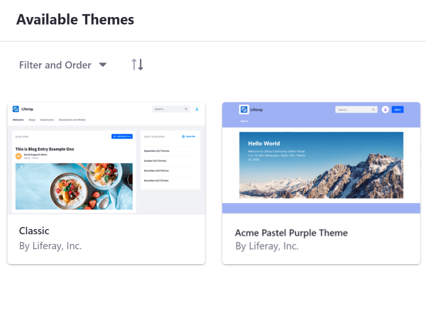
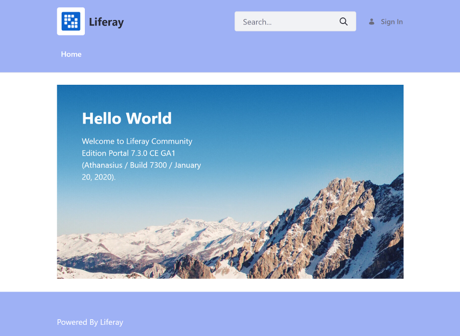
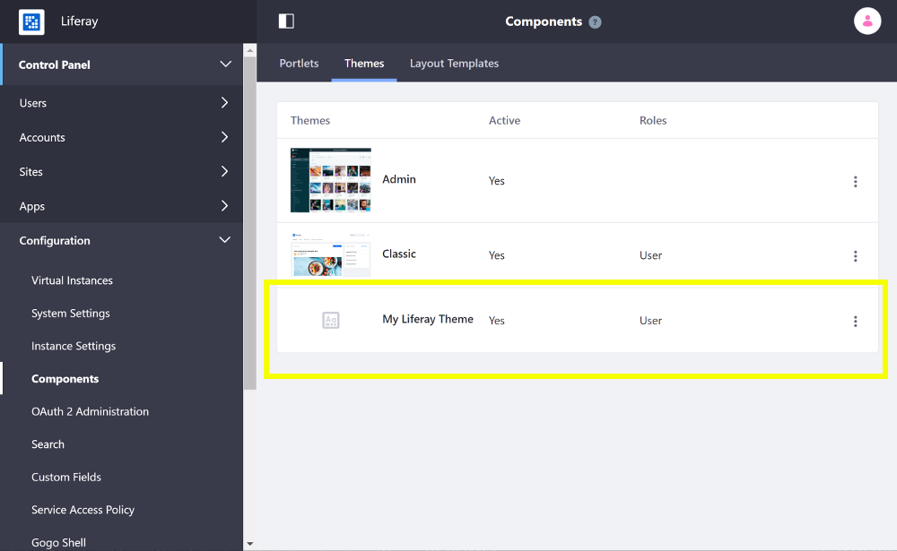

# Developing a Theme

Themes are packaged WAR files composed of CSS, HTML (FreeMarker), and JavaScript that can be used to create a custom look and feel for pages.

```note::
   Starting with Liferay DXP 7.1+, the overall design of `Content Pages <../../creating-pages/building-and-managing-content-pages/content-pages-overview.md>`_ can be accomplished with `Page Fragments <../../displaying-content/using-fragments/page-fragments-intro.md>`_. Starting with Liferay DXP 7.3+ users can define the common elements of a page (Header and Footer) in the `Master Page Template <../../creating-pages/defining-headers-and-footers-with-master-pages/master-page-templates-intro.md>`_ .
```



You can create your own Theme in a few steps:

1. Generate the Theme.
1. Build the base files.
1. Customize the CSS.
1. Customize the Theme templates.
1. Customize the JavaScript.
1. Build the Theme's WAR file and copy it to the Docker container.

This example uses a Docker image with a fresh install of Liferay DXP.

> This example runs on Liferay DXP 7.3+

## Generate the Theme

1. Install the [Liferay Theme Generator](./reference/installing-the-theme-generator-reference.md), if it's not installed.
1. Run the Liferay Theme Generator and follow the prompts to create the Theme. The example Theme is based on the Classic Theme, created with this command:

    ```bash
    yo liferay-theme:classic
    ```

    ```note::
      The ``liferay-theme:classic`` sub-generator is available for Liferay DXP 7.2+ in v9.50+ of the Liferay Theme Generator.
    ```

```note::
  Since Liferay DXP Fix Pack 2 and Liferay Portal 7.2 CE GA2, Font Awesome is available globally as a system setting, which is enabled by default. If you're using Font Awesome icons in your theme, answer yes (y) to the Font Awesome question in v9.x.x generator to include Font Awesome imports in your theme. This ensures that your icons won't break if they are disabled in the global setting.
```

## Build the Base Files

Run the build script for your Liferay JS Toolkit version. If you're unsure of your version run `npm list -g generator-liferay-theme` from your command line to print it.

**v9.5.0+:**

```bash
npm run build
```

**Older versions:**

```bash
node_modules\.bin\gulp build
```

## Customize the CSS

Add custom CSS to the Theme's `/src/css/_custom.scss` file. The example below changes the background color of the Header and updates the font color of the navigation links. Styles are condensed by using `Sass <https://sass-lang.com/>`_ , as demonstrated by the nested styles in the example code.

```scss
body header .navbar-classic {
  background-color: #9EB1F5;
  
  &.navbar-light {
    ul > li > a.nav-link.text-truncate {
      color: #FFF;
    }
  }
}
```

This updates the Footer's background color to match the Header:

```css
body #footer {
	background-color: #9EB1F5;
}
```



## Customize the Theme Templates

Add your HTML markup customizations to the Theme templates in the `/src/templates/` folder. If this folder doesn't exist, you must create it. Copy the Theme templates from the `/build/templates/` folder to the `/src/templates/` folder to modify them. The example below adds a new button to the Header beside the User Personal Bar in `portal_normal.ftl`:

```markup
...
<div class="autofit-col">
  <@liferay.user_personal_bar />
</div>

<div class="ml-3 autofit-col">
  <button name="Alert Button" onclick="alert('You pushed the button.')" class="btn btn-primary">Alert</button>
</div>
...
```

## Customize the JavaScript

Add custom JavaScript to the generated `/src/js/main.js` file. If this folder doesn't exist, you must create it. You can copy the `main.js` file from the `/build/js/` folder to get started. The example prints a message in the browser's console when the Theme is loaded on the page:

```javascript
console.log('My Theme is loaded to the page.');
```

## Build the Theme's WAR File and Copy it to the Docker Container

You can download and unzip this [example Theme](https://github.com/liferay/liferay-learn/tree/master/docs/dxp/7.x/en/site-building/developer-guide/developing-themes/developing-a-theme/liferay-g4t8.zip) if you want to deploy it or compare your code at this point:

    ```bash
    curl https://github.com/liferay/liferay-learn/tree/master/docs/dxp/7.x/en/site-building/developer-guide/developing-themes/developing-a-theme/liferay-g4t8.zip
    
    unzip liferay-g4t8.zip
    cd liferay-g4t8
    npm install
    ```

1. Start the Docker container:

    ```bash
    docker run -it -p 8080:8080 liferay/portal:7.3.0-ga1
    ```

1. Build the Theme's WAR.

    ```bash
    cd my-theme-project
    npm run build
    ```

1. Copy the Theme's WAR to the `[host_folder]/deploy` folder for your Docker image's [bind mount](TODO), or create the `[host_folder]/deploy` folder if it doesn't exist.

    ```bash
    cp my-liferay-theme-1.0.0.war path/to/your/bind/mount
    ```

    ```note::
    You must restart the Docker container if you're creating the `[host_folder]/deploy` folder for the first time in your bind mount.
    ```

1. Confirm the deployment to the Liferay Docker container console. The log message below should appear in the Docker console:

    ```bash
    INFO [fileinstall-/opt/liferay/osgi/war][BundleStartStopLogger:39] STARTED my-liferay-theme_1.0.0 [1114]
    ```

1. Verify that the Theme is available. Open your browser to `https://localhost:8080`, open the Product Menu and go to *Control Panel* &rarr; *Configuration* &rarr; *Components*, and select the *Themes* tab.

    

Great! You successfully built and deployed a custom Theme.

## Related Information

* [Apply a New Theme](TODO:applying-themes)
* [Installing the Theme Generator](./installing-the-theme-generator.md)