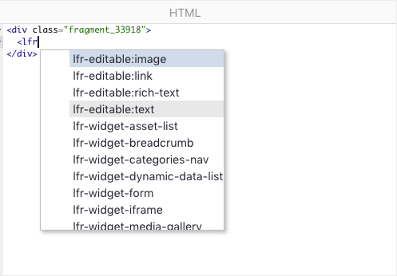
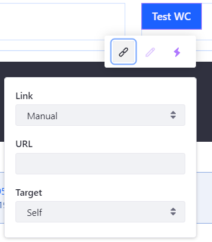

# Fragment Specific Tags and Attributes Reference

Along with standard HTML, CSS, and JavaScript, you can use Liferay-specific tags and, since Liferay Portal CE 7.3 GA3 and Liferay DXP 7.3, attributes, to make editable sections or embed widgets in your Fragment. Editable elements can be modified before publication, which means that you can create simple, reusable Fragments that have identical formatting, but contain elements that are adaptable to the specific context.

Page Fragments have access to these types of liferay-specific tags and attributes that add these features:

* Editable Text
* Editable Images
* Editable Links
* Editable HTML (Liferay Portal CE 7.3 GA3+ and DXP 7.3+)
* Embedded Widgets

```note::
  When you start typing the name of a tag, the `HTML editor <../../developing-page-fragments/using-the-fragments-editor.md>`_ provides auto-completion for `lfr` tags like editable elements and embeddable widgets.
```

The text or images you provide here are the default values for the fields. You may want to display them in the final version of the page, or you may want filler text that should be replaced before the page is published.

All of these work together to help you create dynamic, reusable elements for building a site. For example, if you need a small text box with an image and link to provide a product description, you can create a Fragment containing editable filler text, space for an editable image, the appropriate formatting, and an editable link. You can then add the Fragment to multiple pages and define the image, text, and link for each product you need to describe.

```warning::
  IDs of editable elements must be unique. Do not change the ID after the Page Fragment has been added to a page. Changing the ID of an editable Fragment after it's been modified can cause the changes to be lost.
```

You can make a Fragment even more dynamic by including a widget. Currently, portlets are the only embeddable types of widgets, but other options are planned.



This reference list the available editable tags and attributes along with examples of how to use them in your Fragments.

```note::
  Since Liferay Portal CE 7.3 GA3 and Liferay DXP 7.3, you can use ``data-lfr-editable*`` attributes to define elements as editable, rather than wrapping editable elements with ``lfr-editable`` tags. The old tags still work for backwards compatibility, but we recommend that you use the newer data attributes if you're running Portal CE 7.3 GA3+ or Liferay DXP 7.3, as they are easier to write.
```

## Making Text Editable

You can make Fragment text editable by including the `data-lfr-editable-type="text"` attribute in the image element. An example is shown below. The `data-lfr-editable-id` must be a unique ID:

```html
<p data-lfr-editable-id="text1" data-lfr-editable-type="text">
  Placeholder
</p>
```

```note::
   All block elements and inline elements are supported for editable text.
```

For Liferay Portal CE 7.3 GA2 and below, use the syntax below. A unique ID is required to render the element properly:

```html
<lfr-editable id="unique-id" type="text">
   This is editable text!
</lfr-editable>
```

If you need formatting options like text or color styles, use `rich-text`:

```html
<p data-lfr-editable-id="text1" data-lfr-editable-type="rich-text">
  Placeholder
</p>
```

```note::
   All block element tags are supported for editable Rich text.
```

For Liferay Portal CE 7.3 GA2 and below, use the syntax below:

```html
<lfr-editable id="unique-id" type="rich-text">
   This is editable text that I can make bold or italic!
</lfr-editable>
```

```note::
  If you want to make text inside an HTML element editable, you must use the ``rich-text`` type. The ``text`` type strips HTML formatting out of the text before rendering.
```

## Making Images Editable

Images use the same `data-lfr-editable-type` attribute as text, but with the `image` type, like this:

```html

```

For Liferay Portal CE 7.3 GA2 and below, use this syntax:

```html
<lfr-editable id="unique-id" type="image">
   
</lfr-editable>
```

After you add the `lfr-editable` tag with the type `image` to a Fragment, when you add that Fragment to a page, you can then click on the editable image to select an image or configure content mapping for the image.


Most images can be handled like this, but to add an editable background image you must add an additional property to set the background image ID, `data-lfr-background-image-id`. The background image ID is set in the main `div` for the Fragment and is the same as your editable image ID.

```html
<div data-lfr-background-image-id="unique-id">
   <lfr-editable id="unique-id" type="image">
      
   </lfr-editable>
</div>
```

Content mapping connects editable fields in your Fragment with fields from an Asset type like Web Content or Blogs. For example, you can map an image field to display a preview image for a Web Content Article. For more information on mapping fields, see [Building Content Pages](../../../creating-pages/building-and-managing-content-pages/building-content-pages.md#mapping-content).

## Creating Editable Links

There is also a specific syntax for creating editable link elements:

```html
<a
  href="#placeholder"
  target="_blank"
  data-lfr-editable-id="link1"
  data-lfr-editable-type="link"
>
  Go to placeholder
</a>
```

For Liferay Portal CE 7.3 GA2 and below, use this syntax:

```html
<lfr-editable id="unique-id" type="link">
    <a href="default-target-url-goes-here">Link text goes here</a>
</lfr-editable>
```

You can edit the link text, target URL, and basic link styling---primary button, secondary button, link.



For more information on editable links, see [Editable Links](../../../creating-pages/building-and-managing-content-pages/building-content-pages.md#editing-a-hyperlink).

## Creating Editable HTML

You can make general HTML elements editable as well by setting the `data-lfr-editable-type` attribute to `html`:

```html
<article data-lfr-editable-id="text1" data-lfr-editable-type="html">
  <h1>Placeholder</h1>
</article>
```

For Liferay Portal CE 7.3 GA2 and below, use this syntax:

```html
<lfr-editable type="html" id="text1">
  <h1>Placeholder</h1>
</lfr-editable>
```

<!-- Image commented out until a replacement is provided.

-->

For more information on editable HTML, see [Editable HTML](../../../creating-pages/building-and-managing-content-pages/building-content-pages.md#editing-an-html-element).

## Including Widgets Within A Fragment

To include a widget, you must know its registered name. For example, the Site Navigation Menu portlet is registered as `nav`. Each registered portlet has an `lfr-widget-[name]` tag that's used to embed it. For example: the Navigation Menu tag is `<lfr-widget-nav />`. You could embed it in a block like this:

```html
<div class="nav-widget">
    <lfr-widget-nav>
    </lfr-widget-nav>
</div>
```

These are the widgets that can be embedded and their accompanying tags:

| Widget Name    | Tag |
| -------- | --- |
|DDL Display	|`<lfr-widget-dynamic-data-list>`|
|Form           |`<lfr-widget-form>`|
|Asset Publisher|`<lfr-widget-asset-list>`|
|Breadcrumb	    |`<lfr-widget-breadcrumb>`|
|Categories Navigation |`<lfr-widget-categories-nav>`|
|Flash	|`<lfr-widget-flash>`|
|Media Gallery	|`<lfr-widget-media-gallery>`|
|Navigation Menu	|`<lfr-widget-nav>`|
|Polls Display	|`<lfr-widget-polls>`|
|Related Assets	|`<lfr-widget-related-assets>`|
|Site Map	|`<lfr-widget-site-map>`|
|Tag Cloud	|`<lfr-widget-tag-cloud>`|
|Tags Navigation	|`<lfr-widget-tags-nav>`|
|Web Content Display	|`<lfr-widget-web-content>`|
|RSS Publisher (Deprecated)	|`<lfr-widget-rss>`|
|Iframe	|`<lfr-widget-iframe>`|

### Enabling Embedding for Your Widget

If you have a custom widget that you want to embed in a Fragment, you can configure that widget to be embeddable. To embed your widget, it must be an OSGi Component. Inside the `@Component` annotation for the portlet class you want to embed, add this property:

```properties
com.liferay.fragment.entry.processor.portlet.alias=app-name
```

When you deploy your widget, it's available to add. The name you specify in the property must be appended to the `lfr-widget` tag like this:

```markup
<lfr-widget-app-name>
</lfr-widget-app-name>
```

```note::
    According to the W3C HTML standards, custom elements can't be self closing. Therefore, even though you can't add anything between the opening and closing ``<lfr-widget...>`` tags, you can't use the self closing notation for the tag.
```
