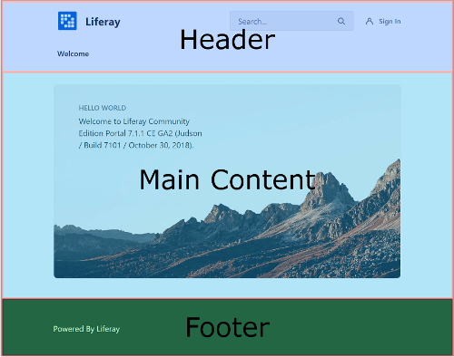
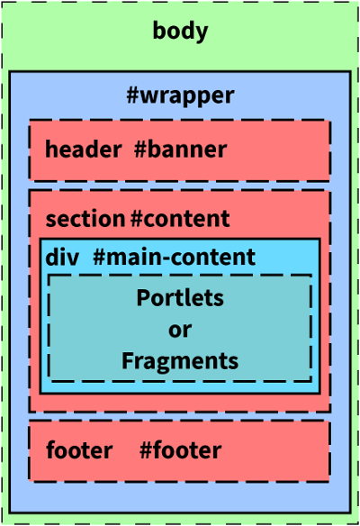
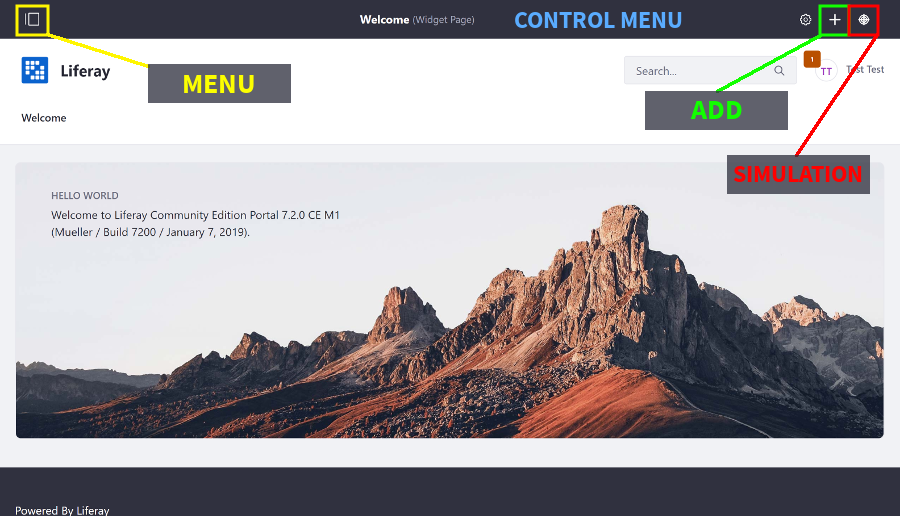
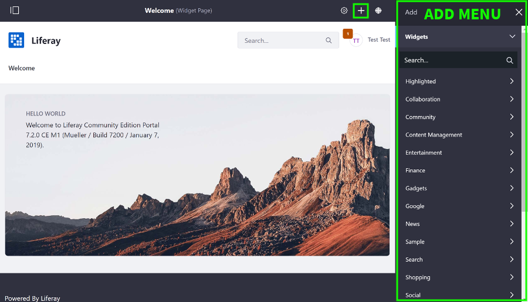
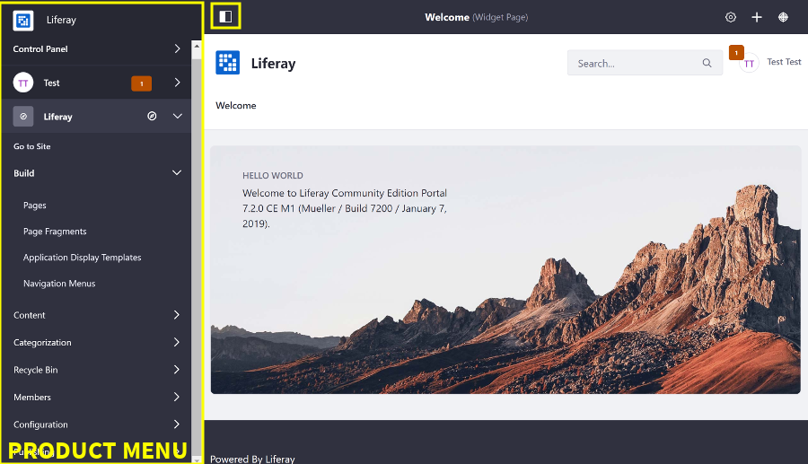
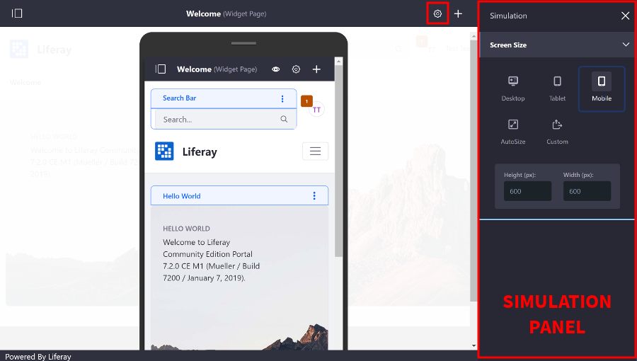

# Understanding the Page Structure

Understanding the page's structure is crucial to targeting the correct markup for styling, organizing your content, and creating your site. Your page layout is unique to the requirements and design for your site. The Unstyled theme's default page layout is organized into three key sections in its `portal_normal.ftl` template:

* **Header:** Contains the navigation, site logo and title (if shown), and sign-in link when the user isn't logged in.
* **Main Content:** Contains the portlets or fragments for the page.
* **Footer:** contains additional information, such as the copyright or author.



## Portlets or Fragments

The `#content` `Section` makes up the majority of the page. Portlets or fragments are contained inside the `#main-content` `div`. Liferay DXP ships with a default set of applications that provide common functionality, such as forums and Wikis, documents and media, blogs, and more. You can also create custom portlets for your site. Portlets can be added via the Add Menu (referred to as widget), included in a sitemap through the [Resources Importer](importing-resources-with-a-theme), or they can be [embedded in the page's theme](embedding-portlets-in-themes). See the [portlet tutorials section](portlets) for more information on creating and developing portlets. 

You can target the elements and IDs shown in the table below to style the page:

| Element | ID | Description |
| --- | --- | --- |
| `div` | `#wrapper` | The container div for the page contents | 
| `header` | `#banner` | The page's header |
| `section` | `#content` > `#main-content` | The main contents of the page (portlets or fragments) |
| `footer` | `#footer` | The page's footer |

```note::
  In Liferay DXP 7.3+, you can modify the Header and Footer styles using `Master Page Templates <../../../site-building/creating-pages/master-page-templates/creating-a-master-page-template.md>`_ on Content Pages.
```



As shown in the diagram above, you can also add [fragments](../../../displaying-content/using-fragments/using-page-fragments.md) to a page. Fragments are components---composed of CSS, JavaScript, and HTML---that provide key pieces of functionality for the page (i.e. a carousel or banner). Liferay DXP provides [an editor](../../../developing-page-fragments/using-the-fragments-editor.md) for creating collections of fragments that you can then add to the page. These fragments can be edited on the page to suit your vision.

## Layout Templates, Page Templates, and Site Templates

The page layout within the `#content` Section is determined by the [Layout Template](layout-templates). Several layout templates are included out-of-the-box. You can also [create custom layout templates manually](layout-templates) or with the [Liferay Theme Generator's layout sub-generator](./installing-the-theme-generator.md#generator-and-sub-generator-commands). 

Layout templates can be pre-configured depending on the [page type](../../../creating-pages/understanding-pages/understanding-pages.md) you choose when the page is created. Along with setting the types of portlets to include on the page, the page template may also define the default Layout Template for the page. Climbing further up the scope chain, you can create [Site Templates](../../../building-sites/building-sites-with-site-templates.md), which can define the pages, page templates, layout templates, and theme(s) to use for site pages. 

## Product Navigation Sidebars and Panels

The main page layout also contains a few notable sidebars an administrative user can trigger through the Control Menu. These are listed below:

* **Add Menu:** For adding portlets (widgets) and content to the page.
* **Control Menu:** Provides the main navigation for accessing the Add Menu, Product Menu, and Simulation Panel
* **Product Menu:** Contains administrative apps, configuration settings, and user account settings, profile, and dashboard page
* **Simulation Panel:** Simulates how the page appears on different devices









When styling the page, you must keep the navigation menus in mind, especially for absolutely positioned elements, such as a fixed navbar. If the user is logged in and can view the Control Menu, the fixed navbar must have a top margin equal to the Control Menu's height. 

See the [Product Navigation articles](product-navigation) for more information on customizing these menus. 

## Related Information

* [Developing a Theme](../../developing-themes/developing-a-theme.md)
* [Look and Feel Overview](./look-and-feel-overview.md)
* [Installing the Liferay Theme Generator](./installing-the-theme-generator-reference.md)
