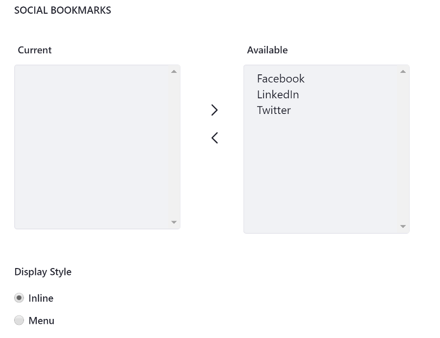
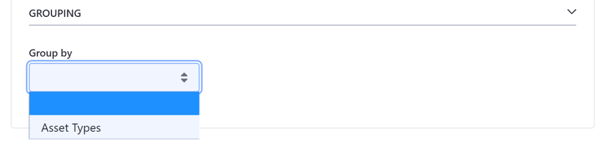

# Configuring Display Settings

Once you've [selected your assets](./selecting-assets.md) for the Asset Publisher, you can configure several display settings to specify how users view your content. Follow these steps:

1. Hover over the Asset Publisher and click the Options icon () in the widget's menu and select *Configuration*.
1. With the *Setup* tab selected, click on the *Display Settings* tab.
1. Under the *Display Settings* panel, choose a display template.
1. Configure the remaining options under the *Display Settings* tab.
1. Expand the *Set and Enable* panel and check the boxes for the options you want to enable.
1. Expand the *Metadata* panel and move options from the Available box to the Current box to display the metadata for each asset. For example, you can select tags and categories for display. Then users can click on the tags and categories to filter the displayed assets manually. 

  

1. Expand the *Grouping* panel and optionally establish grouping rules.
1. Click *Save* to apply your display settings.

## Asset Publisher Display Configuration Reference

### Display Settings


These templates are in every site by default:

| Display Template | Scope | Description |
| --- | --- | --- |
| Abstracts | instance | Displays the first 200-500 characters of the content, defined by the **Abstract Length** field. This is the default display template. |
| Table | instance | Displays the content in an HTML table which can be styled by a theme developer |
| Title List | instance | Displays the content's title as defined by the user who entered it |
| Full Content | instance | Displays the entire content of the entry |
| Rich Summary | global | Displays a summary view of each asset along with a *Read More* link to the article's full content |
| Map | global | displays [geo-localized assets](TODO) in either a Google Map or an Open Street Map provider. The map provider can be configured in Instance Settings, and Site Settings in the Advanced section. |

These are the remaining settings for the *Display Settings* section:

| Setting | Description |
| --- | --- |
| Abstract Length | Select the number of characters to display for abstracts. The default is `200`. Note this option is only available for the Abstracts display template. |
| Asset Link Behavior | The default value is *Show Full Content*, which displays the full asset in the current Asset Publisher. *View in Context* displays the asset in the application that it belongs to. For example, a blog entry is displayed in Blogs where it was created. See the section below on display pages for more information. |
| Number of Items to Display | the maximum number of assets that can be displayed. If pagination is enabled, this number represents the maximum number of assets that can be displayed per page. |
| Pagination Type | the type of UI to display for pagination. Three options are available: *None*: displays no pagination controls; *Simple*: adds Previous and Next buttons for browsing through pages of assets; *Regular*: adds more options and information including First and Last buttons, a dropdown selector for pages, the number of items per page, and the total number of results (assets displayed) |

### Set and Enable Options

Many of these, such as printing, flags, ratings, comments, comment ratings, and social bookmarks work the same way they do in other applications. 




These options are available:

| Setting | Description |
| --- | --- |
| Show Add Content Button | When selected, an *Add New* button appears that lets users add new assets directly from the Asset Publisher application. This is checked by default. |
| Show Metadata Descriptions | Enables Metadata descriptions such as *Content Related to...* or *Content with tag...* to display with the published assets. |
| Show Available Locales | Since content can be localized, you can have different versions of it based on locale. Enabling this option shows the available locales, so users can view the content in their languages. |
| Set as the Default Asset Publisher for This Page | The Asset Publisher app is an instanceable app: multiple Asset Publishers can be added to a page and each has an independent configuration. The default Asset Publisher for a page is the one used to display content associated with the page. |
| Show only assets with [current Display Page Template] as its display page template | Display assets that only exist for the specified Display Page Template. |
| Include tags specified in the URL | Incorporate tags specified in the URL |
| Enable ... | Enable/disable these options for displayed assets. The Print option adds a *Print* link to the full view of an asset. Clicking *Print* opens a new browser window with a print view of the asset. Enabling flags, related assets, ratings, comments, comment ratings, or social bookmarks add links to the corresponding social features to the full view of the asset. |
| Social Bookmarks | Specify which social media links to display by moving the bookmark from the Available box to the Current box |

```tip::
   An alternate way to add flags, comments, and ratings to a page is through the *Page Flags*, *Page Comments*, and *Page Ratings* applications. Just add the applications in the appropriate location near the asset that should have feedback.
```

### Metadata

This section specifies what metadata to display with the asset entry. Move metadata from the Available box to the Current box to include it.


### Grouping

The *Grouping* section specifies what groups to divide the displayed assets into. You can group assets by type or by vocabulary (if you have defined some). 


For example, suppose you have a vocabulary called *Membership Type* with two categories: *Premium* and *Regular*. If you group assets by Membership Type, all assets with the Premium category appear in one group and all assets with the Regular category appear in another group. Grouping rules are applied before any [ordering rules](./selecting-assets-for-the-asset-publisher.md#configuring-asset-display-ordering). The ordering rules are applied separately to each group of assets. The example in the figure below groups assets by type; The image is listed after the web content articles.

