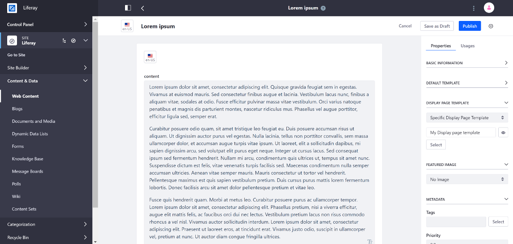
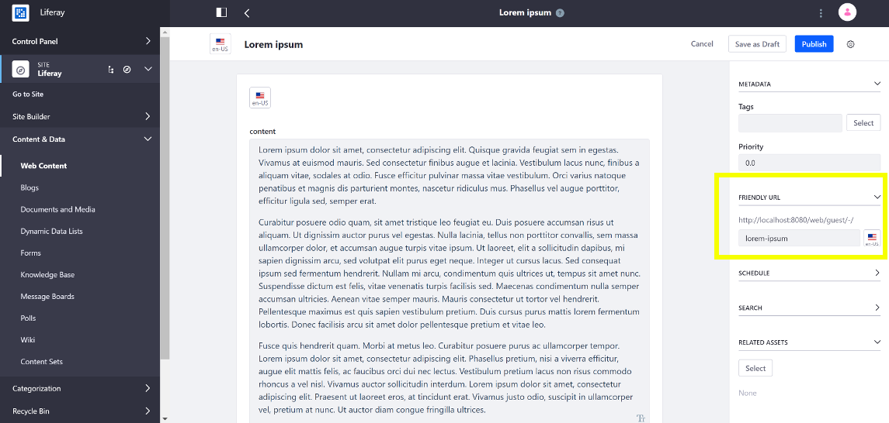

# Displaying Content on Display Pages

Follow these steps to display your content on a Display Page:

1. Open the Product Menu and go to *Content & Data* &rarr;, open the site's menu, and select the type of content you want to configure a Display Page Template for: *Web Content*, *Blogs*, or *Documents and Media*.

1. Open the Edit menu for an existing content or create a new piece of content.

1. Expand the *Display Page Template* section in the Properties window, open the dropdown selector and choose *Specific Display Page Template*.

    

1. Click the *Select* button and select the Display Page Template and click *Done*.

    When editing the content, you can preview what the display page looks like with the *Preview* () button located next to the selected Display Page Template.

    

1. Scroll down to the *Friendly URL* panel, expand it, and modify the friendly URL if you want. This is the URL your web content is displayed at when the full content is viewed.

    

1. Click *Publish*.

When published, you can view the content at its Friendly URL or when you click on the content in an Asset Publisher with *Asset Link Behavior* set to *View in Context*.