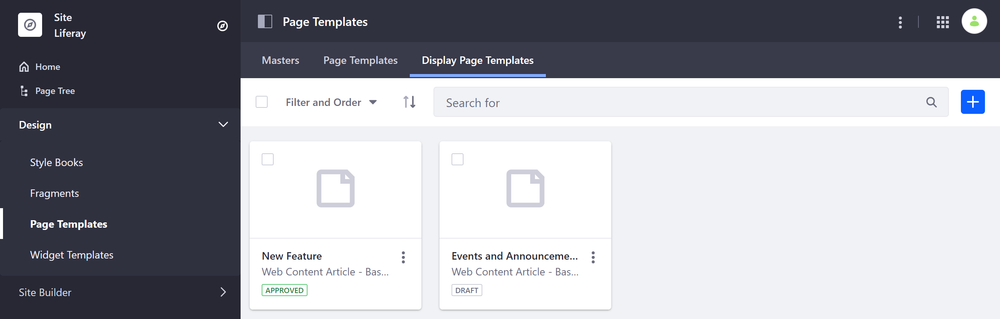
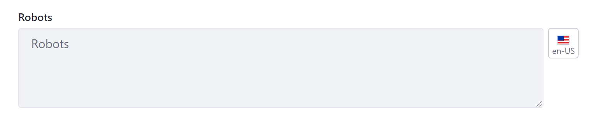
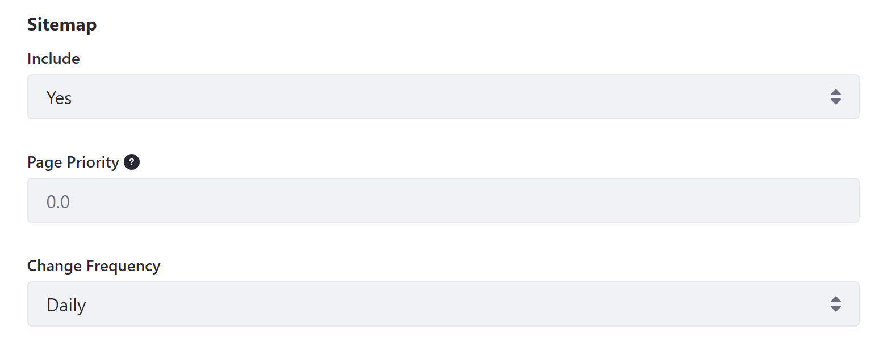
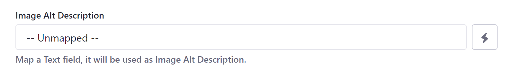

# Configuring SEO and Open Graph

With *Display Page Templates*, you can create standard formats for displaying different content types, such as *Web Content Articles*, *Documents*, and *Blog Entries*. When configuring a template, you can map SEO and Open Graph settings to dynamically fill in these fields for each Page.

To create or configure these setting for an existing Display Page template, go to *Design* &rarr; *Page Templates* in the Product menu, and click on the *Display Page Templates* tab.



Create a new template using the Add button (), or edit an existing template by clicking on its *Actions* button (  ) and selecting *Configure*. Here, configuration options are organized into two tabs: *SEO* and *Open Graph*.

* [Configuring SEO Settings](#configuring-seo-settings)
* [Configuring Open Graph Settings](#configuring-open-graph-settings)

## Configuring SEO Settings

Search engine optimization (SEO) refers to the methods used to improve your page's ranking in search engine results pages (SERP). With Liferay DXP, you can create Display Page templates that dynamically configure your Page for SEO.

### HTML Title

The *HTML Title* field defines a Page's title `<meta>` tag. This title is used by search engines to rank your page and serves as the page's heading in search engine results.

Be default, Display Page templates map this field to *Title*, but you can select any other Text field. Though keep in mind, the recommended length for an HTML title is under 60 characters.


### Description

The *Description* field defines a Page's description `<meta>` tag. This description is used by search engines to rank your page and appears in search results as a preview of your page.

By default, Display Page templates map this field to *Description*, but you can select any other Text field. Though keep in mind, the recommended length for a page's description is under 155 characters.


### Robots

The *Robots* field configures `robots.txt` rules for a Page. These rules provide instructions to search engines and other tools crawling and indexing your Site, either blocking or granting a crawler access to a specified path. You can also localize this field using the *Language Flag*.



### Sitemap

Determine whether to include a Page in your `sitemap.xml` file, as well as set its *Priority* and *Change Frequency*. These fields inform search engines whether to crawl and index a Page, how it should be prioritized relative to other Site Pages, and how frequently it is updated.



## Configuring Open Graph Settings

[Open Graph](https://ogp.me/) is an internet protocol that standardizes how a Site's metadata is displayed on social networks. With Liferay DXP, you can create Display Page templates that dynamically configure a Page's Open Graph `<meta>` tags.

```note::
   Page values defined here override values defined elsewhere in your Liferay instance.
```

### Title

The *Title* field defines a Page's `og:title` property, which determines the title displayed for a Page in rich previews. By default, this field is mapped to *Title*, like the HTML title field for SEO. While you can select any other Text field, its best practice to update SEO and Open Graph titles together.


### Description

The *Description* field defines a Page's `og:description` property, which determines the description displayed for a Page in rich previews. By default, Display Page templates map this field to *Description*, like the description field for SEO.  While you can select any other Text field, its best practice to update SEO and Open Graph description together.


### Image

The *Image* field defines a Page's `og:image` property, which determines the image displayed for a Page in rich previews. By default, this field is unmapped in Display Page templates. This means the template defaults to the image set at Site level, unless you select a different Image field.


### Image Alt Description

The *Image Alt Description* field defines a Page's `og:image:alt` property, which determines the alt text for a Page's `og:image` property that is read by screen readers. By default, this field is unmapped in Display Page templates. This means the template defaults to the alt text set at Site level, unless you select a different Text field.



## Additional Information

* [Displaying Content with Display Page Templates](./displaying-content-with-display-page-templates.md)
* [Creating a Display Page Template](./creating-a-display-page-template.md)
* [Search Engine Optimization](./../../optimizing-sites/search_engine_optimization.html)
* [Open Graph](./../../site-settings/configuring-open-graph.md)
