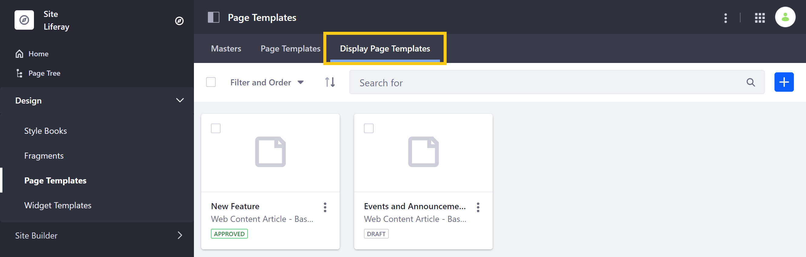
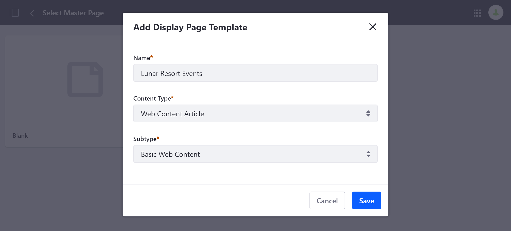
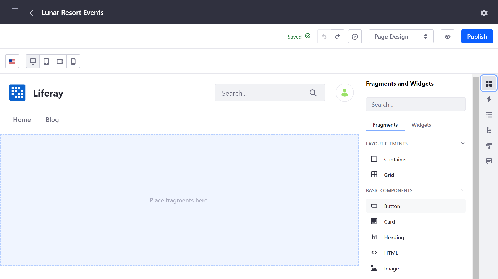
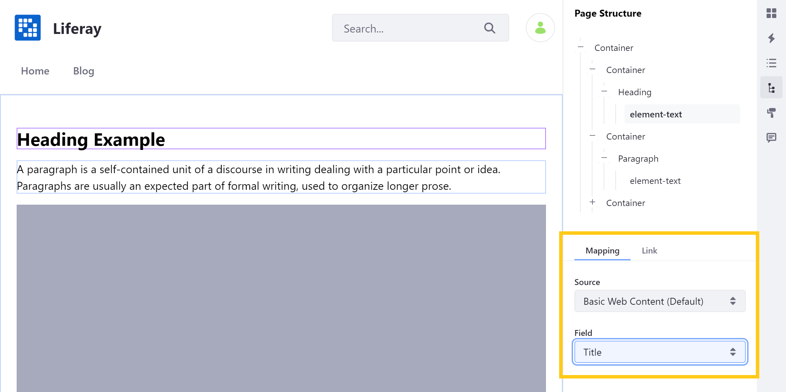

# Creating a Display Page Template

A Display Page Template specifies the layout and formatting for your content and displays it at a unique friendly URL.


```note::
   Display Page Templates are only supported for web content, documents, and blog entries.
```

Follow these steps to create a Display Page Template:

1. Open the Product Menu, and go to *Design* &rarr; *Page Templates*.

1. Click on the *Display Page Templates* tab.

   

1. Click the *Add* button ().

1. Enter a name for your template and select a content type and subtype, if applicable. Then, click on *Save*. This will redirect you to a new, blank Display Page template.

   

1. Begin editing your template using the same editing interface and page elements as [Content Pages](../../creating-pages/building-and-managing-content-pages/building-content-pages.md).

   

1. Once you've added Page elements, you can [map](../../creating-pages/building-and-managing-content-pages/building-content-pages.md#mapping-content) them to content structure fields (e.g., title, description) by double-clicking on an editable field. Mapped fields are outlined in purple.

   

   See [Configuring SEO and Open Graph](./configuring-seo-and-open-graph.md) to learn about using these mapped structure fields when configuring SEO and Open Graph settings for your Display Page.

1. When finished, click on *Publish* to save your work.

Now that your Display Page Template is created, you can [publish your content with it](./publishing-content-with-display-pages.md).

## Additional Information

* [Publishing Content with Display Pages](./publishing-content-with-display-pages.md)
* [Configuring SEO and Open Graph](./configuring-seo-and-open-graph.md)
* [Content Page Overview](./../../creating-pages/building-and-managing-content-pages/content-pages-overview.md)
* [Building Content Pages](../../creating-pages/building-and-managing-content-pages/building-content-pages.md)
