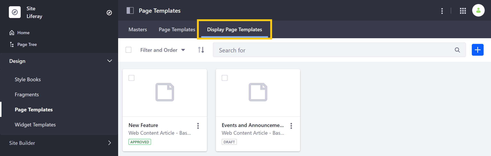
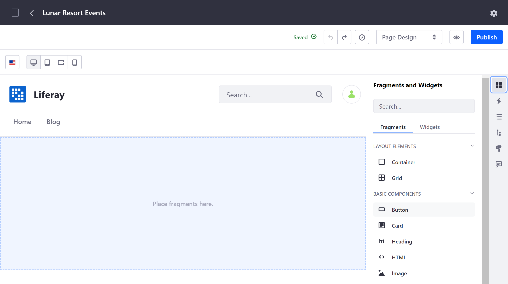
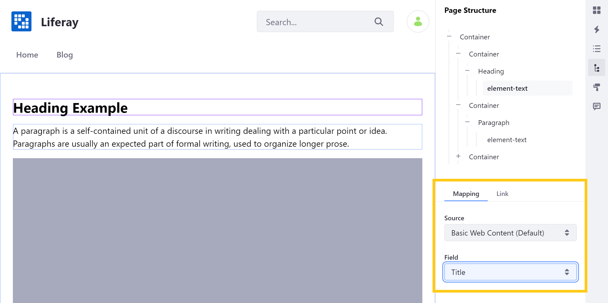
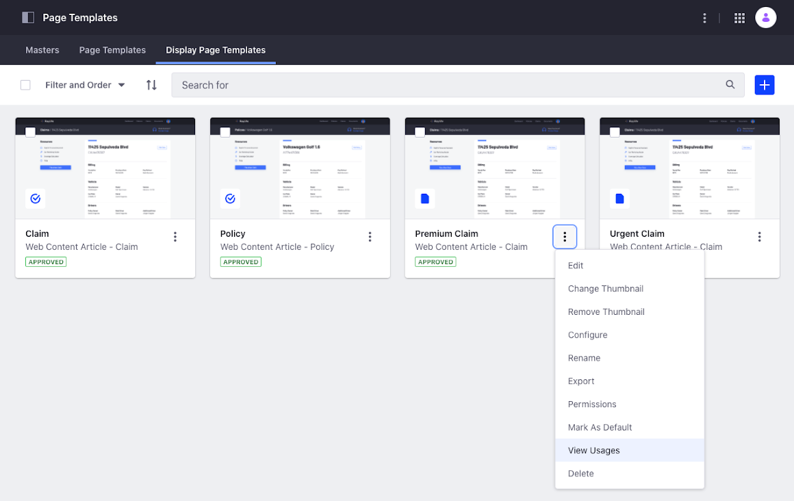

# Creating and Managing Display Page Templates

A Display Page Template specifies the layout and formatting for your content and displays it at a unique friendly URL.


```note::
   Display Page Templates are only supported for web content, documents, and blog entries.
```

## Creating a Display Page Template

Follow these steps to create a Display Page Template:

1. Open the Product Menu, and go to *Design* &rarr; *Page Templates*.

1. Click on the *Display Page Templates* tab.

   

1. Click the *Add* button ().

1. Enter a name for your template and select a content type and subtype, if applicable. Then, click on *Save*. This will redirect you to a new, blank Display Page template.

   

1. Begin editing your template using the same editing interface and page elements as [Content Pages](../../creating-pages/building-and-managing-content-pages/building-content-pages.md).

   

1. Once you've added Page elements, you can [map](../../creating-pages/building-and-managing-content-pages/building-content-pages.md#mapping-content) them to content structure fields (e.g., title, description) by double-clicking on an editable field. Mapped fields are outlined in purple.

   

   See [Configuring SEO and Open Graph](./configuring-seo-and-open-graph.md) to learn about using these mapped structure fields when configuring SEO and Open Graph settings for your Display Page.

1. When finished, click on *Publish* to save your work.

Now that your Display Page Template is created, you can [publish your content with it](./publishing-content-with-display-pages.md).

## Viewing Display Page Template Usage

> Liferay 7.4+

You can manage the different Display Page Templates using the *Actions* menu (). From here, the *View Usages* option provides a list of the site content that is using a specific Display Page Template.

```note::
   The *View Usages* option does not provide the usage of content assigned to the default Display Page Template.
```



Before you delete a Display Page Template in use by some of your site content, you must unassign the Display Page Template from the content using one of these options:

- Assign to Default --- Your content is unassigned from the current Display Page Template and assigned to the default Display Page Template for the content type and subtype (if applicable.)
- Unassign --- Your content is not assigned to any Display Page Template.

To view your Display Page Template usage and unassign your content:

1. Open the Product Menu, and go to *Design* &rarr; *Page Templates*.
1. Click on the *Display Page Templates* tab.
1. Click on the *Actions* menu () of the Display Page Template and select *View Usages*.
1. From the list of content using the Display Page Template, select one or more elements.
1. Click the *Actions* menu () in the top-right corner and select *Assign to Default* or *Unassigned*.
1. Click *OK*.

If you assign your content to a new Display Page Template, review that the content displays as expected. To preview and publish your content, see [Publishing Content with Display Pages](./publishing-content-with-display-pages.md).

## Additional Information

- [Publishing Content with Display Pages](./publishing-content-with-display-pages.md)
- [Configuring SEO and Open Graph](./configuring-seo-and-open-graph.md)
- [Content Page Overview](./../../creating-pages/building-and-managing-content-pages/content-pages-overview.md)
- [Building Content Pages](../../creating-pages/building-and-managing-content-pages/building-content-pages.md)
