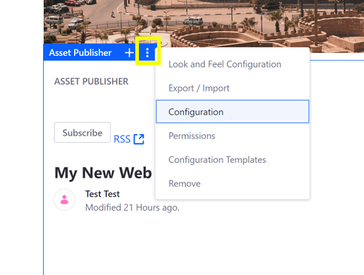
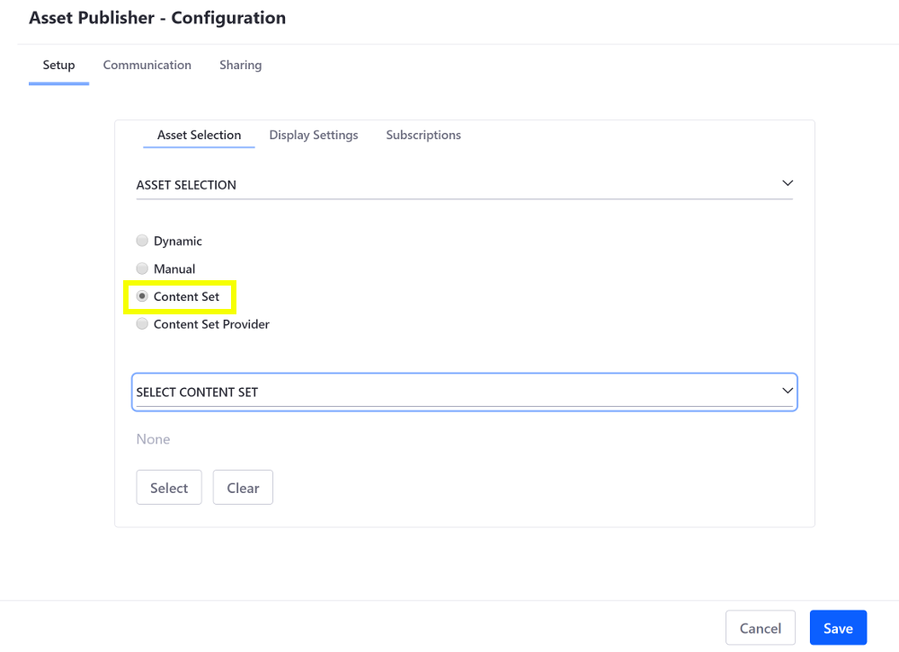

# Selecting Assets for the Asset Publisher

```note::
   This information applies to Liferay DXP 7.3+. For previous Liferay DXP versions, see `Liferay DXP 7.2 <#liferay-dxp-7-2>`_.
```
Use the *Asset Publish* widget to organize and publish different assets from within a Site page. The widget also supports collections. To start using the widget,

1. Navigate to an existing page where you wish to add the *Asset Publisher* widget. Click on the *Add App* icon () at the top the page.

    Or [create a new page](../../../site-building/creating-pages/adding-paged.md) on which to add the widget.

1. The *Asset Publisher* widget is found under the Content Management section of the list of widgets. It can also be found by searching for *Asset Publisher*.

    

1. Drag the widget onto your page. Any media files previously uploaded should already be visible. If you wish to [add additional media files](../../../uploading-and-managing/uploading-files.md), they can be uploaded from the *Documents and Media* Application.

1. Configure the widget by clicking on the *Options* button () at the top-right corner of the widget.

1. Select Configuration* and the Configuration window will appear.

    

    Under the Setup tab, there are a few sub-tabs with different options to configure. The Asset Selection sub-tab allows you to select how you would like to filter through your assets:

    **Dynamic:** Select this option to set parameters that will automatically include specific assets. Use the Asset Type drop-down list to select one or more types of assets to be included. Choose across your different sites in the Scope section. In the Filter section, you can also filter your assets by things such as category, keywords, or tags. As new assets are added, the widget will automatically update.

    **Manual:** Select this option to set parameters and manually filter specific assets. Choose across your different sites in the Scope section. Under Asset Entries, click on the *Select* button to filter for specific types of assets. For example, if you wanted to filter for images, you could select *Images* and add a check to each image you want included.

    

    Once you are finished making your selection, click the *Add* button. A new collection will be created based on your selection.

    **Collection:** Select this option to choose from your previously saved collections. Under Select Collection, click on the *Select* button and choose a collection.

    

    To learn more, go to the [About Collections](../../../collections-and-collection-pages/about-collections-and-collection-pages.md) page.

    **Collection Provider:** This is a new feature in Liferay 7.3 that allows developers to create specific collections with more advanced criteria. 
        
    **Create a collection from this configuration:** Once you have set your specific parameters, you can click this option to save this as a new collection.

## Liferay DXP 7.2

You can configure the Asset Publisher to select assets dynamically based on specific criteria, or you can select assets manually, specifying exactly what assets to display. You can also display assets from [Content Sets](../../../content-authoring-and-management/content_sets.md).

## Selecting Assets Dynamically

By default, the Asset Publisher selects assets dynamically, according to a set of customizable rules. These rules can be combined to compliment each other to create a nice, refined query for your content. Assets are filtered by permissions automatically, no matter how complicated your asset selection rules are.

To enable dynamic asset selection, follow these steps:

1. Hover over the Asset Publisher and click the Options icon () in the widget's menu and select *Configuration*.

    

1. In the Asset Publisher configuration, click the *Dynamic* radio button beneath *Asset Selection* if it's not already selected.
1. Expand the *Source* panel and select the type of Assets to display. By default, all (any) assets are displayed.
1. Select a *Scope*. A list of configured scopes appears under the Scope heading. You can configure multiple scopes, including the global scope, from which to select assets. Remove a scope with the *X* button at the right. Add a scope with the *Select* button.

    

1. Optionally specify any filters for tags, categories, or keywords that you need under the *Filter* heading.

    

1. Optionally expand the *Custom User Attributes* heading and specify categories for the assets to match. These categories must be from the global context. 

1. Expand the *Ordering* panel and specify how to order and group the assets. See [below](#configuring-asset-display-ordering) for more information.

1. Click *Save* to apply the dynamic configuration.

```note::
  These actions are applied immediately to the Asset Publisher and don't require saving:

  * Changing the value of the *Asset Selection* option
  * Changing the value of the *Scope* option
  * Selecting, adding, sorting or deleting asset entries (only when selecting assets manually)
```

## Selecting Assets Manually

To enable manual asset selection, follow these steps:

1. Hover over the widget and click the *Options* icon () in the widget's menu and select *Configuration*.
1. In the Asset Publisher configuration, select *Manual* from the select box beneath *Asset Selection*.
1. Select a *Scope*. A list of configured scopes appears under the Scope heading. You can configure multiple scopes, including the global scope, from which to select assets. Remove a scope with the *X* button at the right. Add a scope with the *Select* button.

    

1. Open the *Asset Entries* panel and click the *Select* button for each scope to select the assets to display for it. A list of the selected assets appears in the Asset Entries section. See [Configuring Display Settings](./configuring-display-settings.md) for more information.
1. click *Save* to apply the manual configuration.

## Selecting a Content Set

Since Liferay DXP 7.2, you can select Content Sets: predefined lists of content to display in the Asset Publisher. To use a Content Set, follow these steps:

1. Hover over the widget and click the *Options* icon () in the widget's menu and select *Configuration*.
1. In the Asset Publisher configuration, select *Content Set* or *Content Set Provider* beneath *Asset Selection*.
1. Expand the *Select Content Set* panel that appears and choose the Content Set that you want to use.

    

## Configuring Asset Display Ordering

Ordering controls how assets are arranged in the Asset Publisher. For example, you can display a series of "How To" articles in descending order based on whether the article has a certain tag. The second ordering is applied to any assets for which the first ordering isn't sufficient. For example, if you order assets by title and there are multiple assets with the same title, the second ordering takes effect. You can display the assets in ascending or descending order by these attributes:

* Title
* Create Date
* Modified Date
* Publish Date
* Expiration Date
* Priority

Ordering rules are one way to control how your content appears. You can combine ordering with [grouping](./configuring-display-settings.md#grouping) to organize your assets further. See [Asset Publisher Display Settings](./configuring-display-settings.md) for other display options.