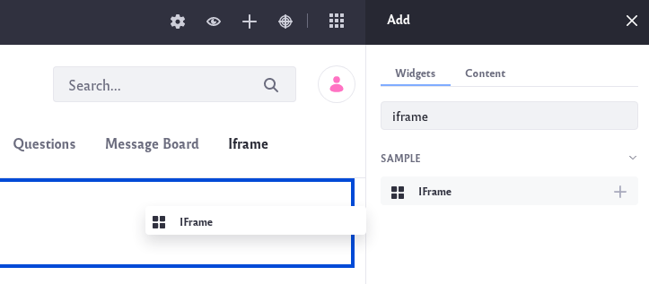
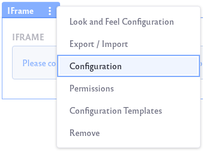
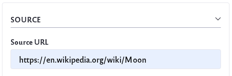

# Iframe Widget

The *Iframe* widget allows you to embed and display a website right from within the widget.

## Setting Up the Iframe Widget

Follow these steps to add an *Iframe* widget to a Site page:

1. Navigate to an existing page where you wish to add the *Iframe* widget. Click on the *Add App* icon () at the top of the page.

    Or [create a new page](../../../site-building/creating-pages/adding-paged.md) on which to add the widget.

2. The *Iframe* widget is found under the Sample section of the list of widgets. It can also be found by searching for *Iframe*. Drag the widget onto your page.

    

3. Click on the *Options* icon () at the top left of the widget. Click on Configuration.

    

4. Under Source URL, input the website URL you wish to embed.

    

    Click the *Save* button to save your configuration.

    *Note that not all websites allow you to display their page in an *Iframe* widget.

## Using the Iframe Widget

Using the *Iframe* widget is as simple as navigating any other typical website. Once you have finished setting up your widget, user's can navigate to your Site page and view the embedded website.

User's can interact with the website from within the widget without ever having to leave your Site page.