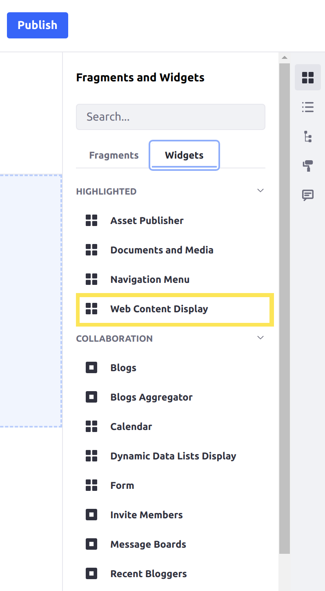
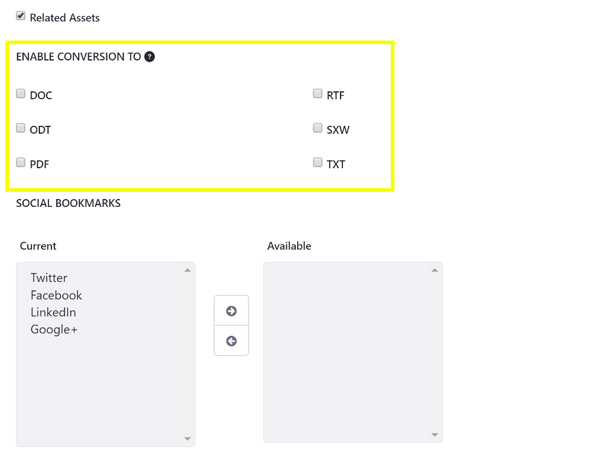

# Using the Web Content Display Widget

Once you've created a [Web Content Article](../../content-authoring-and-management/web-content/web-content-articles/adding-a-basic-web-content-article.md), the quickest way to display it on a page is the Web Content Display widget. Once a web content article is displayed updates to that content will be displayed immediately, unless a [workflow](../../process-automation/workflow/introduction-to-workflow.md) is enabled.

## Adding Web Content Display to a Page

Follow these steps to add a Web Content Display widget to a page and configure it:

1. Enter Edit (  ) mode (if you are using a content page), and then [add the Web Content Display widget to the page](../creating-pages/using-widget-pages/adding-widgets-to-a-page.md).

    

1. [Open the Web Content Display widget's configuration menu](TODO:adding-widgets#configuration-menu).

1. Click the *Select* button to select a piece of web content.

1. Search for and click on the article that you want to display.

1. [Configure the options](#using-the-web-content-display-widget-configuration-options) you want to enable for the widget.

1. Click *Save* to apply the changes, and close the configuration window. If you are using a content page, then click *Publish* to publish the page with the widget.

## Web Content Display Configuration Options

All features are implemented as simple selector buttons so you can enable or disable them as you need. These features are available:

* **User Tools**
  * *Translations:* Shows the available locales for your content. If you're working on the page for a particular language, you can select the translation of your content that goes with your locale.
  
  * *Print:* Opens a print dialog with a print-friendly version of the content.
  
  * *Download as PDF | DOC | ODT | TXT:* Downloads the web content in the selected format. These options are only available if [Open Office integration is enabled](../../content-authoring-and-management/documents-and-media/devops/enabling-openoffice-libreoffice-integration.md).

* **Content Metadata**
  * *Related Assets*
  * *Ratings*
  * *Comments*
  * *Comment Ratings*

### Enabling Comments for Guests

By default, guests can't leave comments on web content. If you want to allow guests to comment on your web content article, follow these steps:

1. Open the [Global Menu](../../getting-started/navigating-dxp.md) (  ) and go to *Control Panel* &rarr; *Roles*.

1. Select *Guest* &rarr; *Define Permissions*.

1. From the left menu, select *Site and Asset Library Administration* &rarr; *Content & Data* &rarr; *Web Content*.

1. Navigate down to the Web Content Article heading and check the *Add Discussion* checkbox.

1. Click *Save*.

Guests can now post comments on your web content article.

### Editing Content from the Web Content Display Widget

You can edit published content directly from the Web Content Display widget.

1. Hover over the Web Content Display widget.
1. Open the Actions Menu () inside the widget container.
1. Select *Edit Web Content* to launch the editor, or select *Edit Template* to launch the template editor for the web content article's template if it has one.

### Integrating Open Office with Your Web Content Display

If you have [enabled OpenOffice/LibreOffice integration](../../content-authoring-and-management/documents-and-media/devops/enabling-openoffice-libreoffice-integration.md) with your Liferay Portal instance, you can enable document conversion for your content. Then users can download your content in their format of choice. Enable the conversion options desired in the Web Content Display's configuration page under the *User Tools* list.

## Related Information

* [Content Authoring and Management](../../content_authoring_and_management.html)
* [Displaying Content on Display Pages Templates](./using-display-page-templates/displaying-content-with-display-page-templates.md)
* [Displaying Assets](./using-the-asset-publisher-widget/displaying-assets-intro.md)
