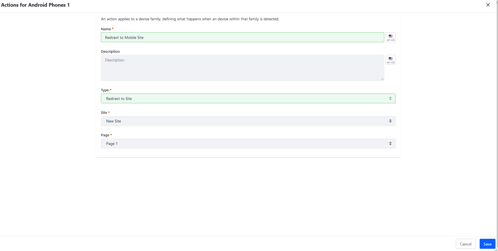

# Mobile Device Actions Reference

Mobile Device Actions defined for a [Mobile Device Family](./creating-mobile-device-rules.md) determine what happens to a request when the device is detected and the family has been found to apply.

Mobile Device Actions can be added to a Site or an individual Page. To add a Mobile Device Action, navigate to the *Site Administration* &rarr; *Site Builder* &rarr; *Pages* menu. Select the desired Site or Page where the Mobile Device Action is to be added. (In this example, we are adding the Mobile Device Action site-wide. Click the () icon next to *Public Pages*. The Mobile Device Rules section is found on the *Advanced* tab.)

By default, there are four kinds of actions that can be configured for mobile families:



| Mobile Device Action | Description |
| --- | --- |
| **Layout Template Modification** | Changes the way portlets are arranged on pages delivered to mobile devices. For example, you could have pages with more complex layouts automatically switch to a simpler template if it detects a mobile device---even if the resolution is theoretically high enough to support the standard layout. |
| **Theme Modification** | Selects a specific theme for different mobile device families. You'd have to have a mobile version of your Site's theme that is automatically applied when a device hits your page. |
| **URL Redirect** | Sends mobile users to any URL. This can be used to direct mobile users to a mobile app download or a mobile version of the page. |
| **Site Redirect** | Sends mobile users to a different Site on your portal. In some cases, mobile content could be created on a mirror of your Site. |

```tip::
   Liferay Portal/DXP was designed from the ground up to be responsive and adapt to any device that might be accessing it. Before creating new themes or forcing a layout template change, you should test how the Site behaves out-of-the-box. Certain features, like URL Redirects, can be disruptive and frustrating if used improperly.
```

## Additional Information

* [Creating Mobile Device Rules](./creating-mobile-device-rules.md)
