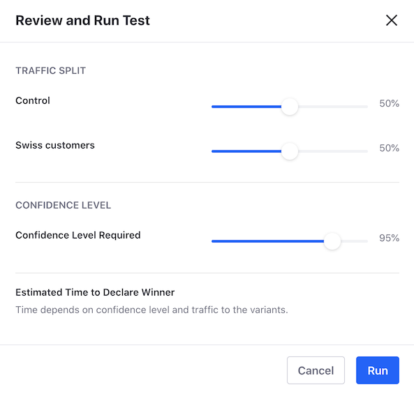

# Running and Monitoring A/B Tests

You can configure these parameters when you run the A/B Test:

- *Traffic Split*: The percentage of visitors randomly split between the variants when visiting the page. Visitors are randomly assigned to a variant and always see the same variant until the test is finished.	
- *Confidence Level Required*: Represents the accuracy of your test. The higher the required confidence level, the longer it takes to declare the winning variant.

The *Estimated Time to Declare Winner* provides an estimation of the test duration. This estimation is based on the *Traffic Split* and *Confidence Level Required* configurations, as well as on the estimated page traffic (based on the traffic history provided by Analytics Cloud.)



After you create the test, review the test status and the history of completed and terminated A/B Tests by clicking the *A/B Testing* button (). Starting Liferay DXP 7.3, you can also view the A/B Test status for an experience through the [experience selection dialog](../experience-personalization/content-page-personalization.md).

Liferay DXP only shows your test's status and the winning Variant when the test finishes. You can manage the other aspects of your A/B test in Analytics Cloud. For more information, see [A/B Testing Analytics](../../../../../../analytics-cloud/latest/en/touchpoints/a-b-testing.md).

When the A/B Test finishes, you can review the test results and publish the preferred test Variant. For more information, read [Reviewing A/B Test Results and Publishing Test Variants](./reviewing-ab-test-results-and-publishing-test-variants.md).

## Running the A/B Test

```note::
   Before running the test, you must create the A/B Test and test Variant. For more information, read `Creating A/B Tests <./creating-ab-tests>`_.
```

1. Go to the Content Page where you want to run the A/B Test
1. In the Control Menu, click the *A/B Testing* button ().
1. If you have additional Experiences for the Content Page, select the Experience.
1. Under the *Active Test* section, click *Review and Run Test*.
1. Optionally, configure the *Traffic Split* and *Confidence Level Required* settings for your test.
1. Click *Run* and then, click *OK*.

You can cancel a running test at any time using the *Terminate Test* button. To delete an A/B Test, you must cancel the test first.

## Related Information

- [A/B Testing](./ab-testing.md)
- [Verifying A/B Test Requirements](./verifying-ab-test-requirements.md)
- [Running and Monitoring A/B Tests](./running-and-monitoring-ab-tests)
- [Reviewing A/B Test Results and Publishing Test Variants](./reviewing-ab-test-results-and-publishing-test-variants.md)
