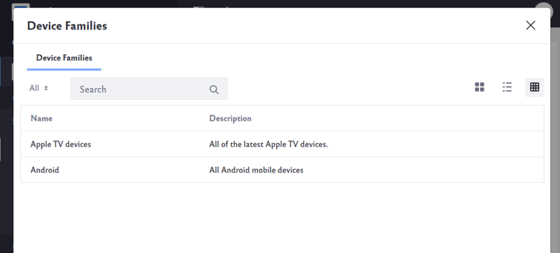

# Creating Mobile Device Rules

> Mobile Device Rules is available for Liferay 7.2 and prior only because Liferay Mobile Device Detection Lite is deprecated in 7.3.

As a prerequisite, you must install the [Liferay Mobile Device Detection Lite (LMDD)](https://web.liferay.com/marketplace/-/mp/application/92831494) app from Liferay Marketplace. This app provides the device detection database that's required to detect which mobile devices are accessing it. 

## Creating a Mobile Device Family

A Mobile Device Family is a group of mobile device actions based on the type of device. Before creating [mobile device actions](#adding-mobile-device-actions), create a Mobile Device Family. For example, create a group for all Android devices; if Liferay detects an Android device, it can redirect the visitor to a mobile-friendly page.

To create a Mobile Device Family,

1. Navigate to the desired Site. 
1. Click the () icon.
1. Go to *Configuration* &rarr; *Mobile Device Families*.
1. Click *Add* button () to add a *New Device Family*.
1. Enter a *Name* and *Description*.
1. Click *Save*.

The Mobile Device Families page lists the defined families.


To add families for all Sites, go to the Global site by clicking the Site Selector () &rarr; *My Sites* &rarr; *Global* and then add a new device family.

The rules defined for a family, along with the priorities of the families selected for a particular Site or page, determine which family's actions are applied to a given request. New rules can specify an operating system, rule type, physical screen size, and screen resolution. You can add as many rules to a family as you need in order to classify the devices on which you'd like to take actions.

1. In the *Mobile Device Families* page, click on the name of the Mobile Device Family. The Classification Rules page appears.
1. Click the *Add* button () to add a new rule.
1. Enter a *Name* and *Description*.
1. Select the classifications you want for this rule from *Operating System and Type*, *Physical Screen Size*, and *Screen Resolution*.

    

1. Click *Save*.

## Applying a Mobile Device Rule

You can add families to a Site, individual page, or page set from their respective configuration pages. To do it for a Page Set,

1. Go to *Site Builder* &rarr; *Pages* in your Site.
1. Click the () icon for the Public Pages.
1. Click the *Advanced* tab.
1. Expand the *Mobile Device Rules* section.
1. Click *Select* to open the list of families.
1. Select the families to apply.

    

1. Click *Save* when finished.

### Applying a Mobile Device Rule to a Page

You can configure each page to inherit the mobile device rules from the parent Site or you can apply a different rule to specific pages.

To configure a mobile device rule for a specific page,

1. Go to *Site Builder* &rarr; *Pages* in your Site.
1. Click on the  icon next to the desired page then *Configure*.
1. Click the *Advanced* tab.
1. Expand the *Mobile Device Rules* section.
1. Slide the toggle to *NO* to choose a different mobile device rule from the parent site.
1. Click *Select* to open the list of families.
1. Select the families to apply.

    

1. Click *Save* when finished.

## Adding Mobile Device Actions

Once you've created some mobile device families and added some rules to them, add mobile device actions. These actions defined for a family determine what happens to a request when the device is detected and the family has been found to apply.

```tip::
   Segmentation and Personalization has a *Device* rule that evaluates whether a User is accessing content using a particular device family. This rule is integrated with the Mobile Device Families app.
```

You can add Mobile Device Actions to a Page Set or to a specific page.

To add actions to a Mobile Device Rule on a Site,

1. Open the *Site Administration* menu for the Liferay Guest Site.
1. Click *Site Builder* &rarr; *Pages*.
1. Click the () icon next to *Public Pages*.
1. Click the *Advanced* tab.
1. Expand the *Mobile Device Rules* section.
1. Click *Options* () &rarr; *Manage Actions* next to the device family that you wish to add an action for.
1. Click *Add Action*.
1. Enter a *Name* and *Description*.
1. Select a *Type* (for example, *Redirect to Site*). See the [Mobile Device Actions Reference](#mobile-device-actions-reference) next to learn about the Types.
1. Select the desired Site where visitors will be redirected to.
1. Select the default landing page on the Site.

    

1. Click *Save* when finished.

The Mobile Device Action has been added to this Site.

## Mobile Device Actions Reference

Mobile Device Actions defined for a Mobile Device Family determine what happens to a request when the device is detected and the family has been found to apply.

By default, there are four kinds of actions that can be configured for mobile families:


| Mobile Device Action | Description |
| --- | --- |
| **Layout Template Modification** | Changes the way portlets are arranged on pages delivered to mobile devices. For example, you could have pages with more complex layouts automatically switch to a simpler template if it detects a mobile device---even if the resolution is theoretically high enough to support the standard layout. |
| **Theme Modification** | Selects a specific theme for different mobile device families. You'd have to have a mobile version of your Site's theme that is automatically applied when a device hits your page. |
| **URL Redirect** | Sends mobile users to any URL. This can be used to direct mobile users to a mobile app download or a mobile version of the page. |
| **Site Redirect** | Sends mobile users to a different Site on your portal. In some cases, mobile content could be created on a mirror of your Site. |

```tip::
   Liferay was designed from the ground up to be responsive and adapt to any device that might be accessing it. Before creating new themes or forcing a layout template change, you should test how the Site behaves out-of-the-box. Certain features, like URL Redirects, can be disruptive and frustrating if used improperly.
```

## Additional Information

* [Building a Responsive Site](./building-a-responsive-site.md)
