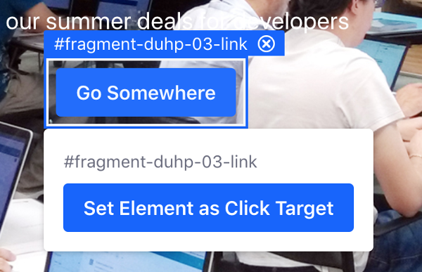

# Creating A/B Tests

Before creating A/B Tests, consider the following information:	

- You can create a test for a default Experience or a personalized Experience mapped to a Segment.
- You can only create an A/B Test for one page or experience at a time.
- You cannot edit an Experience that is part of a running A/B Test.
- You cannot create a test for an Experience that already has an active test running.	
- When you delete a Content Page or Experience that is part of an A/B test, you also delete the test.	

To create the A/B test, you must create the test first, and then you create one or more Test Variants.

## To Create the Test

1. Go to the Content Page where you want to run the A/B Test.
1. In the Control Menu, click the *A/B Testing* button ().
1. If you have created additional Experiences for the Content Page, select the Experience you want to test.
1. Click *Create Test*.
1. Enter a *Name* for your test, and optionally add a *Description*.
1. Select the goal you want to track with your test:

   - *Bounce Rate*: Percentage of users who arrive to the page, don't exhibit any activity (like click or scroll), and navigate away from the site without visiting another page
   - *Click*: Percentage of users who clicked on the page (per session)

1. Click *Save* to save the test as a *Draft* (not yet visible to visitors).

    ```note::
      You can always edit or delete the new A/B test by clicking the *Actions* button in the top right of the A/B Test menu. Deleted tests are not recoverable (i.e., not sent to the Recycle Bin). These options are not available for an active running test.
    ```

## To Create the Test Variant

A test Variant is a customization of the Experience you want to optimize with A/B Testing. Each A/B Test must have at least one Variant.

1. Open the A/B Test sidebar panel for your Content Page.
1. If you selected the *Click* goal for the A/B Test, you must also select the element you want to test:
    1. Under the *Active Test* tab and *Click Goal* section, click *Set Element*.

    

    1. Click the element you want to test on the Content Page.
    1. Click *Set Element as Click Target*.

    

    ```note::
       Only links and buttons with an ID attribute can be selected as a target for the click goal. The click target element applies to the whole A/B Test, and therefore it must be present in all variants.
    ```

1. Under the *Active Test* tab and *Variants* section, click *Create Variant*.
1. Enter a name for the variant and click *Save*.
1. Click the Edit button () next to the variant's name.

```note::
   The current Content Page is displayed as the baseline for the Variant.
```

1. Edit the variant with the changes you want to test and  to apply them. For example, if you want to test a different call-to-action text, update the button with the new text.
1. Click *Save Variant*.

* [A/B Testing](./ab-testing.md)
* [Configuring A/B Testing](./configuring-ab-testing.md)
* [Running and Monitoring A/B Tests](./running-and-monitoring-ab-tests)
* [Reviewing A/B Test Results and Publishing Test Variants](./reviewing-ab-test-results-and-publishing-test-variants.md)