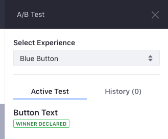
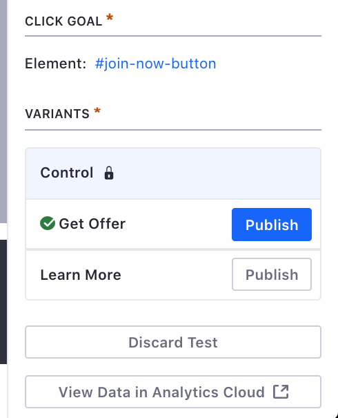

# Reviewing A/B Test Results and Publishing Test Variants

When the A/B Test finishes, Analytics Cloud computes and presents the results. You can find the test results in both Analytics Cloud and Liferay DXP. Analytics Cloud only declares a winner variant when the Confidence Level Required is achieved during the duration of the test. When the Confidence Level Required is not met, Analytics Cloud does not declare a winner. To understand how to configure the Confidence Level Required for your test, see [Running and Monitoring A/B Tests](./running-and-monitoring-ab-tests.md).

From Liferay DXP, you can publish the winning variant or any other variant that is not declared a winner.

To review the A/B Test results and publish your variant, follow these steps:

1. Go to the Content Page with your A/B Test.
1. In the Control Menu, click the *A/B Testing* button ().
1. If you have created additional Experiences for the Content Page, select the Experience.
1. Under the *Active Test* section, review the test results:
    
    - *Winner Declared*: One of the test variants met the Confidence Level Required.
    - *No Winner*: None of the test variants met the Confidence Level Required for the duration of the test.

        

1. Under the *Variants* section, you can:

    - *Publish* the winning variant, which is highlighted with the check mark.
    - *Publish* a non-winning variant.
    - *Discard Test*, to ignore the A/B test recommendations and keep the current Content Page.

        

When you publish one of the test variants, the variant becomes active for all users who visit the Content Page.
