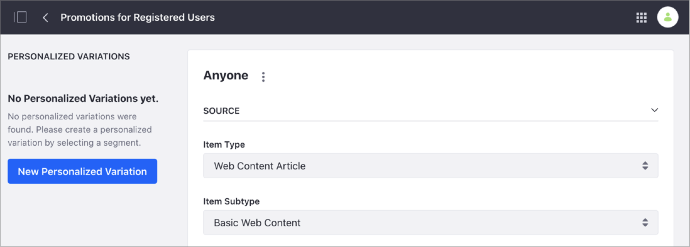
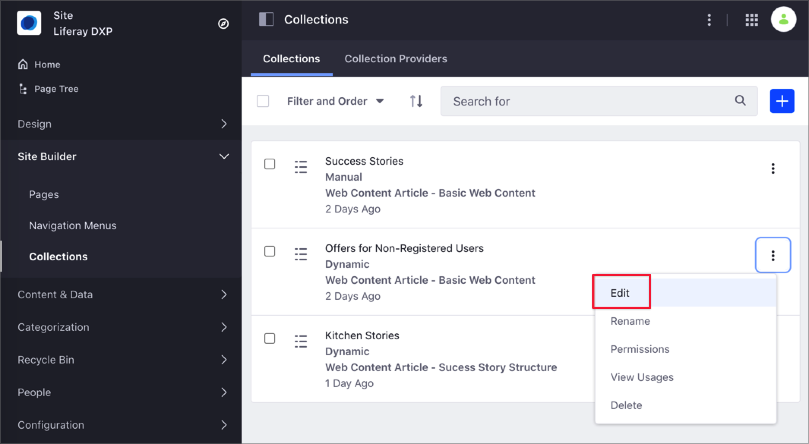
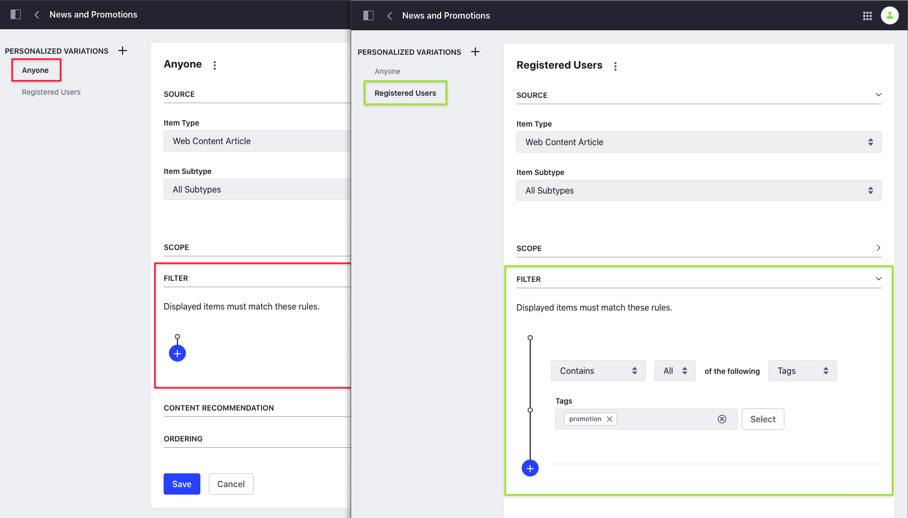

# Personalizing Collections

By default, all the items in a Collection are visible for all users and assigned to the *Anyone* group. You can create a *Personalized Variation* of the Collection's items using [Segments](../../site-building/personalizing-site-experience/segmentation/creating-and-managing-user-segments.md). When you use a Personalized Variation, the items that are part of your Collection don't change, but the Collection Page or Collection Display Fragment show the items filtered for the Segment.

```note::
   To customize a Collection using Segments, you must define your Segments first. For more information, see [Creating and Managing User Segments](../../site-building/personalizing-site-experience/segmentation/creating-and-managing-user-segments.md)
```



Consider the following example. You want to increase sales in your online Kitchenware Store by offering exclusive promotions to registered users. You create a Collection including promotions for registered users and news about your products. You want all users to see the news about your products, but you want to restrict the promotions to registered users. In this example, you can create a new Segment for registered users, and link the Segment to a new Personalized Variation that filters the promotional content.

```note::
   You can create multiple Personalized Variations for a Collection, and edit or delete them as needed. You can also edit the *Anyone* Personalized Variation, but you cannot delete it.
```

## Creating a Personalized Variation

1. Go to *Site Administration* &rarr; *Site Builder* &rarr; *Collections*.
1. From the *Collections* tab, click the *Options* menu () next to the Collection you want to customize and select *Edit*.

    

1. Under *Personalized Variations*, click *New Personalized Variation* or click the New button ().
1. In the *New Personalized Variation* dialog, click the Segment you want to associate to this Collection.
1. Configure the properties for the Personalized Variation. For more information, see [Creating Collections](./creating-collections.md#creating-a-dynamic-collection).

    For example, if this is Manual Collection, you can select the items you want to display in the Personalized Variation. If this is a Dynamic Collection, you can add a filter to customize the content.

    

1. If you are customizing a Dynamic Collection, click *Save*.
1. To preview the items that are part of this Collection:
    - In the Manual Collection, click on the Personalized Variation's name to see the items.
    - In the Dynamic Collection, click the *Options* menu () next to the Personalized Variation's name and select *View Items*.

        

## Related Information

- [Content Page Personalization](./content-page-personalization.md)
- [About Collections and Collection Pages](../../../content-authoring-and-management/collections-and-collection-pages/about-collections-and-collection-pages.md)
- [Creating User Segments](../segmentation/creating-and-managing-user-segments.md)
- [Assigning Roles to User Segments](../../../users-and-permissions/roles-and-permissions/assigning-roles-to-user-segments.md)
