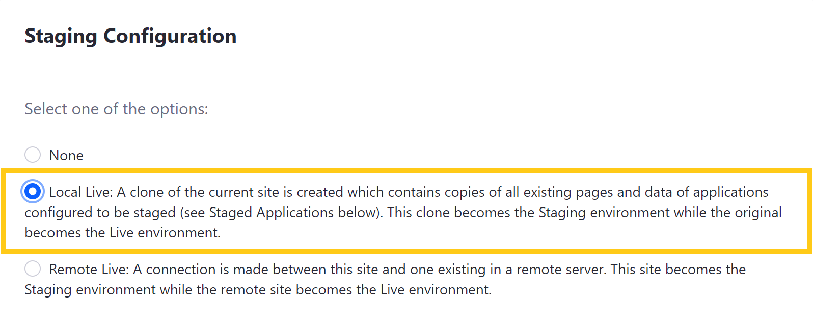
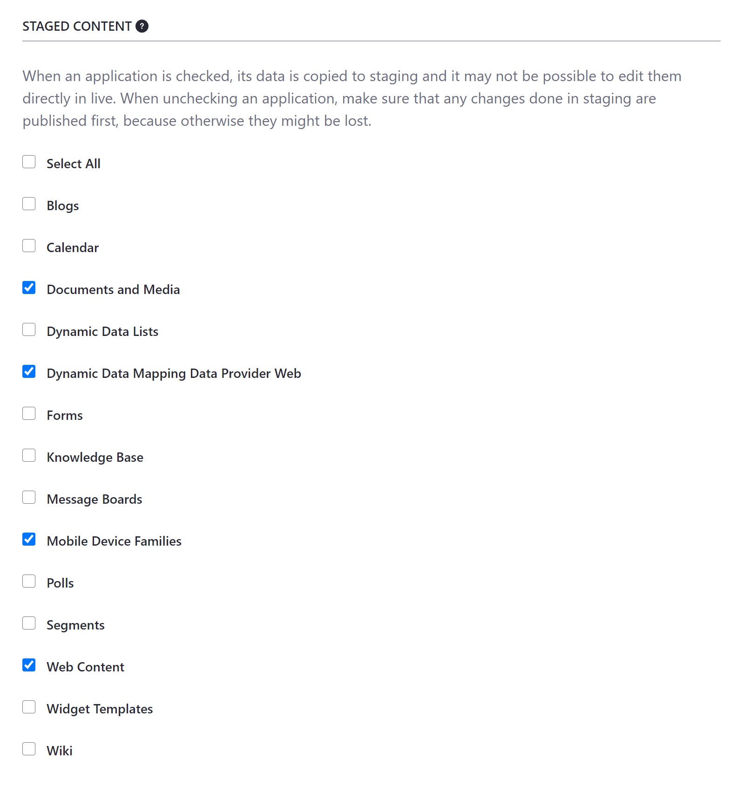

# Configuring Local Live Staging

With *Local Live Staging*, both your Staging and Live environments are hosted on the same Liferay server. When enabled, Liferay DXP creates a local clone of your Site that serves as the Staging environment, while your original instance becomes your Live environment.

Both environments share the same JVM, database, selected application data, and configurations, such as properties set in the `portal-ext.properties` file.

* [Setting Up Local Live Staging](#setting-up-local-live-staging)
* [Disabling Local Live Staging](#disabling-local-live-staging)

## Setting Up Local Live Staging

Follow these steps to set up Local Live Staging for your DXP instance:

1. Go to *Product Menu* &rarr; *Publishing* &rarr; *Staging*.

   

1. Select *Local Live*, which reveals additional fields for *Page Versioning* and *Staged Content*.

   

1. Select whether you want *Page Versioning* enabled on Public and/or Private Page sets.

   

1. Select the application data and content types you want to stage.

   

   ```warning::
      When an application is checked, its data is copied to Staging, and it may not be possible to edit them directly in Live. When unchecking an application, first make sure that any changes in Staging are published, since they may be lost.
   ```

1. Click on *Save* to initiate the cloning process. The duration of this process depends on the size of your Site.

   ```tip::
      Stage your Site early on to reduce cloning time and record a more complete history of your Site's update history, since updates are only recorded once you enable Page Versioning.
   ```

Once the process is complete, you are ready to use Local Live Staging. See [Staging UI Reference](./staging-ui-reference.md) for information about navigating the Staging environment's publishing features.

## Disabling Local Live Staging

If for any reason you need to disable Staging for your Site, you can easily do so from your staging environment. However, be aware that disabling Local Live Staging will delete the Staging environment, along with all unpublished content. For this reason, ensure all necessary information is published or preserved elsewhere before disabling Staging. This process may take some time, depending on the size of your Staging environment. So it's best not to disable staging when your DXP instance is busy.

Follow these steps to disable Local Live Staging:

1. Open the Product Menu in your Staging environment, and go to *Publishing* &rarr; *Staging*.

1. Click on the *Actions* button (  located in the *Application* bar, and select *Staging Configuration*.

1. Select *None* for your Staging configuration, and click on *Save*.

## Additional Information

* [Staging Overview](./staging-overview.md)
* [Staging UI Reference](./staging-ui-reference.md)
* [Managing Staging Permissions](./managing-staging-permissions.md)
* [Managing Data and Content Types in Staging](managing-data-and-content-types-in-staging.md)
