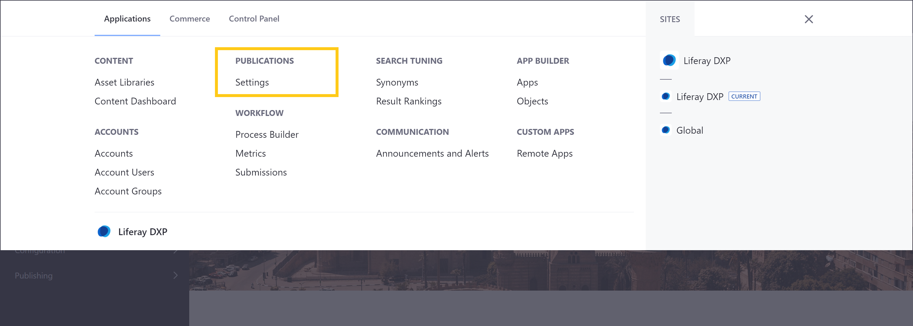
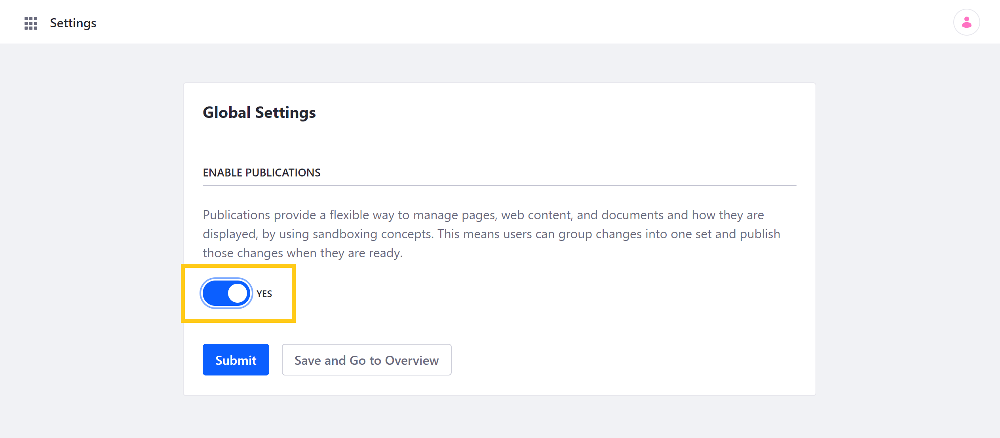

# Enabling Publications

Publications provides a convenient and flexible way for you and your teams to develop, track, and publish changes to your DXP instance. When enabled, Publications is activated globally and can be accessed anywhere to edit supported entities in your instance.

```important::
   Staging and Publications cannot be enabled at the same time. If Staging is enabled on any of your Sites, you must first disable Staging before enabling Publications. See `Disabling Local Live Staging <../staging/configuring-local-live-staging.html#disabling-local-live-staging>`_ and `Disabling Remote Live Staging <../staging/configuring-remote-live-staging.html#disabling-remote-live-staging>`_ for more information.
```

## How to Enable Publications

1. Go to the *Global Menu* () and click on *Settings* under *Publications*.

    

1. Set the toggle switch to *Yes* to enable Publications for your DXP instance.

1. Click on *Submit* to save your configuration.

    Alternatively, you can click on *Save and Go to Overview*, which saves your configuration and redirects you to the Publications overview page.

    

Once enabled, you can access the drop-down Publications bar menu from any page in your DXP instance. You can use this menu to create new publications, select which publication you want to work on, switch between edit and production modes, and review and publish your select publication's changes, either immediately or at a later time. See [Creating and Managing Publications](./creating-and-managing-publications.md) to learn about creating, editing, and removing individual publications.

## How to Disable Publications

Once enabled, you can disable Publications at any time, via the Publications *Settings* page. Set the toggle switch to *No* and then click on *Submit*.

```important::
   Once disabled, all active publications are deactivated, scheduled publications are canceled, and you can no longer access your publication history. DXP, however, retains your instance's publication history, so you can access it again if you re-enable Publications.
```

## Additional Information

* [Publications Overview](./publications-overview.md)
* [Creating and Managing Publications](./creating-and-managing-publications.md)
* [Making and Publishing Changes](./making-and-publishing-changes.md)
