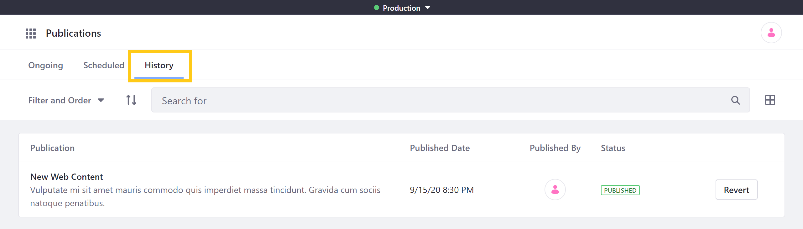
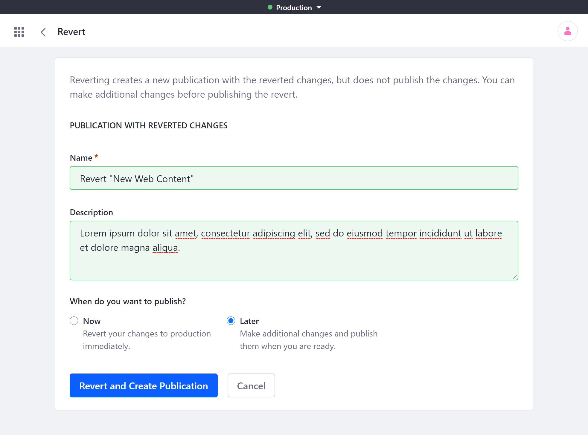

# Reverting Changes

Liferay DXP's Publication tool maintains a history of all published changes. You can use this publishing history to create publications that revert earlier changes to your instance. While reverting changes, you can also make additional changes to your DXP instance as part of your Revert publication.

1. Go to the *Publications* overview page and click on the *History* tab.

   

1. Click on *Revert* for the publication or reversion you would like to revert.

1. Use the *Name* field to determine the name of your reversion. The default name for revert publications is `Revert "[Publication Name]"`.

1. Optionally, enter a description for your reversion.

1. Determine when you want to publish your reversion, whether *Now* or *Later*.

   

1. Click on *Revert and Create Publication*.

This creates a new publication with changes that undo all the changes made by your selected publication across your instance, but it does not immediately apply those changes to production.

If you selected to publish the reverting changes *Now*, you are redirected to the Publish page. If there are no conflicts, you can click *Publish* to publish your reverting changes.

If you selected to publish the reverting changes *Later*, you are redirected to the Review Changes page for your new publication. At this point, you can make further changes to your publication, and then publish both your reverting and new changes when ready.

## Additional Information

* [Creating and Managing Publications](./creating-and-managing-publications.md)
* [Making and Publishing Changes](./making-and-publishing-changes.md)
* [Resolving Conflicts](resolving-conflicts.md)
