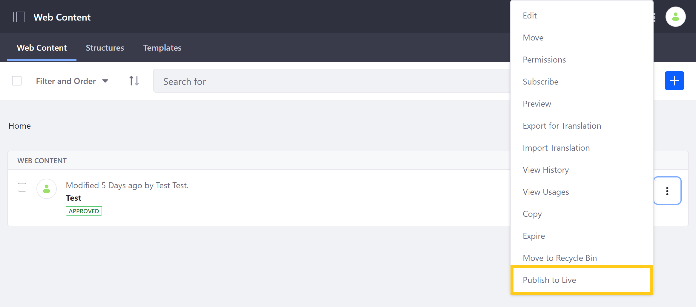
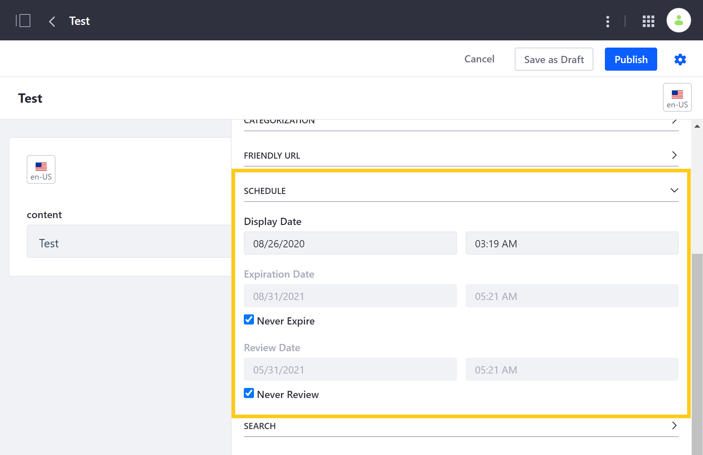
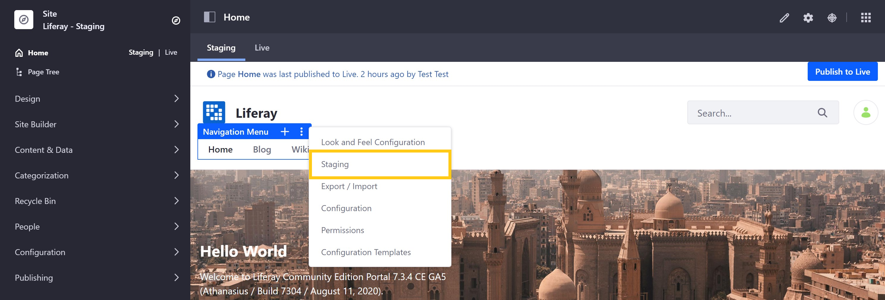

# Publishing Single Assets and Widgets

With Liferay DXP, you can publish single assets and widgets when needed, without going through the entire publication process. You can also schedule when web content is published.

## Publishing Single Assets

To publish assets in this way, Users must have the following permissions: *Export/Import Application Info* and *Publish Staging*. See [Managing Staging Permissions](./managing-staging-permissions.md) for more information.

Follow these steps to publish a single asset:

1. Go to *Content & Data* in the *Product* menu, and select the content or data type you would like to publish.

1. Click on the *Actions* button (  ) for the asset you want to publish, and select *Publish to Live*.

   

Once you confirm your publication, you'll be directed to a process page where you can see the status of your publication.

Similar to the standard publication process, single asset publications include associated dependencies, whether images, custom templates, or folders.

```note::
   Single asset publication is not supported for page-scoped content.
```

## Scheduling Web Content Publication

With Liferay DXP's web content framework, you can determine when your content goes live and when the content is displayed, expired, or reviewed. This is an excellent way to keep your Site current and free from outdated and incorrect information.

Follow these steps to schedule a web content publication:

1. Navigate to the *Product Menu* &rarr; *Content & Data* &rarr; *Web Content*.

1. Create a new web content item by selecting the *Add Web Content* button () &rarr; *Basic Web Content*. Then, click on the web content *Properties* button.

   You can also configure scheduling properties for existing web content.

   

1. Click on the *Cog* icon, and select the *Schedule* tab from the *Properties* menu. Then, configure the publication schedule.

    **Display Date**: The *Display Date* sets (within a minute) when content will be displayed.

    **Expiration Date**: The *Expiration Date* sets a date to expire the content. The default is one year.

    **Never Expire**: The *Never Expire* option sets your content to never expire.

    **Review Date**: The *Review Date* sets a content review date.

    **Never Review**: The *Never Review* option sets the content to never be reviewed.

    

1. When you are finished, click on *Publish*.

Your web content article is now created and will be published according to your configuration.

When you set a *Display Date* for an existing article it does not affect previous versions of the article. If a previous version is published, it remains the same until the new version is scheduled to display. However, the expiration date affects all versions of the article. Once an article has expired, no version of that article appears.

```tip::
   If you want only the latest version of articles to expire, and not every past version, go to *Control Panel* → *Configuration* → *System Settings* → *Web Content* → *Virtual Instance Scope* → *Web Content*. From here, uncheck *Expire All Article Versions Enabled*. This makes the previously approved version of an article appear if the latest version expires.
```

## Publishing Single Widgets

Although Staging is typically used to publish content, you can also publish widgets. For example, you can modify a widget's title and publish the change to live. This is possible because widget configurations are always staged. To publish a widget that is on a Page, you must publish the Page first.

After changing a widget, you can publish the widget by clicking on the *Actions* button (  ) for the widget and selecting *Staging*.



## Additional Information

* [Staging Overview](./staging-overview.md)
* [Managing Staging Permissions](./managing-staging-permissions.md)
* [Page Versioning](./page-versioning.md)
* [Staging UI Reference](./staging-ui-reference.md)
