# Staging UI Reference

After enabling Local or Remote Live Staging for your Site, most Page configuration options are only accessible in your Staging environment. This prevents users from directly editing Live Pages.

Also, once staging is enabled, you can access additional options in your Staging environment. These options are located in the *Staging bar*, *Publish to Live* menu, and *Staging Page*.

* [Staging Bar](#staging-bar)
* [Publish to Live](#publish-to-live)
* [Staging Page](#staging-page)

## Staging Bar

When Staging is enabled for a Site, you can access additional options via the Staging bar on each of your Site's Pages. In this bar you can toggle between Staging and Live environments, as well as click on *Publish to Live* for your staged Pages.

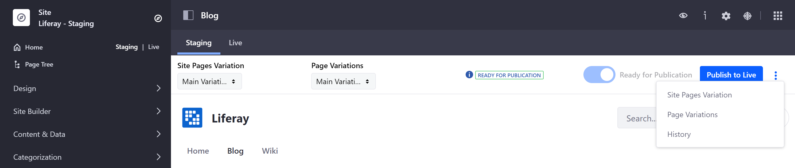

You can also access the following options for Widget Pages in your Staging environment via the Staging bar:

* **Site Pages Variation**: You can toggle between variations of Page sets in your staged Site using the dropdown menu. You can also manage and create Page set variations by clicking on the *Actions* button (  ) in the Staging bar and selecting *Site Pages Variation*. See [Page Versioning](./page-versioning.md) for more information.

* **Page Variations**: You can toggle between variations of a single Page in your staged Site using the dropdown menu. You can also manage and create Page variations by clicking on the *Actions* button (  ) in the Staging bar and selecting *Page Variations*. See [Page Versioning](./page-versioning.md) for more information.

* **Undo/Redo**: You can undo or redo recent changes to a Page by clicking on the *Actions* button () in the Staging bar and selecting *Undo*/*Redo*. Once you've marked a Page as *Ready for Publication*, you are unable to undo or redo recent changes.

* **History**: You can view and manage the history of Page revisions by clicking on the *Actions* button () in the Staging bar and selecting *History*. From here, you can also revert a Page to an earlier version by clicking on the *Actions* button () for the Page version you want to restore and selecting *Mark as Ready for Publication*.

* **Ready for Publication**: When you have finished making your changes, click on *Ready for Publication* to change the Page's status from *Draft* to *Ready for Publication*. You can then click *Publish to Live* to configure and initiate the publication process for your changes. When you publish a Page to Live, only the version *Marked as Ready for Publication* is published.

## Publish to Live

When you click on *Publish to Live*, a modal window appears with additional options for configuring your publication. You can make your publication using *Simple* or *Advanced* settings.

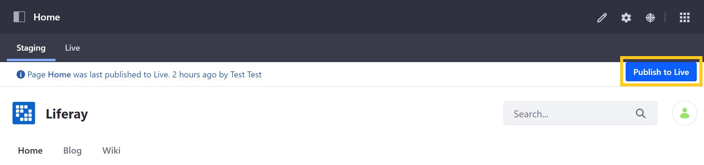

## Simple Publication

The *Simple Publication* tab of the modal window includes the following sections:

**Name**: Enter a descriptive name for your publication into the *Name* field.

**Changes Since Last Publication**: View staged changes made since your last publication.

**Pages to Publish**: View the number of Pages included in your publication.

    ```note::
       This displays the number of Page deletions tracked by the Staging framework. Keep in mind that this number counts the Page deletions on the staging Site, not how many Pages will be deleted on the on the live Site. There could be an inconsistency between the number of Page deletions to be published and the actual number of Pages present on either of the staging and live Sites.
    ```

When ready, click on *Publish to Live* to initiate publishing.

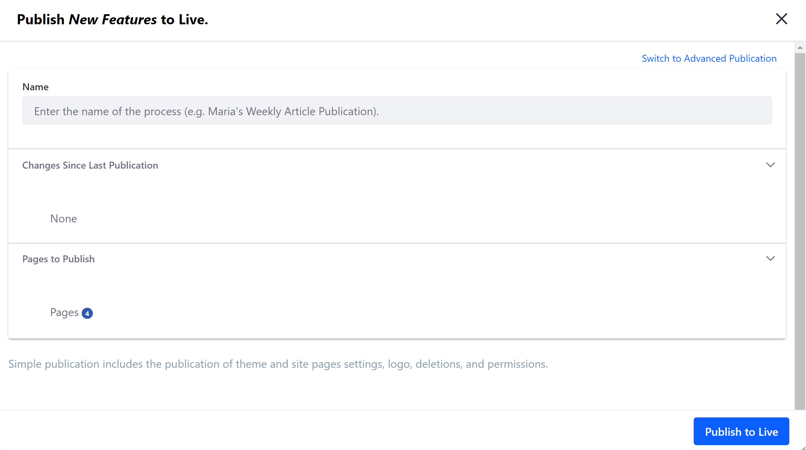

## Advanced Publication

With Advanced Publication, you can choose to define custom publication settings or use a saved publishing template. To access advanced publication settings, click on *Switch to Advanced Publication* in the modal window.

Here, you can access information and settings that you can use to customize your publication. In the *Custom* tab, you can specify content, dates, Pages, and more for your publication. You can switch to the *Publish Template* tab and use a pre-configured template for your publication.

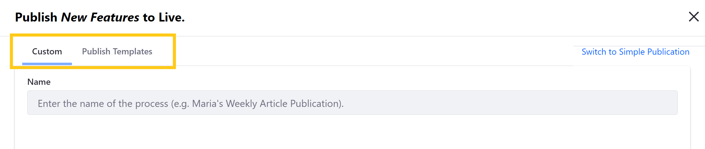

*Custom* advanced publication settings are divided into the following sections:

**Name**: Enter a descriptive name for your publication into the *Name* field.

**Date**: Select whether to publish your changes *now*/immediately, or *schedule* your changes to be published at a later date and time. You can also determine whether and how frequently your publication is repeated.

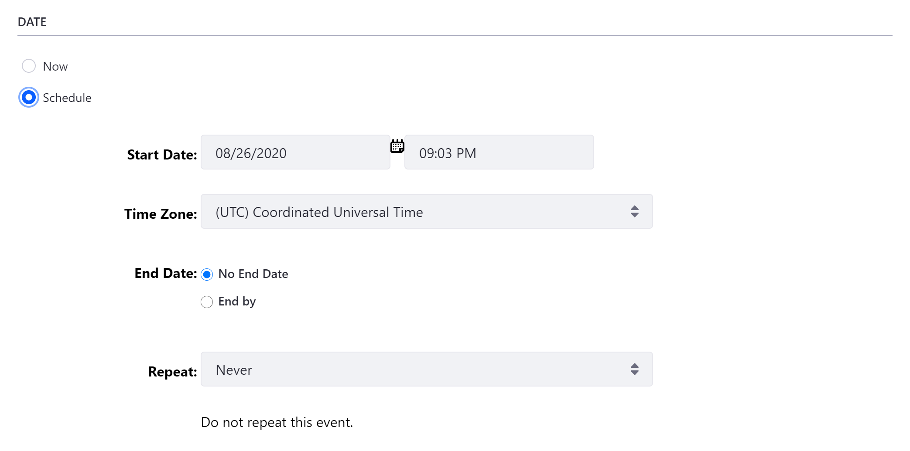

**Deletions**: Select whether you want to *Delete Application Data Before Importing*, and whether you want to *Replicate Individual Deletions*.

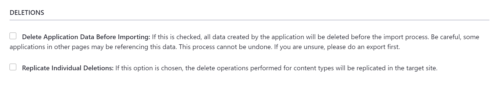

**Pages**: Select which Page set variation and individual Pages you want to publish, as well as the look and feel of your selected Pages. You can also select whether to *Delete Missing Pages*, which deletes all Pages from the live Site that are not present on the staging Site. If you choose a Page to be published from the Pages menu, the widgets and their references are always published.


If you want to publish pages with a custom theme, you must check the Theme Settings option under the *Look and Feel* heading for your staging configuration. Otherwise, the default theme is applied.

**Content**: Select the content you want to include in your publication. You can publish *all* content of the selected types, or specify a date and time parameter to limit the content published. You can also click on *Change* for each content type to manage items and other settings included in each type, such as *version history*, *vocabularies*, and *previews and thumbnails*. See [Publish Templates](#publish-templates) for more information.

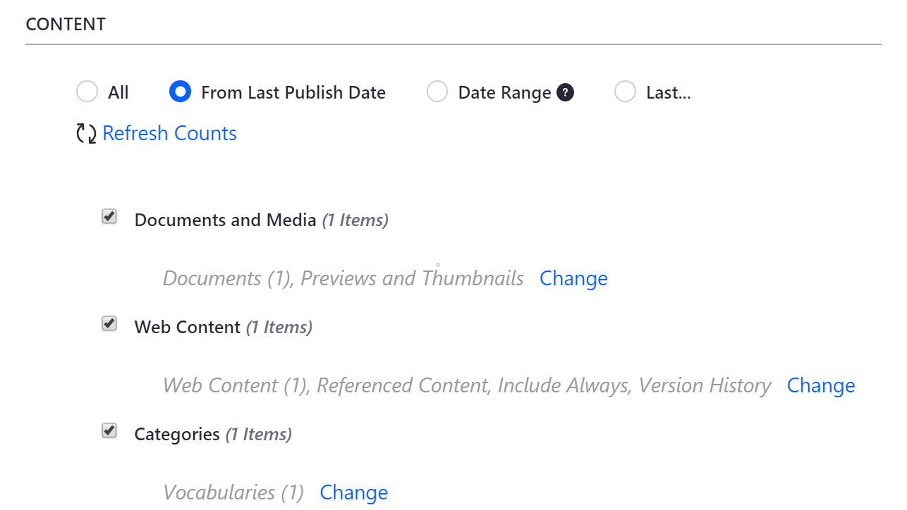

**Permissions**: Select whether to include permissions for the Pages and widgets when your changes are published.

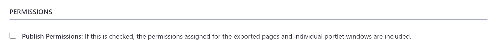

Instead of manually configuring advanced options every time you publish a Page or content, you can use pre-configured *publication templates*. To view and select a saved template for your publication, click on the *Publish Templates* tab.

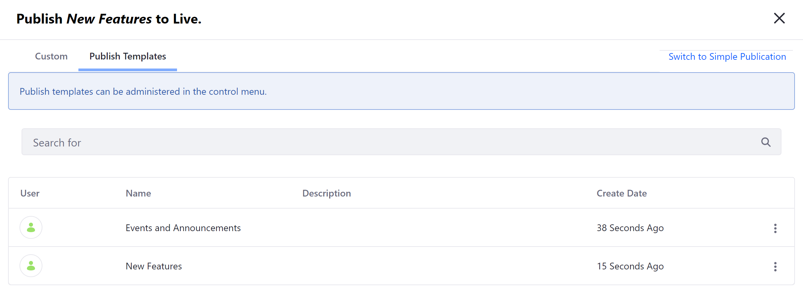

When ready, click on *Publish to Live* to initiate publishing.

## Staging Page

Once you've enabled Staging, the options available from the *Publishing* tab are modified. When in the Live environment, you can only access the *Export* feature. When in the Staging environment, you can only access the *Import* and *Staging* features.

You can also access new options in the Staging Page. You can now view publication *processes*, create and manage *publish templates*, and modify or disable Staging for your Site.

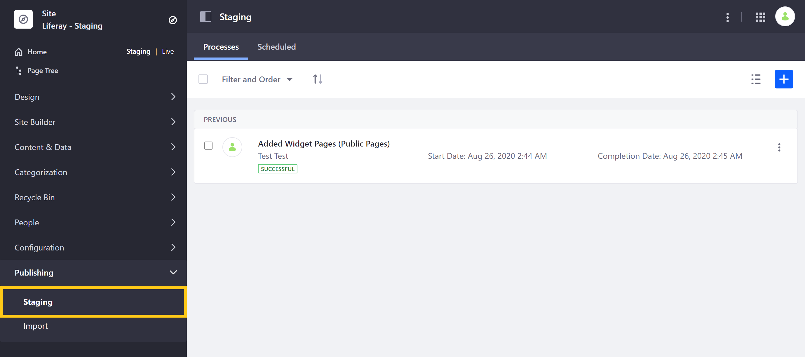

### Previous and Future Publication Processes

When you publish with Staging, it's captured as a *process* and stored for future reference. To view and manage these processes, go to *Product Menu* &rarr; *Publishing* &rarr; *Staging*.

In the *Processes* tab, you'll see a list of staging processes that have been completed. You can *relaunch*, *clear* or view a *summary* of any previous publications by clicking on a process's *Actions* button (  ).

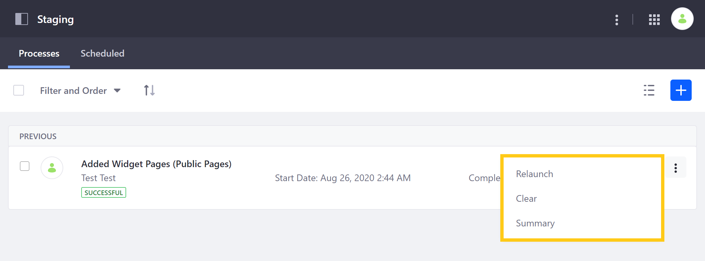

If you click on the *Scheduled* tab, you can view all scheduled publication processes. You can also click on the *Add* () button to create a new publication process using a custom configuration or pre-defined publishing template.

### Publish Templates

If you regularly create similar staging configurations, you can create your own *publish templates* to save time. To create a template, click on the *Actions* button (  ) in the *Application* bar of the *Staging* Page. Then, select *Publish Templates*.

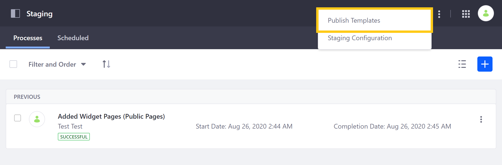

From here, you can create and manage templates for frequent publishing configurations. You can then use a template by clicking on its *Actions* button (  ) and selecting *Publish*.

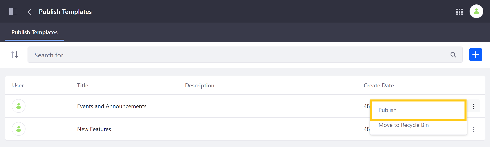

You can also use a template when publishing a Page or content using the *Publish to Live* button in the Staging bar. See [Advanced Publication](#advanced-publication) for more information.

### Staging Configuration

After setting up Staging, you can access the Staging Configuration Page by clicking on the *Actions* button (  ) in the *Application* bar of the *Staging* Page. Then, select *Staging Configuration*.


From here, you can disable Staging for your Site, or modify your [Page versioning](page-versioning.md) settings. However, *Staged Content* options cannot be modified after the initial setup.

## Additional Information

* [Staging Overview](./staging-overview.md)
* [Page Versioning](./page-versioning.md)
