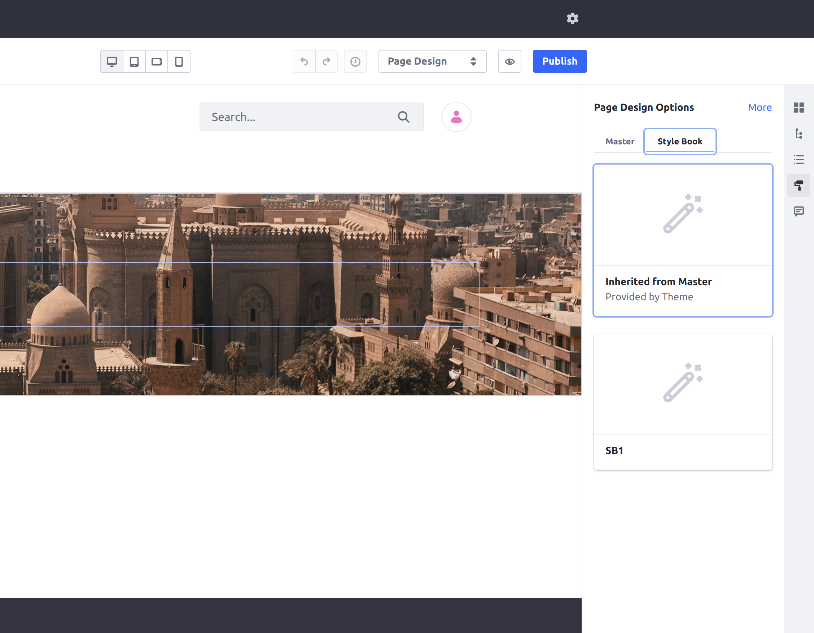
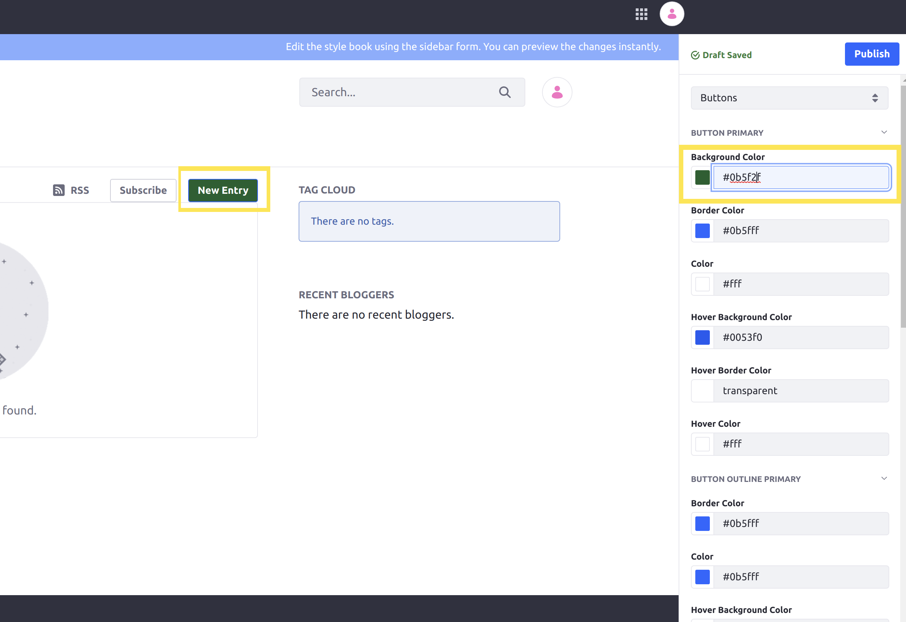

# Using a Style Book to Standardize Site Experience

A Style Book is a set of visual rules that apply to a Site to provide a consistent experience across its pages. They determine various visual settings on the Site, including spacing between elements (such as widgets), colors, and fonts. Each of these settings applies equally to every page using the Style Book.

Developers can also customize the categories with new options for configuring Style Books. See [Style Book Token Definitions](./developer-guide/style-book-token-definitions.md) for more information.

**Contents:**

* [Choosing a Style Book for a Page](#choosing-a-style-book-for-a-page)
* [Creating a New Style Book](#creating-a-new-style-book)
* [Default Classic Theme Categories](#default-classic-theme-categories)

## Choosing a Style Book for a Page

Follow these steps to change the Style Book in use for any page:

1. Click the Edit icon () near the top of the page.

1. Click the icon () on the right side of the screen to open the *Page Design Options* menu.

1. Click to open the *Style Book* tab.

    

1. Select the desired Style Book from the list.

1. Click *Publish*.

The page is published using the new Style Book.

## Creating a New Style Book

Follow these steps to add a new Style Book to your Site:

1. Navigate to the *Site Menu* &rarr; *Style Books*.

1. Click the Add icon () near the top of the page.

1. Enter a name for the Style Book, and then click *Save*.

1. Change any of the available options desired from the different categories available to customize for your Style Book by selecting the options from the drop-down box in the menu on the right side of the screen.

    

    The options available in the provided categories for your Style Book depend on the theme being used for your Site. See the [default Classic theme categories](#default-classic-theme-categories) for more information on the categories available for the default Classic theme.

1. Click *Publish*.

The Style Book is now available to select as an option for any page when editing.

To make this Style Book the new default for your Site, open the Actions menu () beside the newly created Style Book, and then click *Mark as Default*.

## Default Classic Theme Categories

When you are editing a Style Book, each of the categories available from the drop-down box gives a different set of options for styling your pages.

```tip::
   You can place the ``Style Guide Sample`` widget on your pages to help test out the various options in your Style Book categories. This sample widget contains many different UI elements that leverage most of the options available for the Classic theme, so you can refer to it while testing out the various options.
```

The categories listed here are available as options for the Classic theme.

### Color System

Each of the colors used for various fonts and visual elements defined in your theme is customizable in the Color System category. In general, this allows modifying the body, background, and text colors on your pages.


```note::
   Changing the colors for alert-related (such as "Success" or "Warning") may not affect the color of incoming alerts on your Site because each type of alert may use one of many colors. In order to fully customize the color of alerts, you must define a variety of customizable colors to use for them in your own theme's categories.
```

### Spacing

Adjust the spacing between the main elements on your pages with the options in the Spacing category.

### General

The General category gives options for changing the color and spacing for elements that appear on every page of your Site. For example, the *Body Background* option changes the background color of all pages.


### Layout

The Layout category provides options to change the width of containers on your pages. For example, the default container on new Blank pages is configurable via the size of the Extra Large setting.

### Typography

The Typography category allows you to define new fonts for your pages. You can also adjust the size of headers via the options in this category.

### Buttons

In the Buttons category, you can modify the style for the default types of buttons. You can customize the background, foreground, and border colors for each of the buttons used in the Classic theme.



## Additional Information

* [Style Book Token Definitions](./developer-guide/style-book-token-definitions.md)
* [Adding a New Token Set for Your Style Book](./developer-guide/adding-a-new-token-set-for-your-style-book.md)