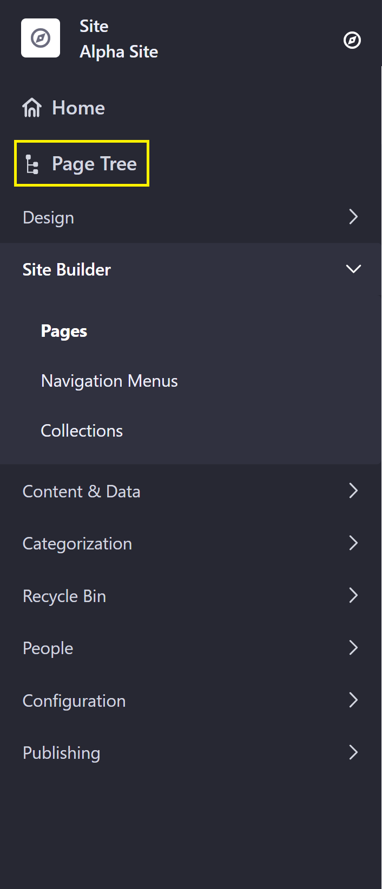
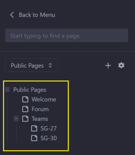

# Configuring Site Navigation

There are multiple functionalities in DXP to configure Site Navigation; users can leverage the _Navigation Menu_ application and widget, use a Page Tree, and add and manage Collections.

## Using Site Builder

Beginning in 7.3, we have a Home page in the DXP Guest site that is a Content Page; previously it was a Widget page.

## Managing Pages

New pages are created on the _Site Builder_ &rarr; _Pages_ page in _Site Administration_. Pages can be created as _Public Pages_ which anyone can view, or _Private Pages_ which can only be viewed by Site Members. See [Adding a Page to a Site](../creating-pages/adding-pages/adding-a-page-to-a-site.md) to learn how to add a page.

## Using Navigation Menus

See [Using Navigation Menus](./using-navigation-menus.md) for to learn how to create Navigation Menus and deploy them on a site page. See the [Navigation Menu Widget Reference](./navigation-menu-widget-reference.md) to learn more about how to configure the _Navigation Menu_ widget.

## Using the Page Tree

Users can view and configure the pages in each site in a vertical hierarchy.

To access the Page Tree:

1. Navigate to the your site's _Site Administration_.
1. Click _Page Tree_.

    

1. The left menu displays the site's pages and child pages:

    

In the Page Tree view, users are still able to add more pages or more child pages, configure a page, and toggle between Public and Private Pages.

## Using Collections

See [Understanding Collections](../content-authoring-and-management/collections/user-guide/README.rst) to learn more about Collections and how to create them.

## Additional Information

* [Adding a Page to a Site](../creating-pages/adding-pages/adding-a-page-to-a-site.md)
* [Using Navigation Menus](./using-navigation-menus.md)
* [Managing Page Hierarchies](./managing-page-hierarchies.md)
