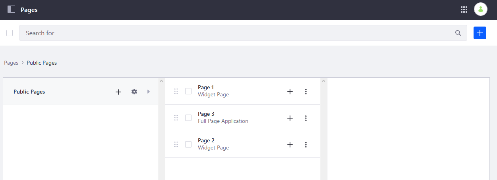
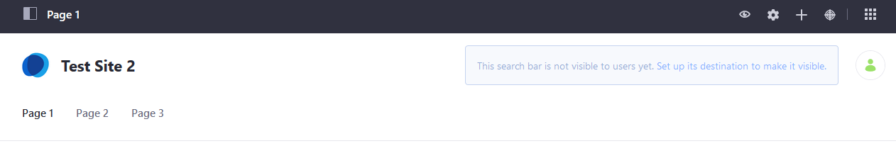
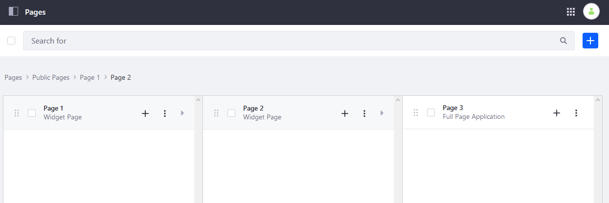

# Managing Page Hierarchies

Using the Page Hierarchy, you create public and private pages and organize those pages in whatever order or structure that you see fit.

## Creating a Page

New pages are created on the _Site Builder_ &rarr; _Pages_ page in _Site Administration_. Pages can be created as _Public Pages_ which anyone can view, or _Private Pages_ which can only be viewed by Site Members. See [Adding a Page to a Site](../creating-pages/adding-pages/adding-a-page-to-a-site.md) to learn how to add a page.

Now that the page is created, it appears in the hierarchy, and you can move or organize its position there.

## Organizing Pages

You can drag and drop one more Pages to reorder their position in the page hierarchy (and subsequently the default navigation that users see) or to nest them as sub-pages. The page at the top of the list is the first page that users see automatically when visiting your Site. You can treat this as the site's landing page.

### Reordering Pages

To reorder your pages:

1. Navigate to the your site's _Site Administration_.
1. Click _Site Builder_ &rarr; _Pages_.

    

1. Drag and drop _Page 2_ above _Page 3_ page.
1. Click _Home_ to see the changes.

    

The page order has been changed.

### Nesting Pages

You can nest pages up to four levels. Follow the steps below:

1. Navigate to the your site's _Site Administration_.
1. Click _Site Builder_ &rarr; _Pages_.
1. Drag and drop _Page 3_ inside _Page 2_ to nest it.
1. Drag _Page 2_ inside _Page 1_.

    

1. Click _Home_ to view the nested pages.

### Public and Private Pages

As noted above, Private Pages work just like Public Pages, except they can be viewed only by registered members of a Site. In the default configuration, Public Pages are at the URL `[web-address]/`**web**`/[site-name]` while Private Pages are at `[web-address]/`**group**`/[site-name]`. Other than the membership distinctions, Public and Private Pages share the same behavior.

## Configuring Page Options

Users can access page options by clicking on the _Options_ () icon.

| Function | Description |
| --- | --- |
| **View** | View the selected page on the Site. |
| **Configure** | View the Page Configuration screen. |
| **Copy Page** | Create a new page in the current Site that duplicates the selected page. |
| **Permissions** | Configure the page's Permissions. |
| **Orphan Widgets** | Clears the data related to widgets that have been removed from the page. |
| **Delete** | Deletes the page and all its data. |

## Additional Information

* [Using Navigation Menus](./using-navigation-menus.md)
* [Navigation Menu Widget Reference](./navigation-menu-widget-reference.md)
