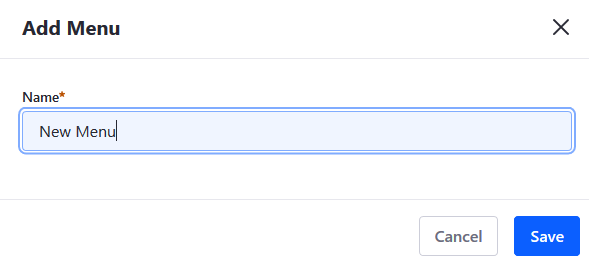
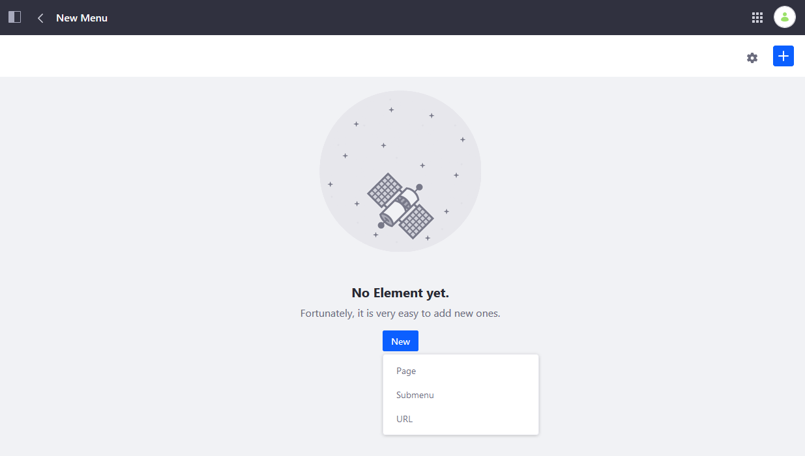
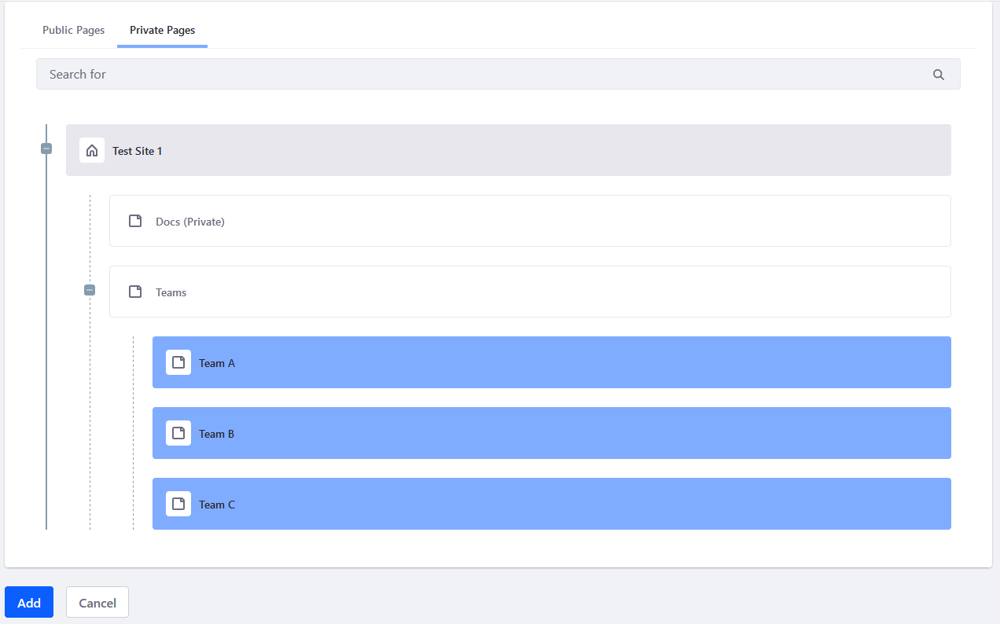
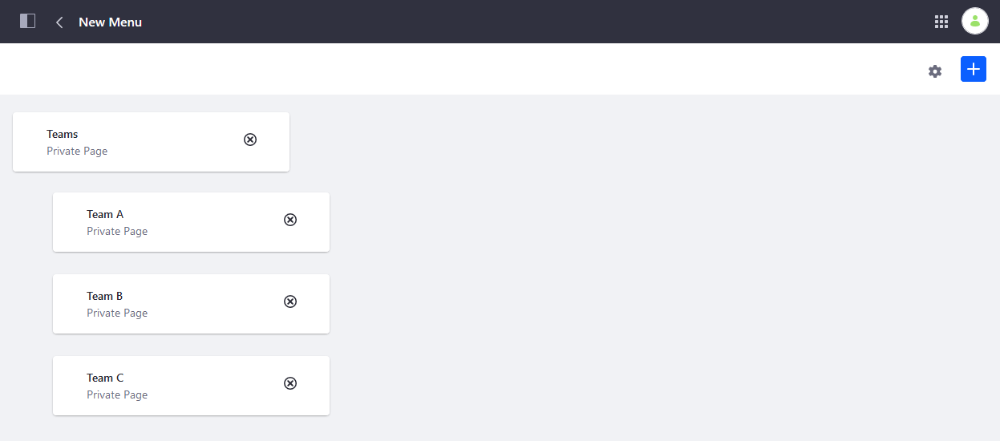
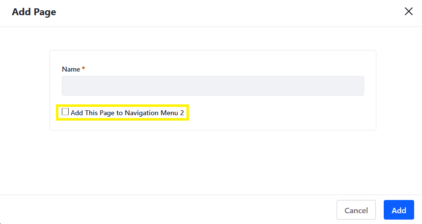
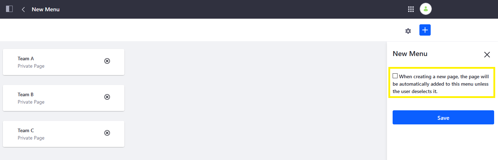
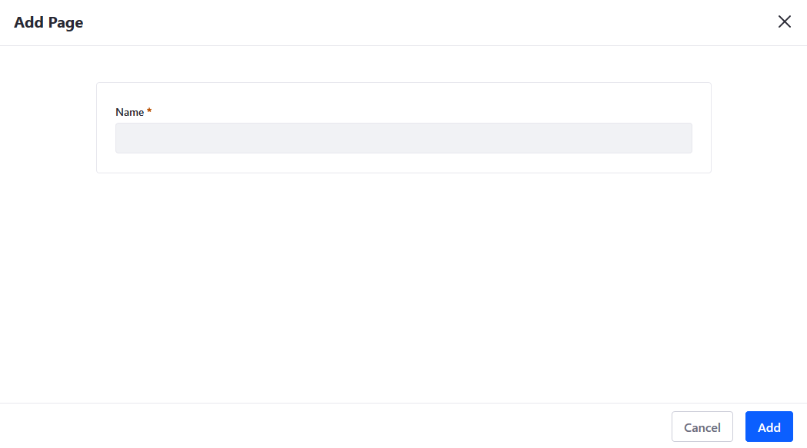
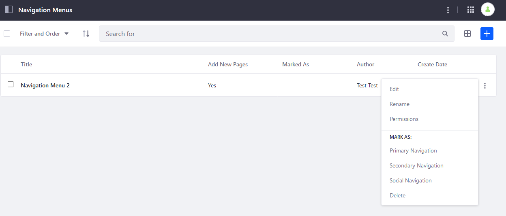

# Using Navigation Menus

You can create _Navigation Menus_ to group desired pages. For example, a navigation menu can contains all child pages of a given page. You can display the menu using the navigation menu widget on the parent page, and you've created a mini-site containing only relevant information. 

## Creating Navigation Menus

1. Click _Product Menu_ () &rarr; _Site Builder_ &rarr; _Navigation Menus_.
1. Click the _Add_ button () to add a new menu.
1. Enter a name: (for example: _New Menu_).

    

1. Click _Save_ when finished.

The new navigation menu has been created.

## Assigning Existing Pages to a Navigation Menu

There are two main ways to assign existing pages to a navigation menu: click the _New_ button or the _Add_ button ().

1. Click _New_ &rarr; _Page_.

    

1. Select the pages to be included into this navigation menu; in this example, three child pages from the private pages are to be included.

    

1. Click _Add_ when finished.
1. Verify that the new navigation menu has been created.

    

## Assigning New Pages to a Navigation Menu

You don't have to [create any pages](../creating-pages/adding-pages/adding-a-page-to-a-site.md) before creating navigation menus. You can create a navigation menu first and then assign the pages later, when you create them. 

To disable automatically adding new pages to a navigation menu,

1. Click the () icon next to the desired _Navigation Menu_ (for example, _New Menu_) then _Edit_.
1. Click the () icon.
1. Uncheck the box.

    

1. Click _Save_ when finished.

Once disabled, you're not prompted to add the page to a navigation menu.

## Marking a Navigation Menu

You can mark a navigation menu as

* Primary Navigation
* Secondary Navigation
* Social Navigation

1. Click the () icon next to the desired navigation menu (for example, _New Menu_)
1. Click the desired navigation (for example, _Primary Navigation_).

   

The navigation menu type appears in the _Marked As_ field. For more information about each type, see the [Navigation Menu Widget Reference](./navigation-menu-widget-reference.md#navigation-menu).

## Deleting a Navigation Menu

1. Click the () icon next to the desired navigation menu (for example, _New Menu_) then _Delete_.
1. Click _OK_ in the confirmation.

The Navigation Menu has been deleted.

## Additional Information

* [Configuring Site Navigation](./configuring-site-navigation.md)
* [Navigation Menu Widget Reference](./navigation-menu-widget-reference.md)
