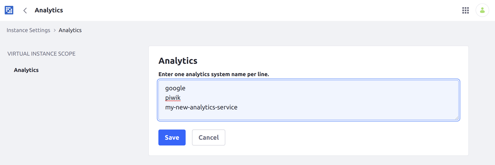
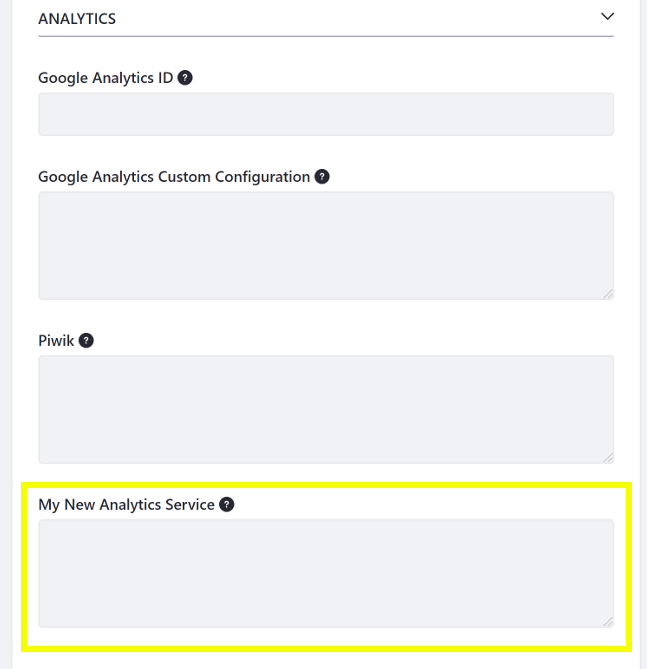

# Adding a New Analytics Service

Liferay DXP includes support for Google Analytics and Piwik for analyzing traffic on your Site. If you require a different analytics service, you can add it for your Site. Follow these steps to enable a new analytics service:

## Adding a New Analytics Service

1. Open the [Global Menu](../../getting-started/navigating-dxp.md) (  ) and go to *Control Panel* &rarr; *Instance Settings*.

1. Select *Analytics* under the *Platform* heading.

1. Enter the name of any additional service you want to add in the *Analytics* field provided.

    

## Adding the Tracking Code for your Analytics Service

1. Once you have entered the name, open the Site Menu and go to *Configuration* &rarr; *Settings* &rarr; *Advanced* &rarr; *Analytics* page for the Site where you wish to add analytics.

    ```note::
       In Liferay DXP 7.1 and 7.2, instead navigate to *Configuration* → *Site Settings* → *Advanced* → *Analytics* in the Site Menu.
    ```

1. Copy the JavaScript tracking code provided by your analytics platform into the corresponding field for your service.

    

Now all pages on the selected Site contain the tracking script and send analytics data to your analytics platform.
