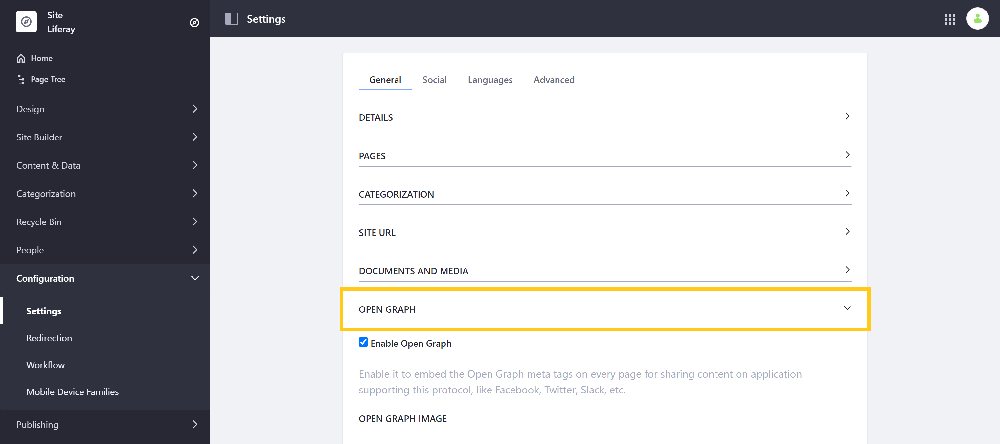
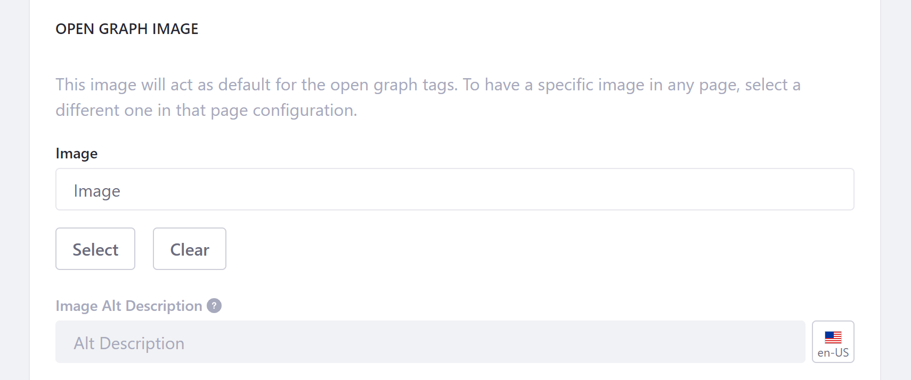
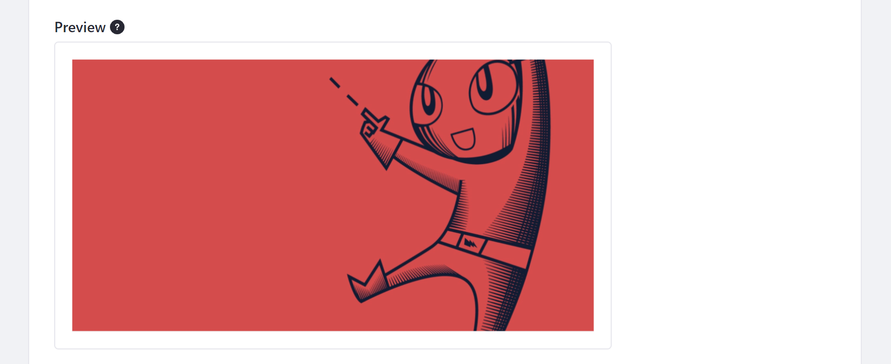

# Configuring Open Graph

[Open Graph](https://ogp.me/) is an internet protocol that you can use to create engaging representations of your Site's content when shared on social networks. With Liferay DXP, you can easily configure Site-wide Open Graph settings. To access these settings, open the Product Menu, and go to *Configuration* &rarr; *Settings*. Then, scroll down to the *Open Graph* sub-heading in the General tab.



From here, you can enable/disable Open Graph and define default `og:image` properties used for your Site's Pages.

## Enabling and Disabling Open Graph

By default, Open Graph `<meta>` tags are embedded in every Page, which you can use to customize how your content appears when shared in applications supporting Open Graph. To disable this behavior, simply uncheck *Enable Open Graph*.


## Configuring Open Graph Image

Here, you can also use the *Image* and *Image Alt Description* fields to define the default `og:image` and `og:image:alt` properties for your Site. To create localized alt descriptions for your Open Graph image, click on the *Language Flag* button and select the language you want to set.



These fields define the following Open Graph `<meta>` tags.

```
<meta property="og:image" content="http://example.com/ogp.jpg" />
<meta property="og:image:alt" content="This is an example." />
```

<!-- Pending Jorge's input...
```
<meta property="og:image:secure_url" content="https://secure.example.com/ogp.jpg" />
<meta property="og:image:type" content="image/jpeg" />
<meta property="og:image:width" content="400" />
<meta property="og:image:height" content="300" />
``` -->

You can also preview how your Open Graph image will appear in supported contexts. Though keep in mind the image ratio may change, depending on where your Page's URL is shared.



When finished, click on *Save* to apply your changes.

## Additional Information

* [Search Engine Optimization](./../optimizing-sites/search_engine_optimization.html)
* [Site Settings UI Reference](./site-settings-ui-reference.md)
* [Page Configuration UI Reference](./../creating-pages/page-settings/page-configuration-ui-reference.md)
