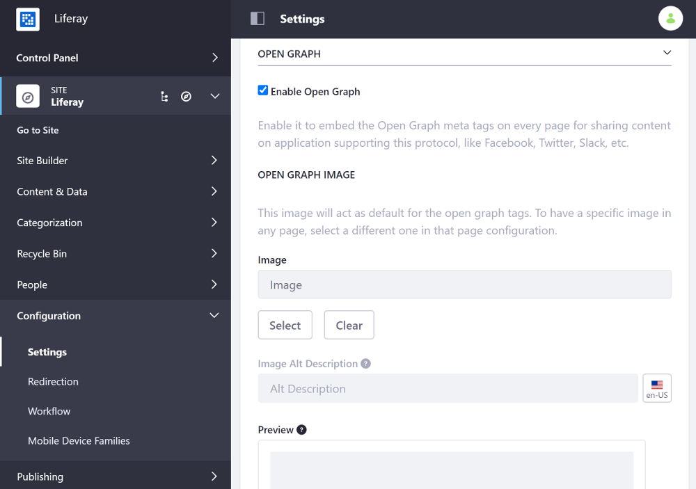

# Configuring Open Graph

By default, Open Graph meta tags are embedded on every page, so you can share content on applications that support it, such as Facebook, Twitter, Slack, etc. You can disable this behavior from your Site's General settings.

1. Open the Product Menu and go to *Configuration* &rarr; *Settings* (previously *Site Settings*)
1. Scroll down to the *Open Graph* sub-heading and expand it.
1. Check/uncheck the *Enable Open Graph* setting to enable/disable this feature, and optionally set an Open Graph image to act as the default for the Open Graph tags.

    

1. Scroll down and click *Save* to apply the changes.