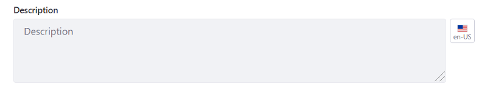
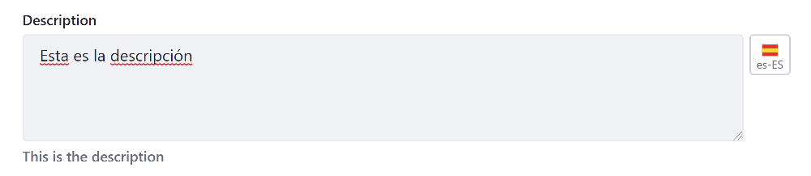

# Modifying Localizable Site Fields

Some Site setting fields have a language flag appended to the end. These fields can be translated into other languages.

Follow these steps to modify a localizable field:

1. Click the language flag beside the field.

1. Enter the new value in the selected language. The default value is displayed beneath the field for reference.

Liferay DXP automatically saves the translation for each language and displays the translated value when that specific language is selected for the instance. If a translation for the field is not provided, the default instance language's value for that field is displayed.