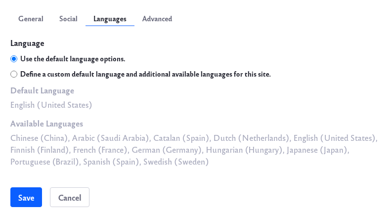
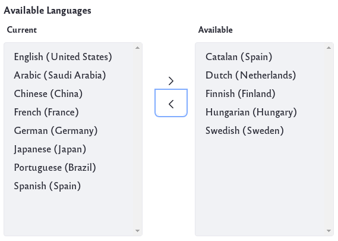

# Site Localization

Liferay DXP allows you to set your installation's default language. You can also define a Site's enabled languages. Follow these steps to change your settings:

1. In the [Site Settings UI](../site-settings-ui-reference.md), click on the Languages tab.

    

2. Click on *Define a custom default language and additional available languages for this site*.

    

3. You can change the default language to any of the available languages in the drop-down list.

4. You can also choose which additional langauges are enabled or disabled.

    

5. Use the left and right arrows to enable or disable additional languages.

6. CLick on the *Save* button to save any changes.
