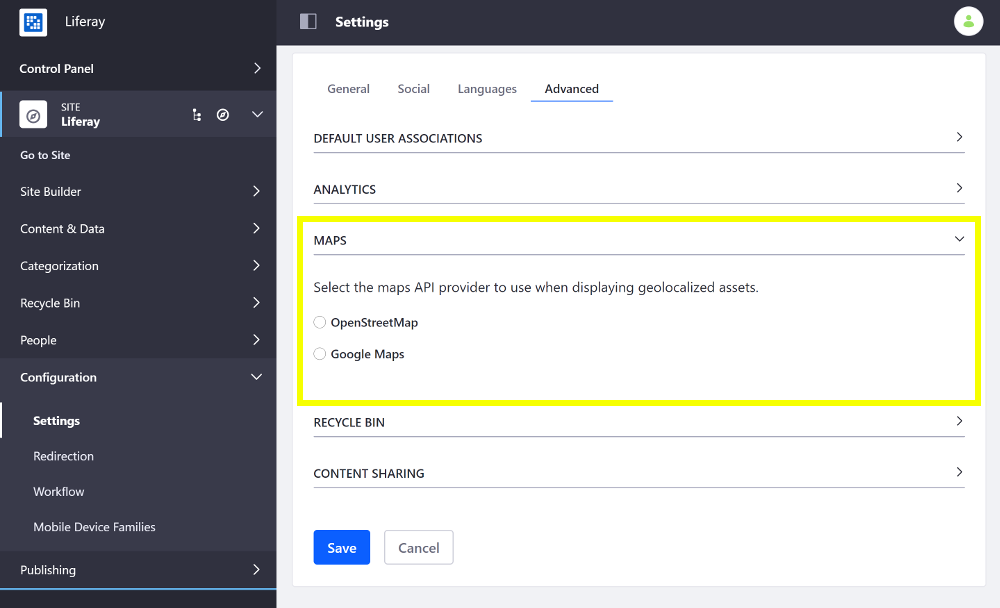

# Configuring Geolocation for Assets

1. Open the Product Menu and go to *Configuration* &rarr; *Settings* (previously *Site Settings*).
1. Select the *Advanced* tab and scroll down to the *Maps* sub-heading and expand it.
1. Click the radio button for the maps API provider you want to use when displaying your geolocalized assets and optionally provide an API key if applicable.

    

    

1. Scroll down and click *Save* to apply the changes.

[Geolocalized assets](../../../content-authoring-and-management/tags-and-categories/user-guide/geolocating-assets/geolocating-assets.md) can be displayed for documents, web content articles, DDL records, etc.