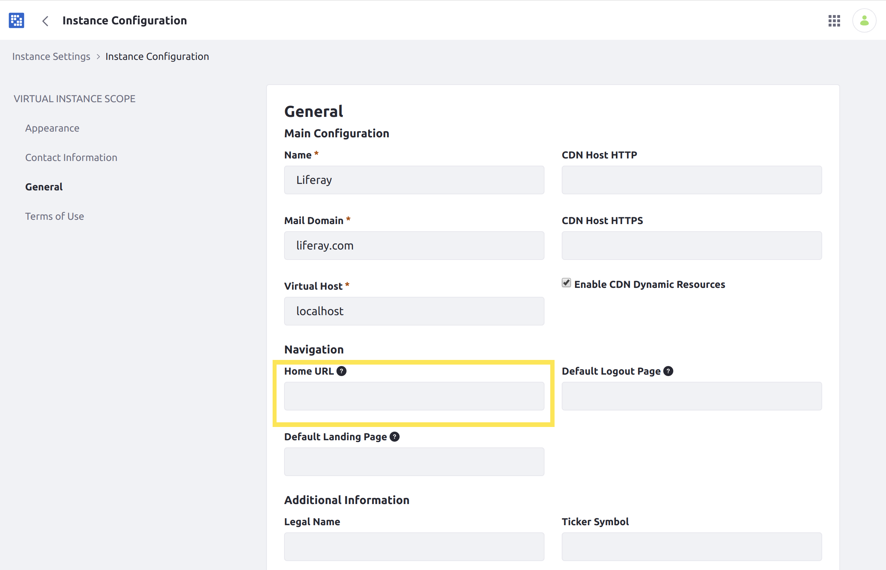

# Configuring Your Site's Friendly URL

Friendly URLs are used for both Public and Private Pages. The public Site base URL is `https://localhost:8080/web`, and the private one is `https://localhost:8080/group`. This helps Users quickly access their Site without having to recall an extended URL. Each friendly URL must be unique. The URL path is appended to the `https://localhost:8080/` URL (i.e. `https://localhost:8080/web/my-site/`). Follow these steps:

1. Open the Product Menu and go to *Site* &rarr; *Configuration* &rarr; *Settings*.
1. Scroll down and expand the *Site URL* panel.
1. Enter a new URL in the *Friendly URL* input and click *Save* to apply the changes.

If you add a friendly URL for your Site's Home Page, follow the additional steps in the next section.

## Updating Your Instance's Home URL

If you add a friendly URL for your instance's Home Page, you should update your instance's Home URL field so that page requests to `http://localhost:8080` redirect properly:

1. Open the Product Menu and go to *Control Panel* &rarr; *Configuration* &rarr; *Instance Settings*.
1. Select *Instance Configuration* under the Platform heading and click the *General* link.
1. Under *Navigation*, enter your new friendly home URL into the *Home URL* field. For example, setting the friendly URL of your default Site to `/my-site` makes your Site's public Home Page's URL `https://localhost:8080/web/my-site/home`. So, you would enter `/web/my-site/home`.

Once you've entered this setting, page requests to `localhost:8080` redirect to the friendly URL of your Liferay DXP instance's new Home Page.