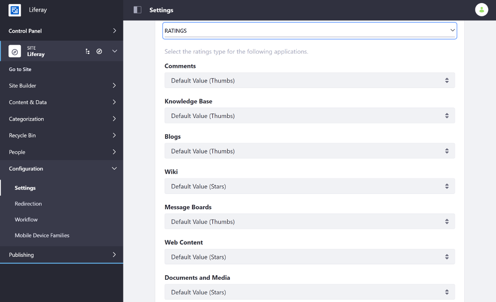

# Configuring Content Ratings Type

[Ratings]() can be represented by different types of icons/labels (like, stacked stars, stars, and thumbs ups). You can configure the ratings types for the application listed below from the Site's Social settings:

* Blogs
* Comments
* Documents and Media
* Knowledge Base
* Message Boards
* Web Content
* Wiki

1. Open the Product Menu and go to *Configuration* &rarr; *Settings* (previously *Site Settings*).
1. Select the *Social* tab and scroll down to the *Ratings* sub-heading.
1. Use the selector for each application to choose the desired ratings type.

    

1. Scroll down and click *Save* to apply the changes.