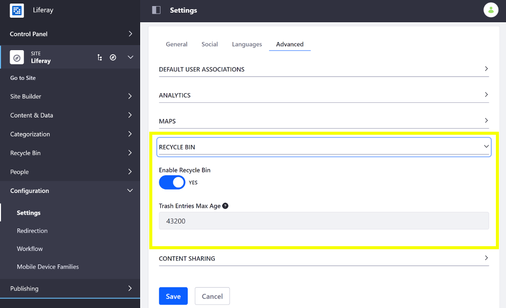

# Configuring the Asset Recycle Bin for Sites

1. Open the Product Menu and go to *Configuration* &rarr; *Settings* (previously *Site Settings*).
1. Select the *Advanced* tab and scroll down to the *Recyle Bin* sub-heading and expand it.
1. Toggle the *Enable Recycle Bin* option from *YES* to *NO* to enable/disable the Recycle Bin for the Site.
1. Optionally provide a value (in minutes) in the *Trash Entries Max Age* input to specify how long the recycled assets should remain in the Recycle Bin before they are permanently deleted.

    

1. Scroll down and click *Save* to apply the changes.

See the [Recycle Bin](../../../content-authoring-and-management/recycle-bin/user-guide/introduction-to-the-recycle-bin.md) section for more information on the Recycle Bin.