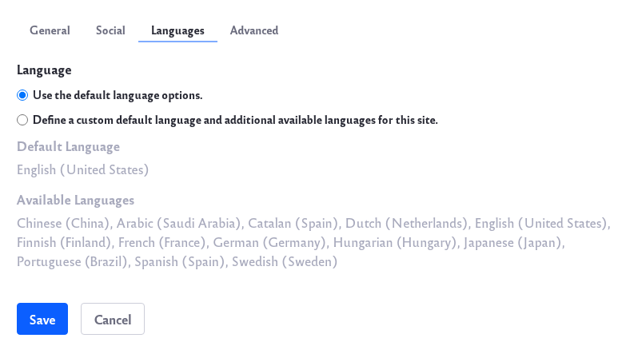
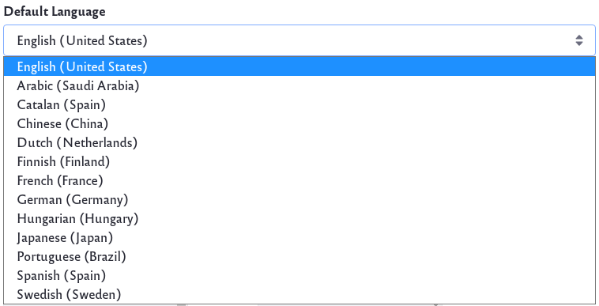
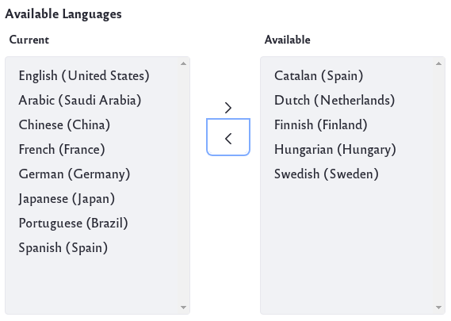

# Site Localization

```note::
   If you are setting up your Liferay installation for the first time, we recommend reviewing `Initial Instance Localization <../../installation-and-upgrades/setting-up-liferay/initial-instance-localization.md>`_ first.
```

## Configuring Site Languages

You can set your site's default language. If you You can also define a Site's enabled languages:

1. In the [Site Settings UI](./site-settings-ui-reference.md#language), click on the Languages tab.

   

1. Click *Define a custom default language and additional available languages for this site*.

   

1. You can change the default language to any language in the list.

1. You can also choose which additional languages are enabled or disabled.

   

1. Use the left and right arrow buttons to enable or disable additional languages.

1. Click the *Save* button to save any changes.

## Modifying Localizable Site Fields

Some fields have an appended language flag button. These fields can be translated into other languages.


1. Click the language flag beside the field.

   

1. Enter the new value in the selected language. The default value is displayed beneath the field for reference.

   

Liferay automatically saves the translation for each language and displays the translated value when that language is selected for the instance. If a translation for the field is not provided, the default instance language's value for that field is displayed.
