# Site Settings UI Reference

Liferay DXP is built with flexibility in mind. Beyond just creating content and pages, Liferay DXP has a wealth of configuration options and tools available to help you create the site that meets your needs and the needs of your users.

To view a site's settings, open the *Product Menu* and go to *Configuration* &rarr; *Settings*. These settings are organized into the following tabs:

* [General](#general)
* [Social](#social)
* [Language](#language)
* [Advanced](#advanced)

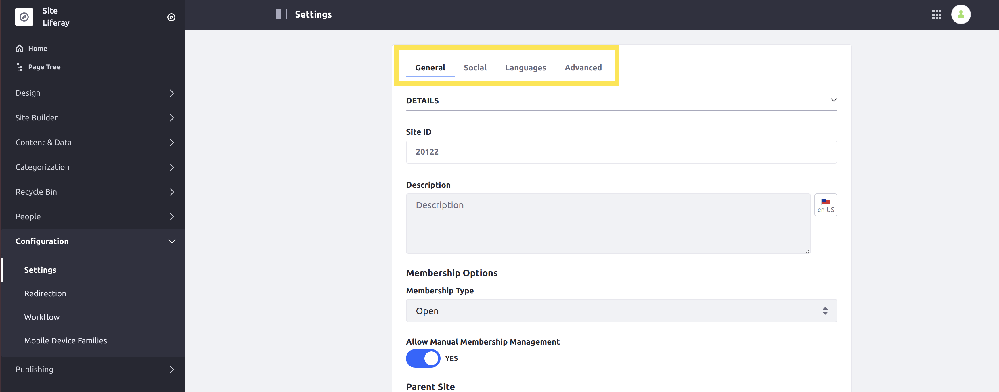

```note::
   Many of these settings can be localized to provide translations based on a user's locale. See `Introduction to Localization <https://help.liferay.com/hc/en-us/articles/360028746672-Introduction-to-Localization>`_ and `Modifying Localizable Site Fields <./configuring-site-languages/modifying-localizable-site-fields.md>`_ or more information.
```

## General

General settings range from core configuration, like a site's Membership Type, to finer details like Documents and Media indexing options. The tab's content is organized into the following subsections: Details, Pages, Categorization, Site URL, Documents and Media, Open Graph, Asset Auto Tagging, Sharing, and Custom Fields.

### Details

**Site ID**: A *Site ID* is a unique number automatically generated for a site at its creation. This ID is permanent and cannot be changed.

**Name**: Set a site's title using the *Name* field. This title is displayed in the browser’s title bar as well as the header for each site page. You can also localize a site's name via the *Language Flag* button.

**Description**: Use the *Description* field to explain a site's purpose. You can also localize a site's description via the *Language Flag* button.

**Active**: Determine whether a site is *Active* or *Inactive*. While inactive, a site is inaccessible to users, though it can be reactivated if desired.

**Membership Type**: Select a *Membership Type* to determine how restrictive a site's membership is. See [Changing Site Membership Types](./site-users/changing-site-membership-type.md) for more information.

**Allow Manual Membership Management**: Determine whether to allow members to be manually added or removed from a site. If your site's membership is handled automatically by a membership policy, you can disable this setting. See [Managing Membership Policies for Sites](./site-users/changing-site-membership-type.md) for more information.

**Parent Site**: Designate a site as a child site by selecting its parent site. See [Site Hierarchies](../building-sites/site-hierarchies.md) for more information.

**Limit Membership to Parent Site Members**: Determine whether a child site's membership is limited to members of its parent site.

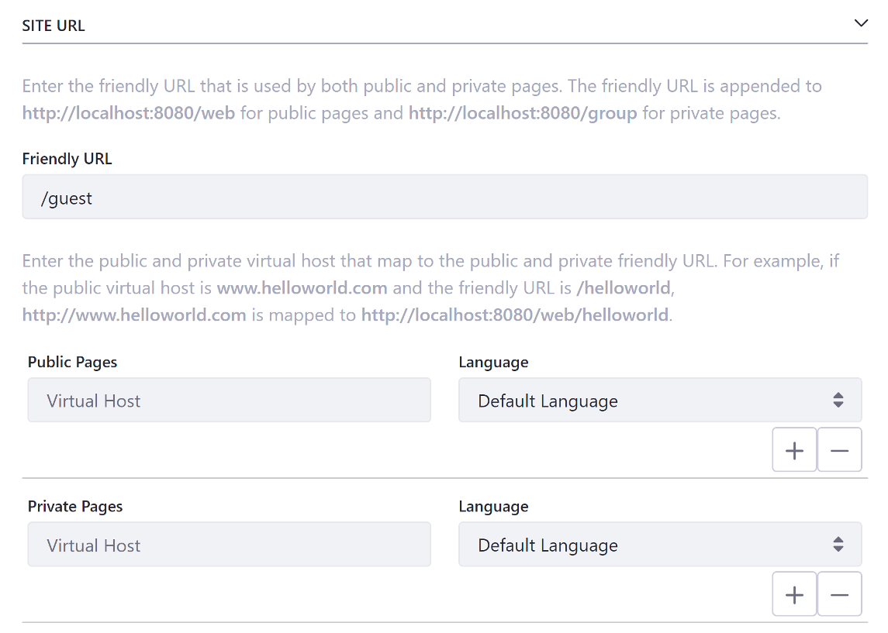

### Pages

In the *Pages* section, you can view a site's Public and Private pages, if any exist. If they don't exist, a *Site Templates* selector appears for creating pages with a template.

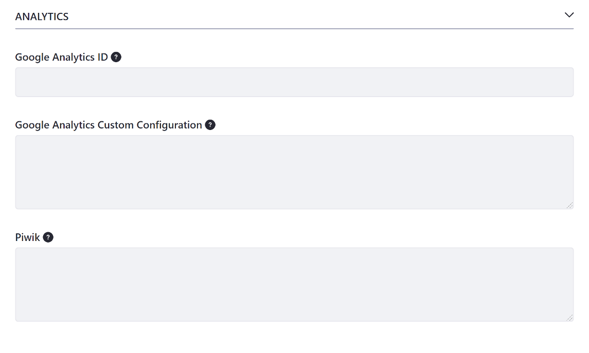

### Custom Fields

In the *Custom Fields* section, you can view and configure any custom fields you've defined for your pages. With these fields, you can set page metadata, such as author, date of creation, and geolocation. This section only appears once you've configured custom fields for your site. See [Custom Fields](https://help.liferay.com/hc/articles/360028818872-Custom-Fields) for more information.

### Categorization

In the *Categorization* section, you can categorize site content using *Topics* and *Tags*. These tools help organize sites so users can more easily find your site's content via search and navigation widgets. See [Organizing Content with Tags and Categories](https://help.liferay.com/hc/articles/360028820452-Organizing-Content-with-Tags-and-Categories) for more information.

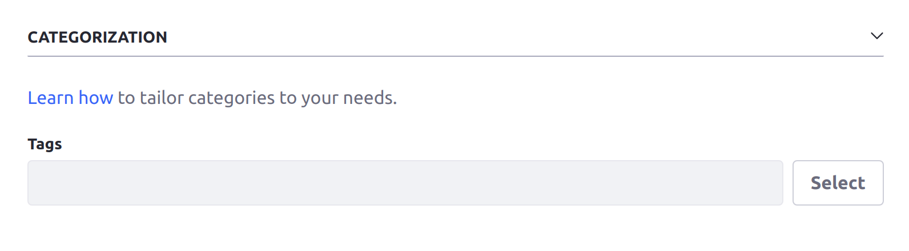

### Site URL

**Friendly URL**: Set a custom URL that is used for both public and private site pages. See [Configuring Your Site's Friendly URL](./managing-site-urls/configuring-your-sites-friendly-url.md) for more information.

**Public and Private Virtual Host**: Set public and private *Virtual Hosts* to map to a site's public and private pages. See [Configuring Virtual Hosts Site URLs](./managing-site-urls/configuring-virtual-hosts-site-urls.md) for more information.

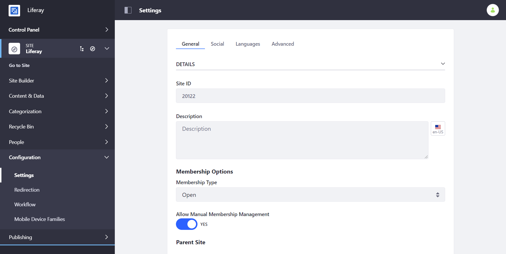

### Documents and Media

In the *Documents and Media* section, you can determine whether to enable *Directory Indexing* for a site. When enabled, a user with view permission can browse the site's document library files and folders.

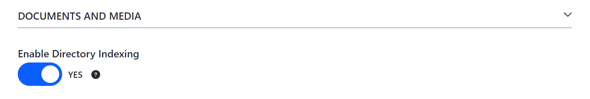

### Site Template

If you created your site using a *Site Template*, this section identifies your selected template and whether the template allows users to modify pages that inherit it. See [Building Sites from Templates](../building-sites/building-sites-with-site-templates.md) for more information about site templates and how to create your own.

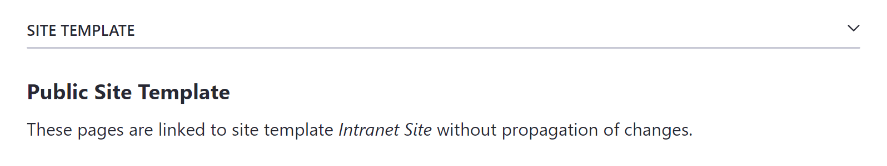

### Open Graph

**Enable Open Graph**: Determine whether to embed [Open Graph](https://ogp.me/) `<meta>` tags in the `<head>` of your site's pages. These tags define page metadata to create engaging representations of your site's content when shared in applications that support the Open Graph protocol, such as Facebook, Slack, and Twitter.

**Open Graph Image**: Use the *Image* and *Alt Description* fields to define the default `og:image` and `og:image:alt` properties used for site pages. You can also localize the image's alt description via the *Language Flag* button. See [Configuring Open Graph](./configuring-open-graph.md) to learn more.

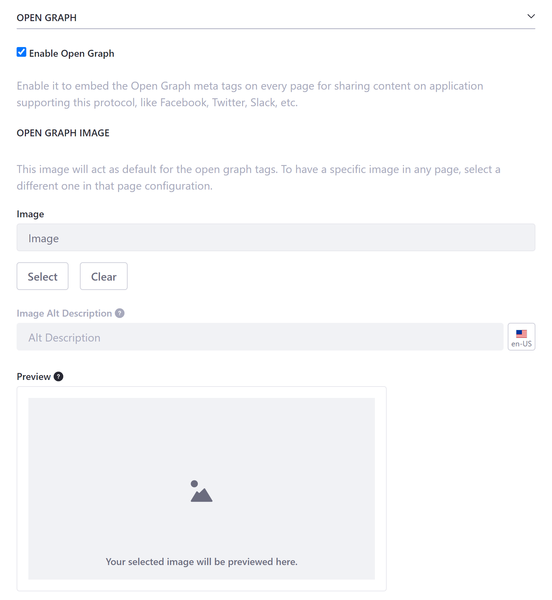

### Asset Auto Tagging

In the *Asset Auto Tagging* section, you can enable or disable asset auto tagging for a site. When enabled, assets will be auto tagged by the providers configured at instance level. See [Asset Auto Tagging]() for more information. <!--FIX link-->

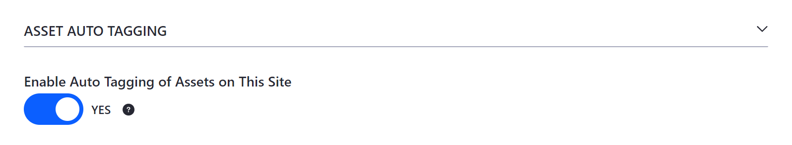

### Sharing

In the *Sharing* section, you can enable or disable document sharing between site users. When enabled, a user will be able to share items with other users. See [Sharing Documents with Other Users]() for more information. <!--FIX link-->

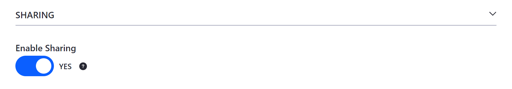

## Social

In the *Social* tab, you can manage the social interactions between users on a site.

### Ratings

In the *Ratings* section, you can select the type of ratings used for the following site applications: Comments, Knowledge Base, Blogs, Wiki, Message Boards, Web Content, and Documents and Media. See [Configuring Content Ratings Types](./site-content-configurations/configuring-content-rating-type.md) for more information.

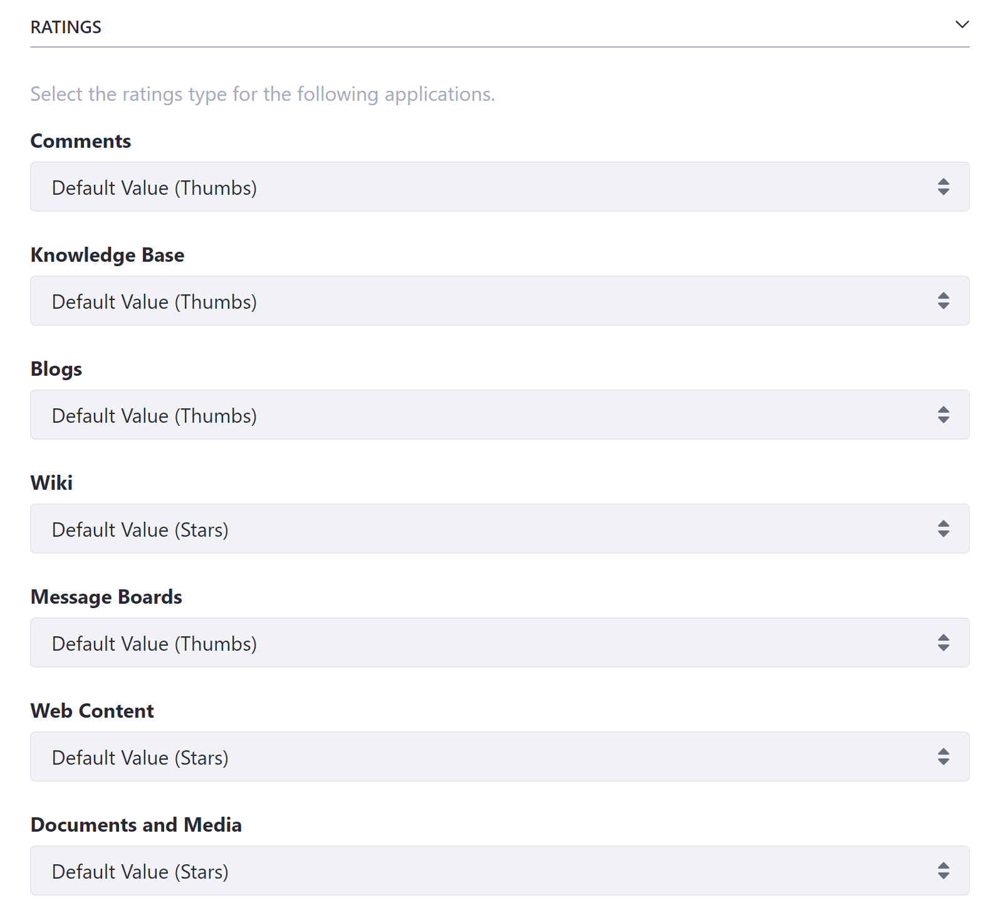

### Mentions

In the *Mentions* section, you can determine whether users can mention other users in site applications. See [Mentioning Users](../../collaboration-and-social/notifications-and-requests/user-guide/configuring-mentions.md) for more information.

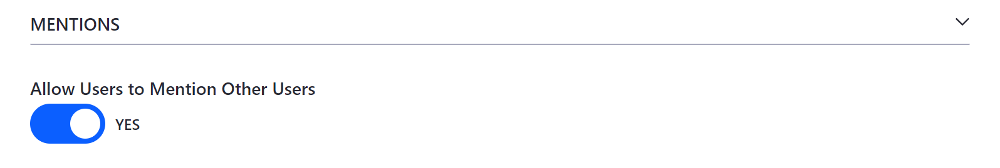

## Language

In the *Languages* tab, you can determine whether to use your instance's default language options, or define a custom default language and additional languages for a site.

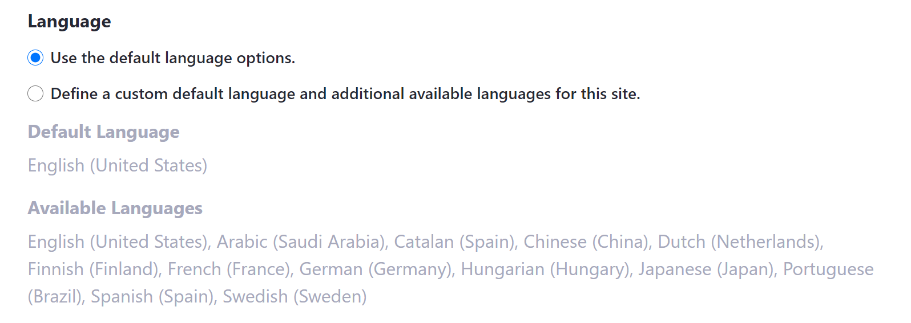

## Advanced

In the *Advanced* tab, you can configure additional settings, including analytics services, content sharing, and more.

### Default User Associations

In the *Default User Associations* section, you can select the role and teams that new site members are assigned to by default. See [Configuring Role and Team Defaults for Site Members](./site-users/configuring-role-and-team-defaults-for-site-members.md) for more information.

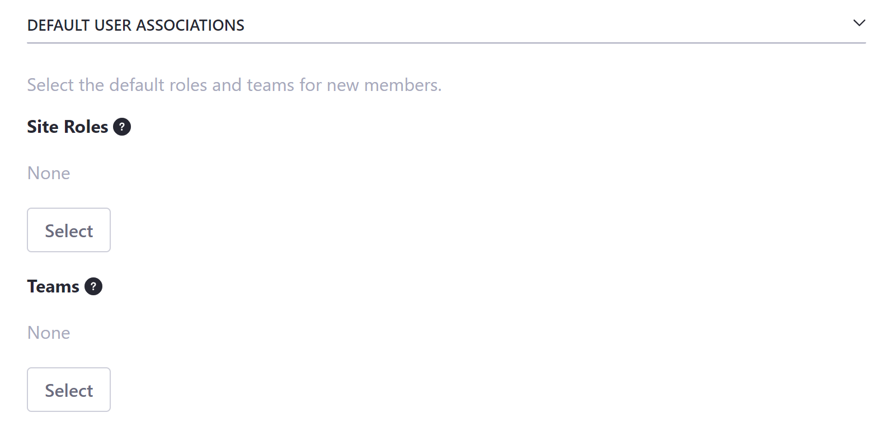

### Analytics

In the *Analytics* section, you can set the *Google Analytics* ID, create method configuration, and custom options used for a site. You can also set the *Piwik Analytics* tracking code for a site by entering the full script code, including the script start and end tags.

If you require a different analytics service, you can add it. See [Adding a New Analytics Service](./adding-a-new-analytics-service.md) for more information and how to add additional fields for different analytics services.

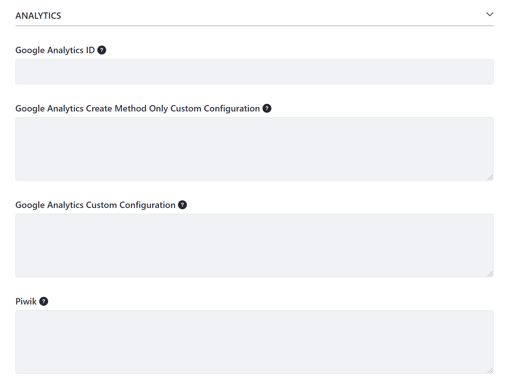

### Maps

In the *Maps* section, you can select the maps API provider to use when displaying geolocalized assets in your site. Geolocalized assets can be displayed for documents, web content articles, DDL records, and more. See [Geolocating Assets](./site-content-configurations/configuring-geolocation-for-assets.md) for more information.

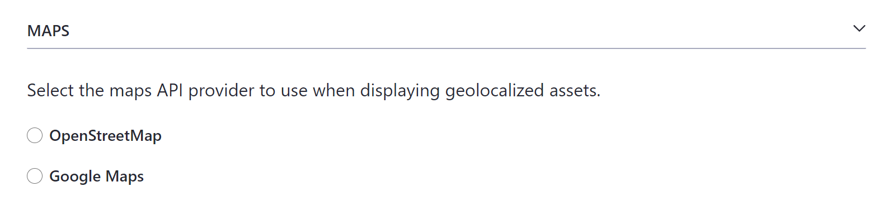

### Recycle Bin

In the *Recycle Bin* section, you can determine whether the *Recycle Bin* is enabled and specify the number of minutes an asset remains in the Recycle Bin before being automatically deleted. See [Configuring the Asset Recycle Bin for Sites](./site-content-configurations/configuring-the-asset-recycle-bin-for-sites.md) for more information.

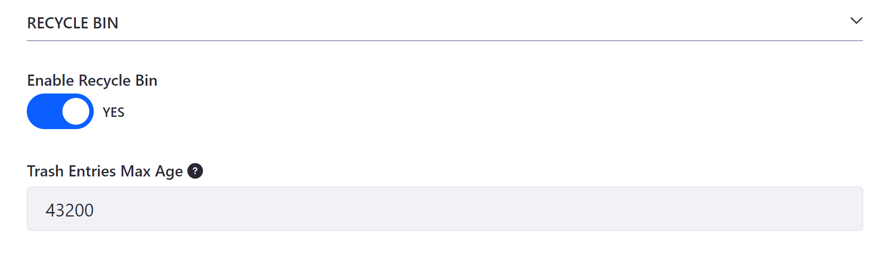

### Content Sharing

In the *Content Sharing* section, you can determine whether subsites can display content from this site, including structures, templates, categories, widget templates, and more. If enabled, you can disable this option at any time, which immediately revokes content sharing from all subsites. See [Managing Content Sharing Across Sites](./site-content-configurations/managing-content-sharing-globally.md) for more information. <!--Rename md file-->

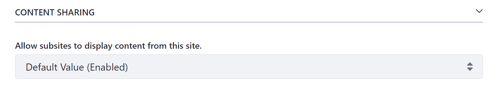
