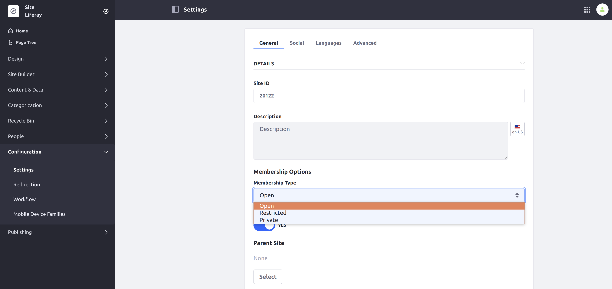

# Changing Site Membership Type

A Site's membership type determines how freely users may join your site. There are three types of site membership:

**Open:** Users can join and leave whenever they want. The site is visible to all users in the My Sites app.

**Restricted:** Site is visible in the My Sites app and users must request membership to join.

**Private:** A Site Administrator must explicitly invite a User to join and then add them to the Site. Private membership Sites don't appear in the My Sites app.

## Setting Site Membership Type

To change your Site's membership type, follow these steps:

1. From the Site Menu on the left side of the screen, go to *Configuration* &rarr; *Settings* (previously *Site Settings*) &rarr; and scroll down to the *Membership Options* sub-heading under *Details*.

    

1. Open the *Membership Type* selector and choose an option.

1. Scroll down and click *Save* to apply the changes.

The Site's membership type is updated.

## Additional Information

* [Managing Site Membership and Permissions With User Groups](../../../users-and-permissions/user-groups/managing-site-membership-and-permissions-with-user-groups)
* [Understanding Site Membership](../../building-sites/site-membership/understanding-site-membership.md)