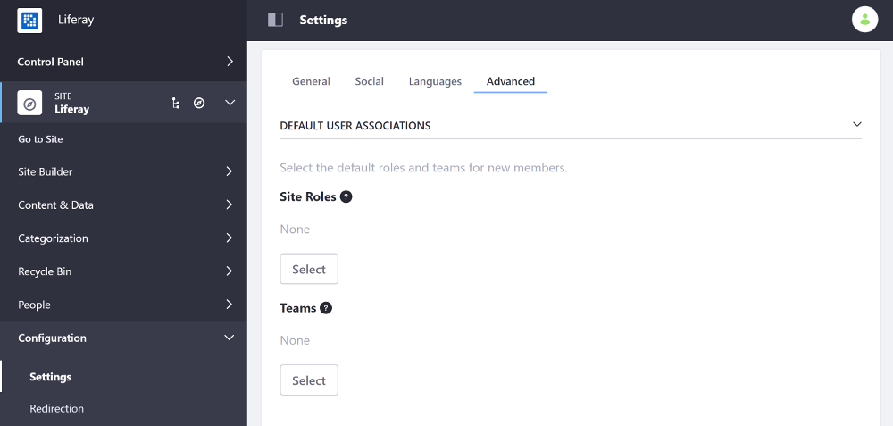

# Configuring Role and Team Defaults for Site Members

You can configure the default Roles and Teams that newly assigned members of your Site receive.

1. Open the Product Menu and go to *Configuration* &rarr; *Settings* (previously *Site Settings*) &rarr; and select the *Advanced* tab.

    

1. Under the *Default User Associations* panel, click the *Select* button under either the *Site Roles* label to define default Roles or the *Teams* label to define default Teams (if any exist) for your Site members. 

    

1. Scroll down and click *Save* to apply the changes.

See [Roles and Permissions](TODO) and [Creating Teams for Advanced Site Membership Management](../building-sites/creating-teams-for-sites.md) for more information.