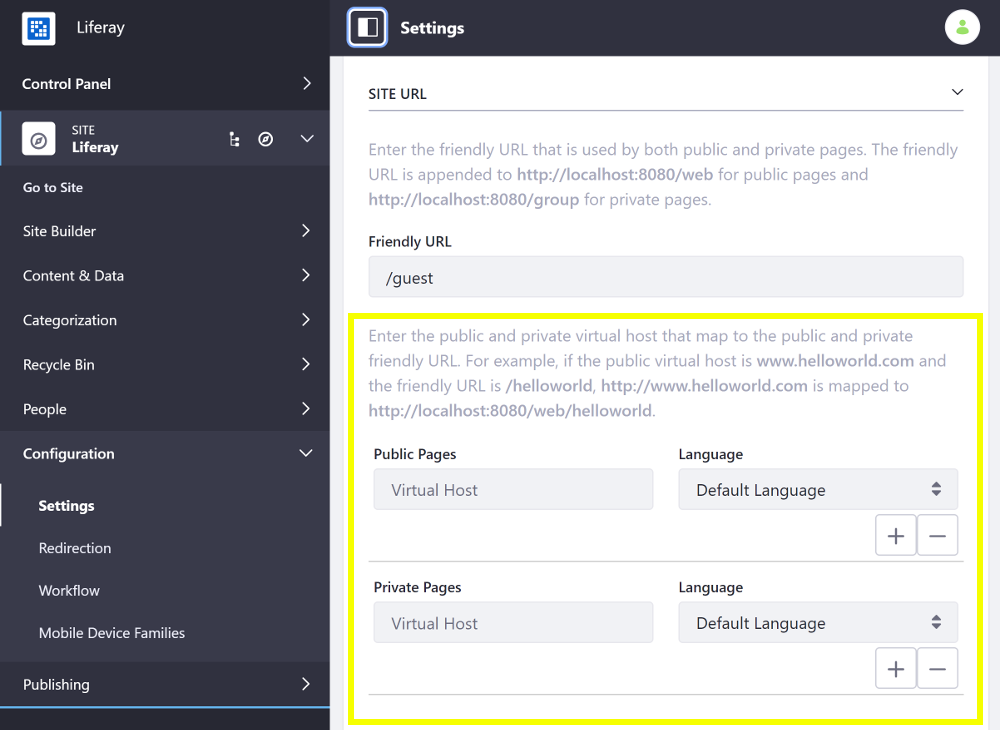
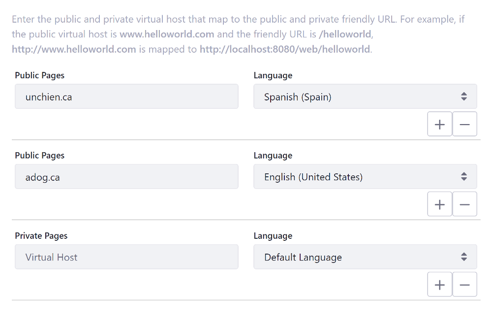

# Configuring Virtual Hosts Site URLs

A virtual host connects a domain name (i.e., `www.my-site.com`) to a Site. This can be a full domain or a subdomain (e.g. `developers.my-site.com`). You can use this to host a number of websites as separate Sites on one Liferay DXP server. Follow these steps to configure virtual hosts Site URLs:

1. With your provider, set the DNS name to point to your Liferay DXP instance's IP address (e.g. `developers.my-site.com`).
1. Inside Liferay DXP, open the Product Menu and go to *Configuration* &rarr; *Settings* (previously *Site Settings*) under the Site Menu.
1. Under the General tab, expand the Site URL panel.

    

1. In the Public Pages or Private Pages inputs for the Developers Site, set the URL to point to the domain or subdomain (e.g. `http://developers.my-site.com`).
1. **Since Liferay DXP 7.3 SP2**, optionally choose a default locale for the Site from the *Language* selector. For instance, if you have a domain for each translation of a Site (e.g. `unchien.ca` and `adog.ca`), you can add a virtual host for the public and private pages of each domain and specify the default locale for each.

  

    ```note::
      Locales are constrained to the Site's available languages, if defined. If a locale isn't specified, the default locale for the Site is used. The locale applies to Sites for all associated domains.
    ```

1. **Since Liferay DXP 7.3 SP2**, if you have multiple domains, click the `+`/`-` buttons next to the Public Pages and/or Private Pages URL input to add/remove a new URL for that Page Set.

  

    ```important::
      A domain can only be applied to a single Site. You can't map a single domain to multiple Sites.
    ```

1. *Save* the changes.