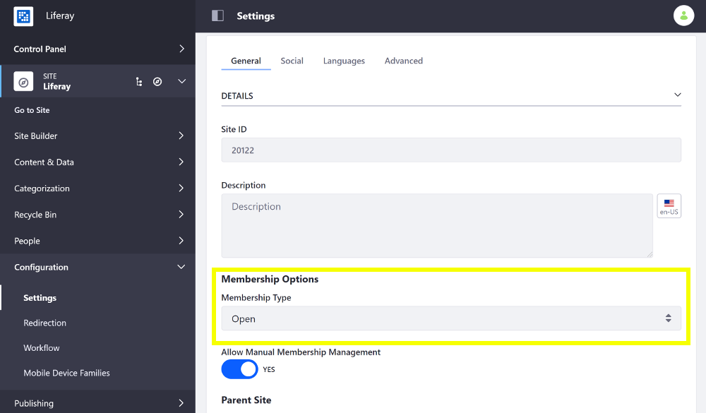

# Changing Site Membership Type

A Site's membership type specifies how restrictive it is. To change your Site's membership type, follow these steps:

1. Open the Product Menu and go to *Configuration* &rarr; *Settings* (previously *Site Settings*) &rarr; and scroll down to the *Membership Options* sub-heading under *Details*.

    

1. Open the *Membership Type* selector and choose an option. Sites can have one of three membership types:

    **Open:** Users can join and leave whenever they want. It appears in the My Sites app.

    **Restricted:** Users must request membership to join.

    **Private:** A Site Administrator must explicitly invite a User to join and then add them manually to the Site. Private membership Sites don't appear in the My Sites app.

1. Scroll down and click *Save* to apply the changes.