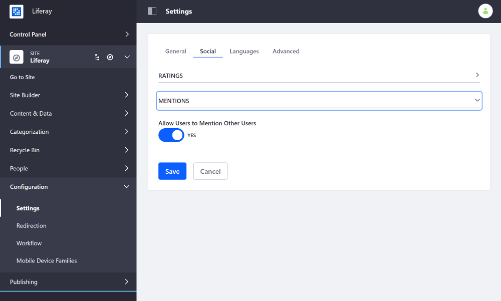

# Configuring User Mentions

User mentions let you tag (notify) friends and colleagues in comment, posts, etc.. This feature is enabled by default, but you can disable this behavior from the Site's Social settings:

1. Open the Product Menu and go to *Configuration* &rarr; *Settings* (previously *Site Settings*).
1. Select the *Social* tab and scroll down to the *Mentions* sub-heading and open it.
1. Toggle the *Allow Users to Mention Other Users* option between *YES* and *NO* to enable/disable User mentions.

    

1. Scroll down and click *Save* to apply the changes.

You can mention Users by entering the `@` character followed by their User name.