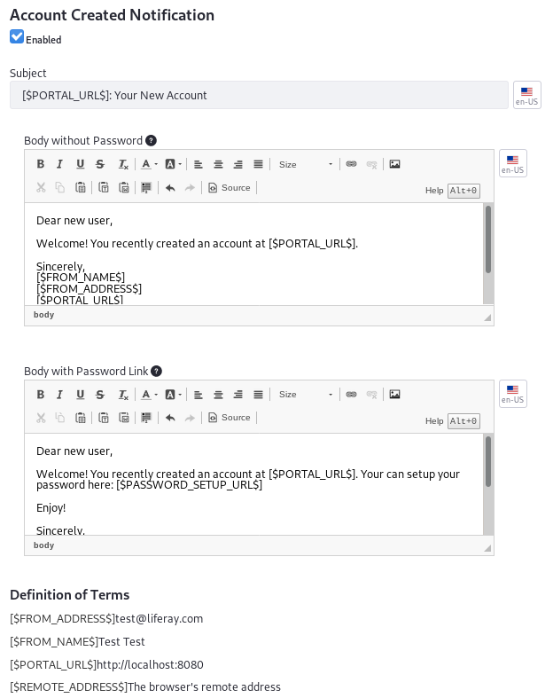
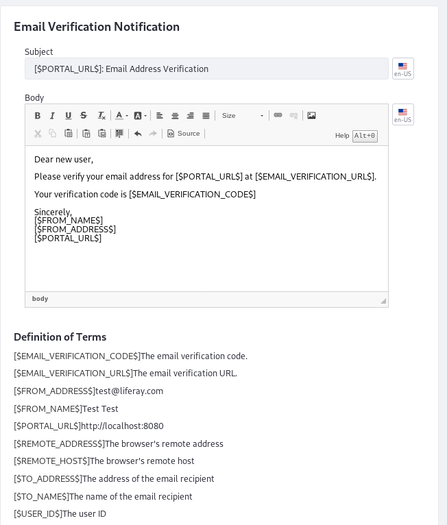
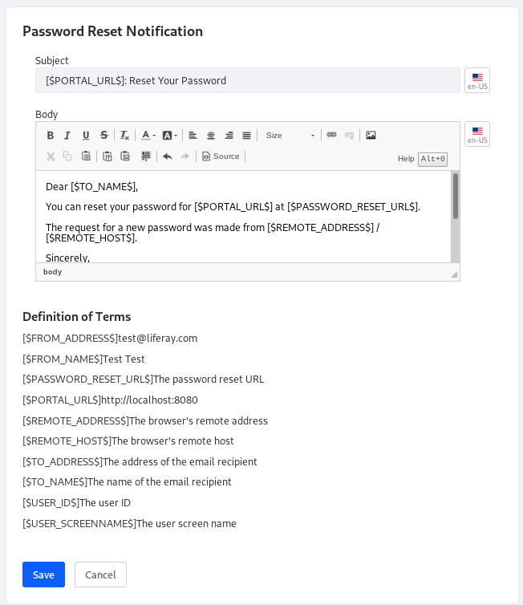

# Email Settings

The Email configuration is where you configure email notifications at the Virtual Instance scope. Open the Control Panel and navigate to *Configuration* &rarr; *Instance Settings* and select the *Email* category under the PLATFORM section. The Email configuration contains six entries:

| Configuration | Purpose |
| --------- | ------------ |
| Account Created Notification | Set whether and what to email Users when the create a new account |
| Email Sender | Set the *From* name and address for the email templates |
| Email Verification Notification | Create the template that asks Users to verify their email address |
| Mail Host Names | Enter mail hosts associated with the instance |
| Password Changed Notification | Notify Users when their password has been changed |
| Password Reset Notification | Notify Users when a request to reset their password is received |

```note::
   Your installation must have a `configured connection to a mail server <../../../installation-and-upgrades/setting-up-liferay-dxp/configuring-mail/connecting-to-a-mail-server.md>`_ in order to send email notifications.
```

## Account Created Notification

The Account Created Notification entry defines the email templates, with and without the new User's password included in the body of the text, for the message sent to notify Users when they create a new account. You can specify whether this email is sent by the *Enabled* checkbox at the top of the configuration entry. Use the template variables listed at the bottom of the configuration under the "Definition of Terms" heading to help build your email template. 



## Email Sender

The Email Sender entry specifies the virtual instance's administrative Name and Address for email notifications, declared as the `[$FROM_NAME$]` and `[$FROM_ADDRESS$]` variables respectively in the email templates. By default, they are from the `admin.email.from.name` and `admin.email.from.address` [portal properties](https://docs.liferay.com/portal/7.3-latest/propertiesdoc/portal.properties.html#Admin%20Portlet). This name and email address appear in the *From* field in all email messages sent by the virtual instance. 


## Email Verification Notification

The Email Verification Notification entry defines the email template for the message sent to Users when asked to verify their Email Address. Use the template variables listed at the bottom of the configuration under the "Definition of Terms" heading to help build your email template. 



## Mail Host Names

Use the Mail Host Names entry to specify additional mail host names that are owned by your organization for the virtual instance. Enter one mail host name per line, but don't enter the one specified in the Virtual Instance configuration. 


## Password Changed Notification

The Password Changed Notification entry defines the email template for the message sent to notify Users when their password has changed. Use the template variables listed at the bottom of the configuration under the "Definition of Terms" heading to help build your email template. 


## Password Reset Notification

The Password Reset Notification entry defines the email template for the message sent to notify Users when a request has been made to reset their password. Use the template variables listed at the bottom of the configuration under the "Definition of Terms" heading to help build your email template. 


