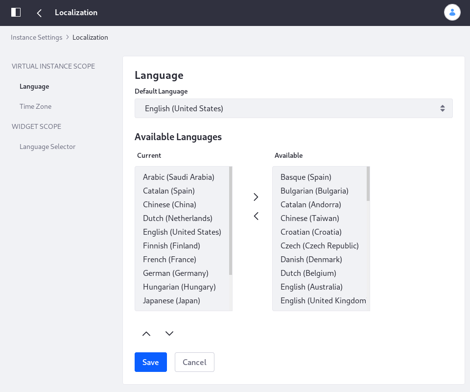

# Localization

The Localization category contains these entries:

| Configuration | Purpose |
| --------- | ------------ |
| Language | Set the default instance language, and the languages that are available in the instance. |
| Time Zone | Set the time zone for the instance |
| Language Selector (WIDGET SCOPE) | Set the instance-scoped default for the Language Selector widget. Override this setting in the widget itself. |

To access the Localization settings, Open the Control Panel and navigate to *Configuration* &rarr; *Instance Settings*, and select the *Localization* category under the *PLATFORM* section.

Use the left and right arrow buttons to move a language from Current (configured and active) to Available (not active, but can be configured) and back, depending on your needs. Use the up and down arrow buttons to sort the Current languages in the order you want them. 

## Additional Information

* [Initial Instance Localization](../../../installation-and-upgrades/setting-up-liferay-dxp/initial-instance-localization.md)