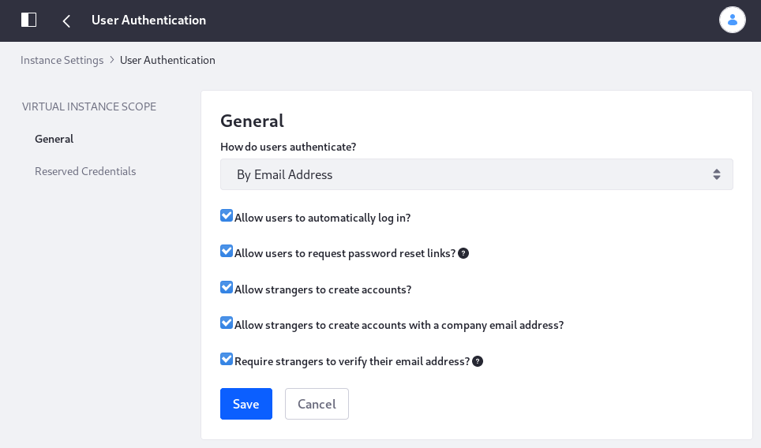

#  User Authentication

The User Authentication settings define how Users can authenticate, the various authentication methods that are required for them, and the screen names and email addresses that are reserved and can't be registered by Users. 

Access the User Authentication settings in the Control Panel's *Configuration* &rarr; *Instance Settings* section, and select the *User Authentication* category under the *PLATFORM* section. 

User Authentication contains two entries:

- General
- Reserved Credentials

## General

The General configuration entry contains several general authentication settings:

**How do users authenticate?** Choose whether Users authenticate by Email Address (default), Screen Name, or User ID (a numerical ID auto-generated in the database---not recommended).

**Allow users to automatically log in?** Enable/Disable automatic log in. If enabled, a User can check a box that causes the Site to "remember" the login information by placing a cookie on the browser. If disabled, Users must always log in manually.

**Allow users to request password reset links?** Enable/Disable requesting a reset link for forgotten passwords.

**Allow strangers to create accounts?** Enable/Disable account creation by strangers. If running an Internet site, leave this enabled so visitors can create accounts. 

**Allow strangers to create accounts with a company email address?** Enable/Disable account creation by those using an email address in the domain of the organization running the Site (which is set on the General page of Instance Settings). This is handy if you're using one Liferay installation to host both internal and external web sites. Make sure all internal IDs are created by administrators but external Users can register for IDs themselves.

**Require strangers to verify their email address?** If this is checked, newly created accounts, whether self-registered or registered by an administrator, require verification. Manual updating of current Users' emails by administrators also requires verification from the new email account.

By default, all settings are enabled. User authentication by email address is an important default for the following reasons:

1. An email address is unique to its owner.

1. People remember their email addresses. Users who haven't logged in for a while could forget their screen names.

1. If email address isn't used to authenticate, a User might change her email address then forget to update the email address in her profile. If this occurs, no notifications sent by the virtual instance reach the User. Keeping the email address at the forefront of a User's mind when she logs in helps ensure the User keeps it current. 

## Reserved Credentials

The Reserved Credentials configuration entry specifies the screen names and email addresses Users aren't allowed to use. This prevents Users from creating IDs that look like administrative IDs or that have reserved words in their names. 

You can learn to configure a third party authentication service or set up Single Sign On (SSO) in the [security documentation](../../../installation-and-upgrades/securing_liferay.html). 
