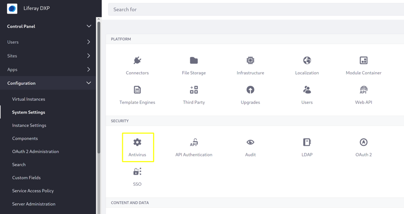
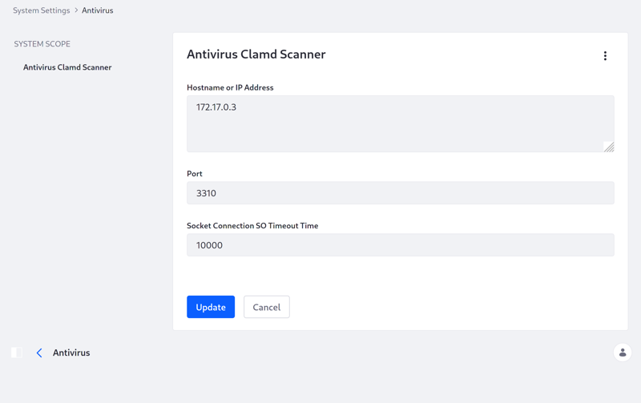

# Enabling Antivirus Scanning for Uploaded Files

> Subscription Required

Antivirus scanning is available for files uploaded to Liferay. When you enable the antivirus scanner, it checks files on upload to Liferay applications, such as [Documents and Media](../sharing-documents-and-media.md), [Message Boards](../../../collaboration-and-social/message-boards/user-guide/getting-started-with-message-boards.md), and more. Virus-infected files are reported for users to reject.


Liferay DXP 7.2 Fix Pack 9+ integrates with the [ClamAV Daemon](https://www.clamav.net/documents/scanning#clamd) (Clamd) running on a separate server.

```note::
   Prior to DXP 7.2 Fix Pack 9+, the ClamAV antivirus scanner ran locally. Now DXP delegates antivirus scanning to a separate server.
```

Here's how to enable the Clamd antivirus scanner:

1. On a separate server, [configure and start Clamd](https://www.clamav.net/documents/scanning#clamd).

    ```important::
       Load your ClamAV database before starting Clamd.
    ```

1. Enable antivirus for your [File Store](../../../system-administration/file-storage/configuring-file-storage.md) (Document Library) by setting the following [portal property](../../../installation-and-upgrades/reference/portal-properties.md) or [Docker Env variable](../../../installation-and-upgrades/installing-liferay/using-liferay-docker-images/configuring-containers.md).

    Portal property:

    ```propertie
    dl.store.antivirus.enabled=true
    ```

    Env variable:

    ```properties
    -e LIFERAY_DL_PERIOD_STORE_PERIOD_ANTIVIRUS_PERIOD_ENABLED=true
    ```

1. Start your Liferay server.

1. Go to *Control Panel* &rarr; *System Settings*, and select *Antivirus* in the *Security* category.

    

1. Select *Antivirus Clamd Scanner* in the menu.

    

1. Enter the Clamd server's hostname or IP address, port, and a connection timeout time (milliseconds).

1. Click *Save*.

Now files are scanned on upload to Liferay applications. If a virus is detected in a file you're uploading, the scanner reports the infected file--decline saving the file.


```important::
   Never save a virus-infected file. Reject the file by canceling the current operation.
```

## Additional Information

[Configuring File Storage](../../../system-administration/file-storage/configuring-file-storage.md)

[Configuring Liferay](../../../system-administration/configuring_liferay.html)

[System Settings](../../../system-administration/configuring-liferay/system-settings.md)