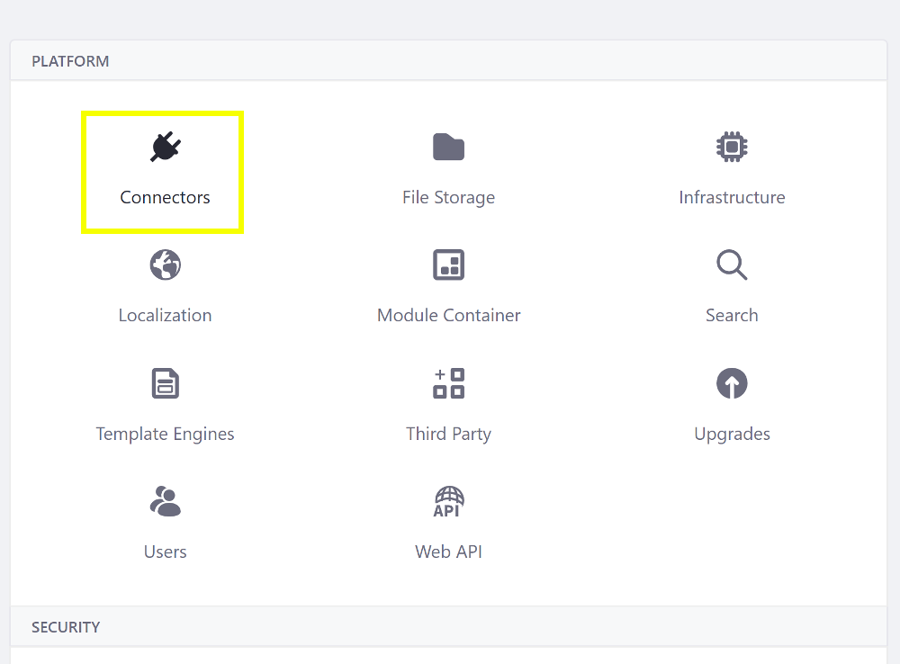
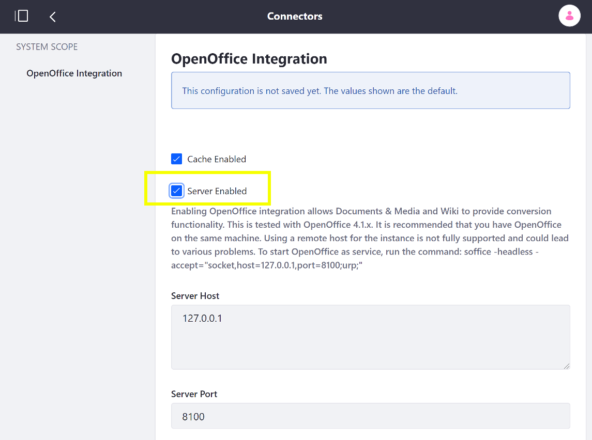

# Enabling OpenOffice / LibreOffice Integration

Coming soon!

<!-- TODO: Leaving this as placeholder now until we can review and provide better direction on this topic.
1. Open the Product Menu and go to *Control Panel* &rarr; *Configuration* &rarr; *System Settings*
1. Select *Connectors* under the Platform heading.

    

1. Check the *Server Enabled* box and click *Save* to apply the changes.

    
 
 -->
