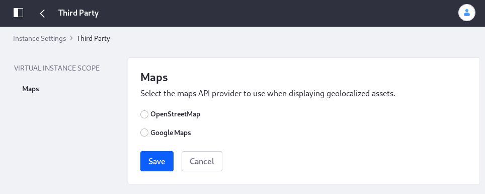

# Configuring a Virtual Instance: Third Party

The Third Party category specifies the maps API provider for geolocalized assets.  Choose OpenStreetMap or Google Maps as the maps API provider. 

To access Third Party configuration settings, open the Control Panel and navigate to *Configuration* &rarr; *Instance Settings*, and select the *Third Party* category under the *PLATFORM* section. 
