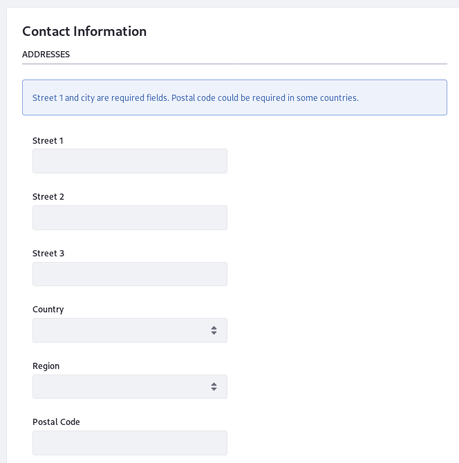
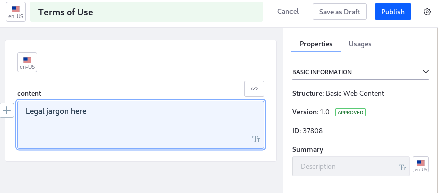

#  Instance Configuration

The Instance Configuration settings define the configuration information for the virtual instance, from its appearance to the Terms of Use your Users agree to the first time they sign in. Access the Instance Configuration settings from the Control Panel's *Configuration* &rarr; *Instance Settings* section, and select the *Instance Configuration* category under *PLATFORM*. The Instance Configuration contains four entries:

| Configuration | Purpose |
| --------- | ------------ |
| Appearance | Define the default logo and the overall look and feel |
| Contact Information | Configure physical addresses, email addresses, websites, and phone numbers for the instance |
| General | Specify landing pages, legal information, and other details |
| Terms of Use | Provide custom Terms of Use for the instance |

## Appearance

The Appearance configuration entry defines the default logo and overall look and feel for the Virtual Instance. It's organized into LOGO and LOOK AND FEEL sections:

**LOGO:** Change the default logo and check/uncheck the *Allow site administrators to use their own logo?* checkbox, enabled by default, to specify whether site administrators can upload a logo when they configure a site. When configuring a new logo, be careful to choose an image file that fits the space. Large images might overlap with the navigation. 

**LOOK AND FEEL:** Set the default theme(s) for the instance and Control Panel. 


## Contact Information

The Contact Information configuration entry specifies how to contact the organization that owns the Virtual Instance. It's divided into several sections:

**ADDRESSES:** Specify the primary, mailing, shipping, P.O. Box, etc. address of the organization. 

**PHONE NUMBERS:** Provide the fax, local, etc. phone numbers for the organization. 

**ADDITIONAL EMAIL ADDRESSES:** Specify any additional email addresses associated with the organization. 

**WEBSITES:** Specify the public and/or Intranet websites for the organization. 

Developers can query for this contact information in their applications. Note that you can add and remove additional entries in a section with the plus and minus buttons respectively. 



## General

The General entry specifies the Virtual Instance's configuration information, landing pages, and the associated organization's basic legal information. It has two sections:

**Main Configuration:** Configure this information for the Virtual Instance:

- Set the name of the entity responsible for running the Virtual Instance.
- Set the mail domain.
- Set the virtual host.
- Set the URLs to a CDN configured to serve static resources.

**Navigation:** Set a home page for your virtual instance as well as default landing and logout pages. To set these pages, use the page's relative URL that follows the domain. For example, to set the default landing page to `http://localhost:8080/web/guest/login`, use `/web/guest/login`. You can use the variable `${liferay:screenName}` as part of the address to redirect Users to their personal pages upon login. For example, the User `marvin` has this default URL to his personal page:

```bash
http://localhost:8080/user/marvin
```

To make sure he's directed there on login, place `/user/${liferay:screenName}` in the Default Landing Page field. These URLs can also be set at the system scope in the `portal-ext.properties` file:

```properties
default.landing.page.path=
default.logout.page.path=
company.default.home.url=
```

All Virtual Instances share the values specified in the properties file. Changes made in Instance Settings override the values set in the properties file. For more information, see the [Portal Properties documentation](https://docs.liferay.com/portal/7.3-latest/propertiesdoc/portal.properties.html).

**Additional Information:** Specify a Legal name, ID, company type, SIC code, ticker symbol, industry and industry type for the owner of the virtual instance. 


## Terms of Use

The Terms of Use page is enabled by default, so one of your first actions should be to disable or replace the placeholder terms. You can disable the requirement for all Users to read the Terms of Use or set the Group ID and Article ID for the Web Content Article that contains your Terms of Use. Either way, the Terms of Use entry contains everything you need to configure Terms of Use for your Users.


The Group ID is the ID of the Site containing the Web Content. 

To find the Group/Site ID,

1. Go to *Site Menu* &rarr; *Configuration* &rarr; *Settings*.

1. Find the Site ID field in the General tab. Enter it into the Group ID field.


To find the Web Content Article's ID,

1. Go to the *Site Menu* &rarr; *Content & Data* &rarr; *Web Content*. 

1. Click on your Terms of Use article. Its ID appears in the Properties panel on the right side of the screen, under the Version and Workflow Status. 



Save the configuration. All Users signing in for the first time see your Terms of Use article. Users must agree to the Terms of Use to register their User accounts. 
