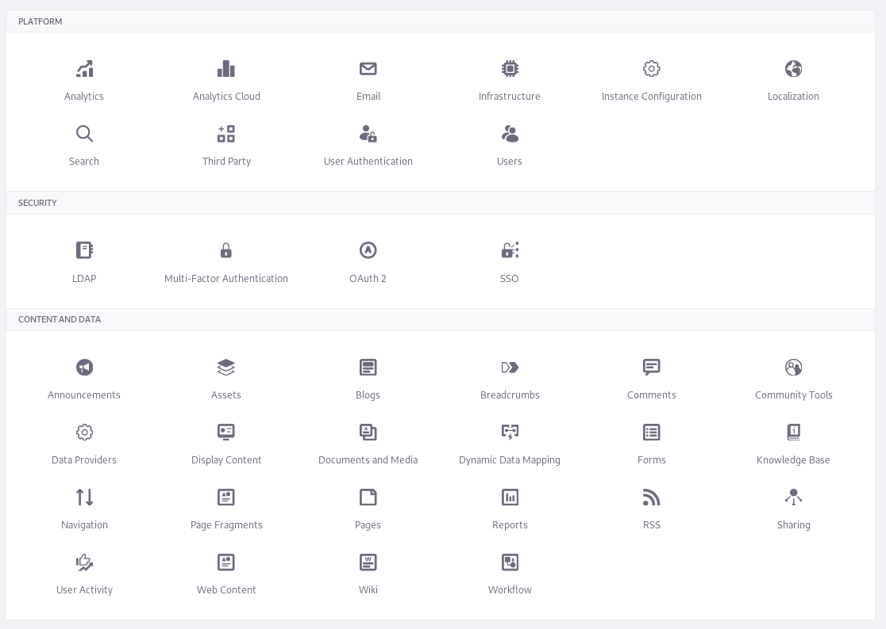

# Understanding Virtual Instances

Liferay DXP can host multiple "portals" on one installation. These are called Virtual Instances. Virtual Instances have completely separate data and configurations. They are accessed via unique domain names and for all intents and purposes, are separate Liferay-based implementations that share a single installation. 

Configuration of a Liferay DXP system happens at different [scopes](../system-seetings/system-settings-and-configuration-scope.md). Configuration at the virtual instance scope is the next most broad scope after the system scope. 

```important::
   The system scope is the highest level configuration scope. All virtual instances are impacted by configuration done at this scope. The *instance* scope applies only to one particular virtual instance.

   If your installation contains only one virtual instance, there's no practical difference between a system scoped configuration and a virtual instance scoped configuration. Both types of configuration apply throughout your system.
```

Say you already have a server hosting a Liferay DXP installation and a database. It has many [Users](./../../users-and-permissions/users/understanding-users.md), [Sites](/docs/7-2/user/-/knowledge_base/u/building-a-site), and specific [instance settings](./../virtual-instances/configuring-a-virtual-instance-instance-configuration.md). If you require a second similar installation, then adding a *Virtual Instance* might be right for you. 

Because of the unique domain name, visitors are directed to the correct Virtual Instance. Because Virtual Instances share an application server and OSGi container, they also share these customizations: 

-  All custom code you've deployed
-  [System-scoped configurations](./../system-settings/system-settings.md) (e.g., `.config` files and changes made in *Control Panel* &rarr; *Configuration* &rarr; *System Settings*). 
-  Application server configuration.

You can add and manage Virtual Instances in *Control Panel* &rarr; *Configuration* &rarr; *Virtual Instances*.


You can configure an instance in *Control Panel* &rarr; *Configuration* &rarr; *Instance Settings*. The Instance Settings are organized into three sections: 

- Platform
- Security 
- Content and Data

The focus here is on the *Platform* settings. 



## Related Topics

[Security](./../../installation-and-upgrades/securing-liferay/introduction-to-securing-liferay.md)
[Search](./../../using-search/)

[Analytics Cloud](https://help.liferay.com/hc/en-us/categories/360000872551)
